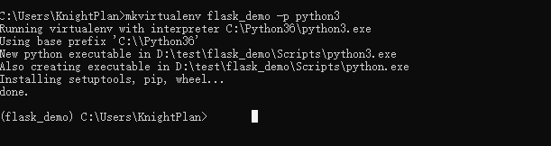
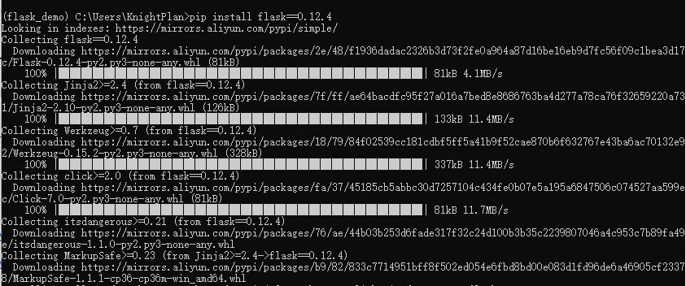

# Flask

Flask诞生于2010年，是Armin ronacher（人名）用 Python 语言基于 Werkzeug 工具箱编写的轻量级Web开发框架。

Flask 本身相当于一个内核，其他几乎所有的功能都要用到扩展（邮件扩展Flask-Mail，用户认证Flask-Login，数据库Flask-SQLAlchemy），都需要用第三方的扩展来实现。比如可以用 Flask 扩展加入ORM、窗体验证工具，文件上传、身份验证等。Flask 没有默认使用的数据库，你可以选择 MySQL，也可以用 NoSQL。

其 WSGI 工具箱采用 Werkzeug（路由模块），模板引擎则使用 Jinja2。这两个也是 Flask 框架的核心。

官网: http://flask.pocoo.org/

官方文档: <http://docs.jinkan.org/docs/flask/>

**Flask常用扩展包：**

- Flask-SQLalchemy：操作数据库,ORM；
- Flask-script：插入脚本；
- Flask-migrate：管理迁移数据库；
- Flask-Session：Session存储方式指定；
- Flask-WTF：表单；
- Flask-Mail：邮件；
- Flask-Bable：提供国际化和本地化支持，翻译；
- Flask-Login：认证用户状态；
- Flask-OpenID：认证；
- Flask-RESTful：开发REST API的工具；
- Flask JSON-RPC:  开发rpc远程服务[过程]调用
- Flask-Bootstrap：集成前端Twitter Bootstrap框架
- Flask-Moment：本地化日期和时间
- Flask-Admin：简单而可扩展的管理接口的框架

可以通过  http://flask.pocoo.org/extensions/ 查看更多flask官方推荐的扩展

## 准备

```
mkvirtualenv flask_demo -p python3
```



## 安装

```
pip install flask==0.12.4
```




## 创建flask项目

与django不同,flask不会提供任何的自动操作,所以需要手动创建项目目录,需要手动创建启动项目的管理文件

例如,创建项目目录 flaskdemo,在目录中创建manage.py.在pycharm中打开项目并指定上面创建的虚拟环境


```
from flask import Flask
app = Flask(__name__)

@app.route('/')
def index():
    return 'Hello World'
    
if __name__ == '__main__':
    app.run()
```


代码分析:

```
# 导入Flask类
from flask import Flask

"""
import_name      Flask程序所在的包(模块)，传 __name__ 就可以
                 其可以决定 Flask 在访问静态文件时查找的路径
static_path      静态文件访问路径(不推荐使用，使用 static_url_path 代替)
static_url_path  静态文件访问路径，可以不传，默认为：/ + static_folder
static_folder    静态文件存储的文件夹，可以不传，默认为 static
template_folder  模板文件存储的文件夹，可以不传，默认为 templates
"""
app = Flask(__name__)


# 加载项目配置
# 配置类
class Config(object):
    DEBUG = True


app.config.from_object( Config )


# 指定服务器IP和端口
app.run(host="0.0.0.0", port=5000, debug = True)
```


## 路由的基本定义

```
# 指定访问路径为 demo1
@app.route('/demo1')
def demo1():
    return 'demo1'
```


###  路由可以设置传递参数, 2种方式

```
# 路由传递参数[没有限定类型]
@app.route('/user/<user_id>')
def user_info(user_id):
    return 'hello %s' % user_id


# 路由传递参数[限定类型]
@app.route('/user/<int:user_id>')
def user_info(user_id):
    return 'hello %d' % user_id
```


### 路由限定请求方式

```
@app.route('/demo2', methods=['GET', 'POST'])
def demo2():
    # 直接从请求中取到请求方式并返回
    return request.method
```


# 正则匹配路由

在 web 开发中，可能会出现限制用户访问规则的场景，那么这个时候就需要用到正则匹配，根据自己的规则去限定请求参数再进行访问

具体实现步骤为：

- 导入转换器基类：在 Flask 中，所有的路由的匹配规则都是使用转换器对象进行记录
- 自定义转换器：自定义类继承于转换器基类
- 添加转换器到默认的转换器字典中
- 使用自定义转换器实现自定义匹配规则

## 代码实现

- 导入转换器基类

```python
from werkzeug.routing import BaseConverter
```

- 自定义转换器

```python
# 自定义正则转换器
class RegexConverter(BaseConverter):
    def __init__(self, url_map, *args):
        super(RegexConverter, self).__init__(url_map)
        # 将接受的第1个参数当作匹配规则进行保存
        self.regex = args[0]
```

- 添加转换器到默认的转换器字典中，并指定转换器使用时名字为: re

```python
app = Flask(__name__)

# 将自定义转换器添加到转换器字典中，并指定转换器使用时名字为: re
app.url_map.converters['re'] = RegexConverter
```

- 使用转换器去实现自定义匹配规则
  - 当前此处定义的规则是：3位数字

```python
@app.route('/user/<re("[0-9]{3}"):user_id>')
def user_info(user_id):
    return "user_id 为 %s" % user_id
```

> 运行测试：<http://127.0.0.1:5000/user/123> ，如果访问的url不符合规则，会提示找不到页面


# 系统自带转换器

```python
DEFAULT_CONVERTERS = {
    'default':          UnicodeConverter,
    'path':             PathConverter,
    'string':           UnicodeConverter,
    'any':              AnyConverter,
    'int':              IntegerConverter,
    'float':            FloatConverter,
    'uuid':             UUIDConverter,
}
```

> 系统自带的转换器具体使用方式在每种转换器的注释代码中有写，请留意每种转换器初始化的参数。


# http的请求与响应

## 请求

文档: http://docs.jinkan.org/docs/flask/api.html#flask.request

- **request**：flask中代表当前请求的 `request 对象`
- **作用**：在视图函数中取出本次请求数据
- **导入**：``from flask import request``

常用的属性如下：

| 属性    | 说明                           | 类型           |
| ------- | ------------------------------ | -------------- |
| data    | 记录请求的数据，并转换为字符串 | *              |
| form    | 记录请求中的表单数据           | MultiDict      |
| args    | 记录请求中的查询参数           | MultiDict      |
| cookies | 记录请求中的cookie信息         | Dict           |
| headers | 记录请求中的请求头             | EnvironHeaders |
| method  | 记录请求使用的HTTP方法         | GET/POST       |
| url     | 记录请求的URL地址              | string         |
| files   | 记录请求上传的文件             | *              |


### 获取请求中查询字符串

http://127.0.0.1/demo1?a=10

```python
"""http://127.0.0.1/?username=xiaoming&lve=1&lve=2&lve=3"""
@app.route("/")
def index():
    username = request.args.get("username")  # 获取单个查询字符串参数
    params = request.args.to_dict()  # 获取所有查询字符串参数, 获取请求地址中的查询字符串并转换为字典格式
    print(params)

    love = request.args.getlist("lve")  # 如果一个参数有多个值的情况,可以通过getlist获取
    print(love)

```


## 响应

flask默认支持2种响应方式:

数据响应: 默认响应html文本,也可以返回 JSON格式

页面响应: 重定向

​                  url_for

响应的时候,flask也支持自定义http响应状态码

### 响应html文本

```python
@app.route("/")
def index():
    # [默认支持]响应html文本
    return ""
```


### 返回JSON数据

在 Flask 中可以直接使用 **jsonify** 生成一个 JSON 的响应

```python
from flask import Flask, request, jsonify

@app.route("/")
def index():
    # 也可以响应json格式代码
    data = [
        {"id":1,"username":"liulaoshi","age":18},
        {"id":2,"username":"liulaoshi","age":17},
        {"id":3,"username":"liulaoshi","age":16},
        {"id":4,"username":"liulaoshi","age":15},
    ]
    return jsonify(data)
```

> flask中返回json 数据,都是flask的jsonify方法返回就可以了.


### 重定向

#### 重定向到百度页面

```python
# 页面跳转响应
@app.route("/user")
def user():
    # 页面跳转 redirect函数就是response对象的页面跳转的封装
    # Location: http://www.baidu.com
    return redirect("http://www.baidu.com")
```

#### 重定向到自己写的视图函数

可以直接填写自己 url 路径

也可以使用 url_for 生成指定视图函数所对应的 url

```python
# 内容响应
@app.route("/")
def index():
    # [默认支持]响应html文本
    # return ""

    # 也可以响应json格式代码
    data = [
        {"id":1,"username":"liulaoshi","age":18},
        {"id":2,"username":"liulaoshi","age":17},
        {"id":3,"username":"liulaoshi","age":16},
        {"id":4,"username":"liulaoshi","age":15},
    ]
    return jsonify(data)

#使用url_for可以实现视图方法之间的内部跳转
# url_for("视图方法名")
@app.route("/login")
def login():
    return redirect( url_for("index") )
```


#### 重定向到带有参数的视图函数

在 url_for 函数中传入参数

```python
# 路由传递参数
@app.route('/user/<user_id>')
def user_info(user_id):
    return 'hello %d' % user_id

# 重定向
@app.route('/demo4')
def demo4():
    # 使用 url_for 生成指定视图函数所对应的 url
    return redirect(url_for('user_info', user_id=100))

```


#### 自定义状态码

在 Flask 中，可以很方便的返回自定义状态码，以实现不符合 http 协议的状态码，例如：status code: 666

```python
@app.route('/demo4')
def demo4():
    return '状态码为 666', 400
```


# 会话控制

所谓的会话,就是用户和浏览器中网站之间一次交互过程.

会话的开始是在用户打开浏览器以后第一次访问网站.

会话的结束时在用户关闭浏览器以后.


因为 http 是一种无状态协议，浏览器请求服务器是无状态的。

**无状态**：指一次用户请求时，浏览器、服务器无法知道之前这个用户做过什么，每次请求都是一次新的请求。

**无状态原因**：浏览器与服务器是使用 socket 套接字进行通信的，服务器将请求结果返回给浏览器之后，会关闭当前的 socket 连接，而且服务器也会在处理页面完毕之后销毁页面对象。

有时需要保持下来用户浏览的状态，比如用户是否登录过，浏览过哪些商品等

实现状态保持主要有两种方式：

- 在客户端存储信息使用`Cookie,本地存储`
- 在服务器端存储信息使用`Session`,redis


## Cookie

Cookie是由服务器端生成，发送给客户端浏览器，浏览器会将Cookie的key/value保存，下次请求同一网站时就发送该Cookie给服务器（前提是浏览器设置为启用cookie）。Cookie的key/value可以由服务器端自己定义。

使用场景: 登录状态, 浏览历史, 网站足迹


Cookie是存储在浏览器中的一段纯文本信息，建议不要存储敏感信息如密码，因为电脑上的浏览器可能被其它人使用

Cookie基于域名安全，不同域名的Cookie是不能互相访问的

如访问luffy.com时向浏览器中写了Cookie信息，使用同一浏览器访问baidu.com时，无法访问到luffy.com写的Cookie信息

浏览器的同源策略针对cookie也有限制作用.

当浏览器请求某网站时，会将本网站下所有Cookie信息提交给服务器，所以在request中可以读取Cookie信息


### 设置cookie

设置cookie需要通过flask的Response响应对象来进行设置,由flask内部提供了一个make_response函数给我们可以快速创建响应对象

```python
from flask imoprt Flask,make_response
@app.route('/set_cookie')
def set_cookie():
    resp = make_response('this is to set cookie')
    resp.set_cookie('username', 'xiaoming', max_age=3600)
    return resp
```


### 获取cookie

```python
from flask import Flask,request
@app.route('/get_cookie')
def resp_cookie():
    resp = request.cookies.get('username')
    return resp
```


## Session

对于敏感、重要的信息，建议要存储在服务器端，不能存储在浏览器中，如用户名、余额、等级、验证码等信息

在服务器端进行状态保持的方案就是`Session`

注意: **Session依赖于Cookie**,而且flask中使用session,需要配置SECRET_KEY选项,否则报错.

### 设置session

```python
@app.route('/set_session')
def set_session():
    session['username'] = 'xiaoming'
    return 'ok!'
```


### 获取session

```python
@app.route('/get_session')
def get_session():
    return session.get('username')
```


