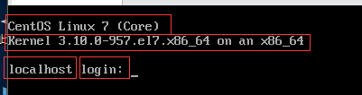
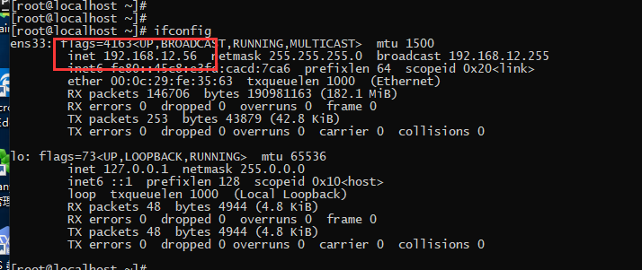
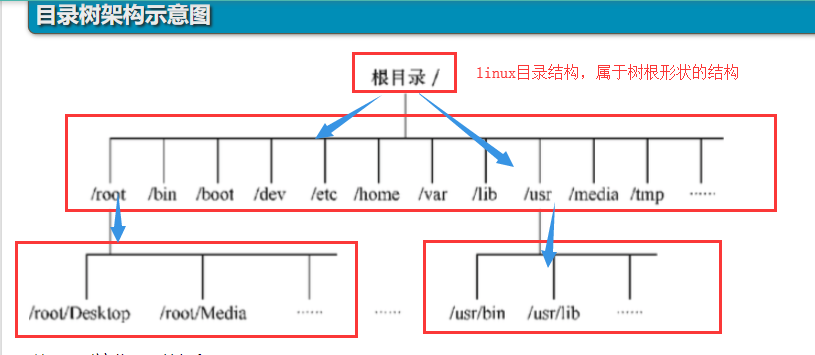
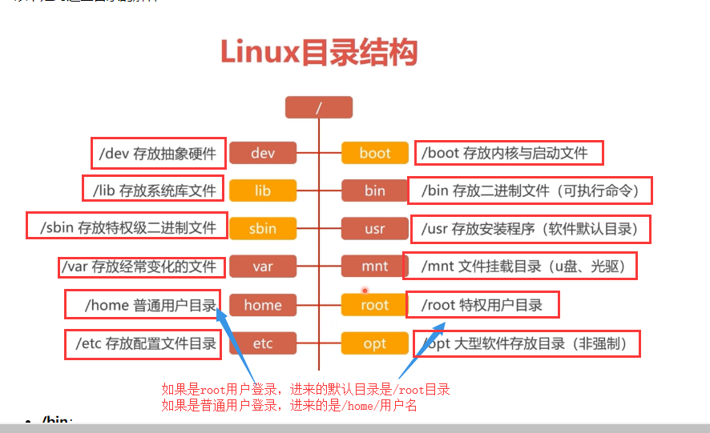
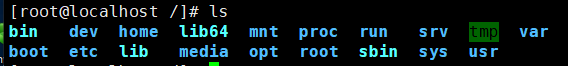
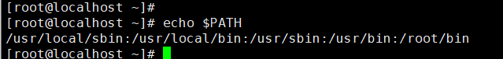

## 一. 电脑或服务器硬件知识

请说出你笔记本的外部结构有哪些

键盘

移动硬盘

显示器

鼠标

触控板

耳麦

USB, type-c, HDMI,

电源

摄像头


你再说出你笔记本内部结构有哪些 

硬盘

CPU

CPU风扇

内存

显卡

声卡

主板

网卡

光驱

电池


服务器:

云服务器:  阿里云，华为云，腾讯云，百度云，京东云 ，亚马逊云

常见的服务器厂商

DELL,  HP, IBM, 浪潮， 联想


  安装Centos7操作系统

参见博客: https://www.cnblogs.com/tiger666/articles/10259102.html

 网络类型:

桥接网络:   虚拟机和大家都在同一个局域网

网络地址转换NAT：  虚拟机在独立的一个局域网

主机模式:


## 二. 初识linux系统

 1 linux系统登录界面




2  远程连接到这台机器的前提条件

(1)    查看服务器的IP信息

```
ip add show
ifconfig
```



(2) 操作网卡命令（重启网络和启用网卡）

```
systemctl restart network
systemctl start network
systemctl stop network
```

启用和停止网卡命令

```
ifup 网卡名
例:
	ifup ens33  # 启用网卡 
	ifdown ens33 # 停止网卡
```


(3) 远程连接服务器

 注意: 因为我的讲师机的虚拟机是桥接模式，跟大家在同一个局域网，所以谁都可以连接

但是，不要干坏事儿

 第一种方式: 使用第三方软件，我们教学就使用xshell进行连接就可以

 第二种方式: 使用命令进行连接

```
ssh root@192.168.12.56
```

## 三. linux目录结构





#### 目录相关操作

```
.    当前目录
..    上一层目录
-    前一个工作目录
~    当前【用户】所在的家目录
```

蓝色的文件:  都是目录

白色的文件: 都是普通文件

绿色的 文件:  都是可执行文件


## 四. linux基本操作命令

增删改查的高大上叫法 ： CURD

增

 ```
#  创建目录(文件夹)
mkdir liulaoshi
mkdir chenwen
mkdir chengang
mkdir zhangqihang
 ```

```
# 创建普通文件
touch huangchun
touch xiaowei
```

删

```
remove > 因为太长，所以改为rm
rm  # 删除文件命令
rm -i # 递归删除目录和文件命令
rm -rf # 递归并且强制删除目录和文件命令
rmdir # 删除一个空目录
```

### 注意:  rm -rf /*是炸弹命令，千万不要使用

### 注意:  rm -rf /*是炸弹命令，千万不要使用

### 注意:  rm -rf /*是炸弹命令，千万不要使用

改

```
cd # 切换目录命令
```



 ```
mv # 移动文件命令
mv  源文件 目标文件   # 对文件重命名 
 ```

查

```
ls   # 查看当前目录下的文件夹和文件
ls -l或ll  # 查看当前目录下的文件夹和文件详情
ls -la # 查看当前目录下的文件夹和文件详情, 还可以查看隐藏文件
pwd  # 查看当前所在的目录的绝对路径
```

 重启或关机命令

```
init 6  # 重启
init 0  # 关机
```

#### linux下查看环境变量

```
echo $PATH
```




#### 绝对路径和相对路径

- 绝对路径：由根目录(/)为开始写起的文件名或者目录名称，如/home/oldboy/test.py;
- 相对路径：相对于目前路径的文件名写法。例如./home/oldboy/exam.py或../../home/oldboy/exam.py，简单来说只要开头不是/，就是属于相对路径


