今日内容


# linux基本命令

### (1) 创建用户命令(重要指数\****)

```
useradd liulaoshi   # 创建用户
passwd liulaoshi   # 设置密码, 回车后会提示让你输入两次密码 

```

普通用户登录的命令提示符与root用户不一样

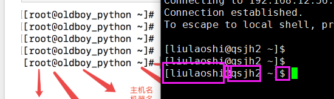

### (2) 修改命令提示符(重要指数**)

```
echo $PS1  # 查看命令提示符参数
PS1="[\u@\h \w \t]\$"  
   \w 显示完整工作路径
   \t 显示时间
```

### (3)  修改主机名(重要指数***)

```mysql
(Ll)
hostnamectl set-hostname qishitwo
```

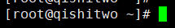

### (4)  linux系统命令提示符

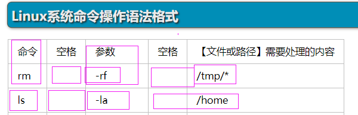

### (5) 创建目录命令(重要指数\****)

```
mkdir -p liulaoshi/chenwen/liujie/xiaowei  # 递归创建目录
mkdir -p {qihang,chenwen,yanglan,xiaowei}  # 创建多个目录
```

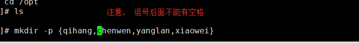

```
touch liulaoshi.py qihang.py yanglan.py xiaowei.py
# 创建多个普通文件命令， 文件之间用空格隔开
```


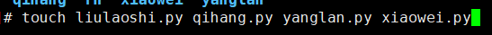

### (6)  VIM操作初识(重要指数\*****)

```
vi/vim操作流程: 
1. vi 打开文件 此时进入命令模式，你可以输入 i 命令，进入编辑模式
2. 在编辑模式下，开始输入字符串
3. 写完之后， 按下 esc 回到命令模式，按下 : 进入底线命令模式
4. :w 写入不退出 :wq! 写入且强制退出 
```

### (7)  修改网卡配置文件，使系统重启之后不用再手动启动网卡(重要指数\****)

```
vim /etc/sysconfig/network-scripts/ifcfg-ens33
```

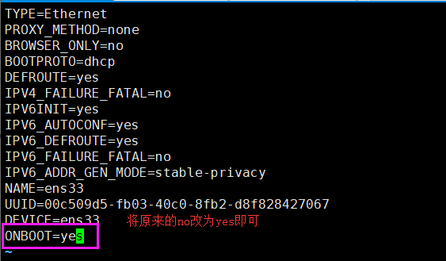

改完之后，下一次你重启系统之后，就不用再使用ifup ens33命令手动启用网卡了

### (8) 查看普通文件内容(重要指数\****)

```
cat 文件名   # 可以用绝对路径，也可以用相对路径
```

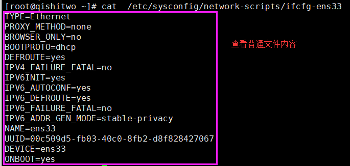


### (9) 特殊符号(重要指数***)

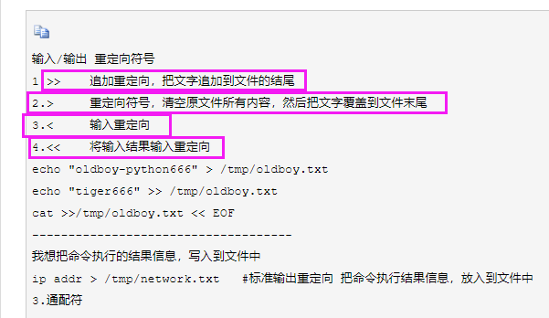

### (10) more和less命令(重要指数\***)

```
more /etc/passwd  # 分页查看文件， 比cat命令好用
less /etc/passwd  # 同more 比more功能更多
```

### (11) linux快捷键(重要指数\*****)

```
1.tab键    用于自动补全命令/文件名/目录名
2.ctrl + l　　清理终端显示 
3.clear/cls  清理终端显示
4.ctrl + c 终止当前操作
```

### (12) echo命令(重要指数\****)

```
echo "山外青山楼外青楼" > passwd   # 单个>符号表示覆盖
echo "能人背后有人弄" >> passwd  # 两个>符号表示追加
```

### (13) 复制命令(重要指数***)

```
cp 参数 源文件 目标文件
	-r 递归,复制目录以及目录的子孙后代
	-p 复制文件，同时保持文件属性不变
	-a 相当于-pdr, 类似与Windows系统的复制快捷方式
```

### (14) 移动和重命名命令mv（重要指数***）

```
mv 源文件 目标文件
# 不仅有移动的功能，还有重命令名的功能
```

### (15) 删除命令(重要指数\****)

```
rm 参数 文件名
    -i  需要删除确认
　　 -f  强制删除
    -r  递归删除目录和内容
```

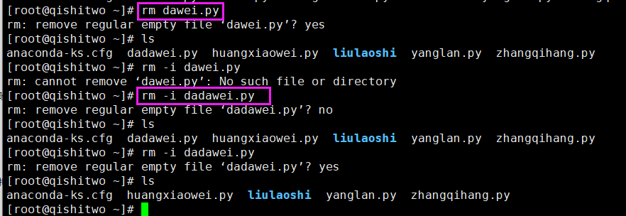

### (16）查找命令(重要指数\*****)

```
find 需要查找的目录
	-name  # 指定文件的名字
	-type  # 指定文件类型
```

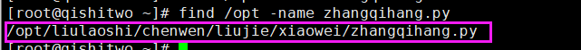

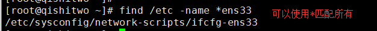


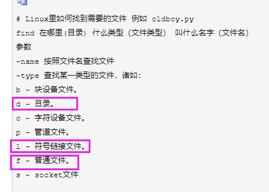


### (17) 别名alias命令(重要指数\***)

```
alias #查看系统存在的别名
```

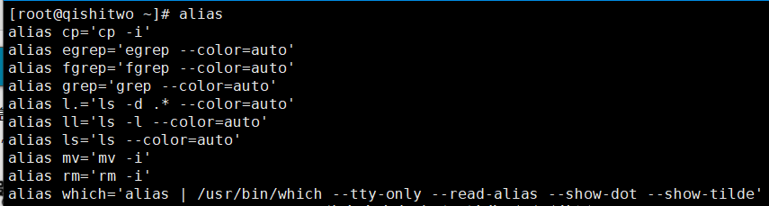

```
alias rm="echo '此命令太危险了，请你不要再使用'"
# 给rm命令别名成为echo '此命令太危险了，请你不要再使用'
# 当用户再输入rm命令时，就会执行这个命令:
echo '此命令太危险了，请你不要再使用'
```

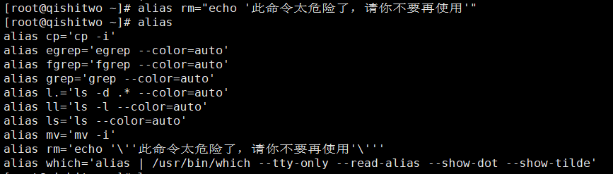

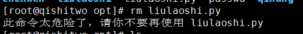

```
unalias rm  # 取消别名
```


### (18) 查看系统运行的进程(重要指数\*****)

```
ps -ef
```

### (19) 查看系统已开放的端口(重要指数\*****)

```
netstat -tunlp
```

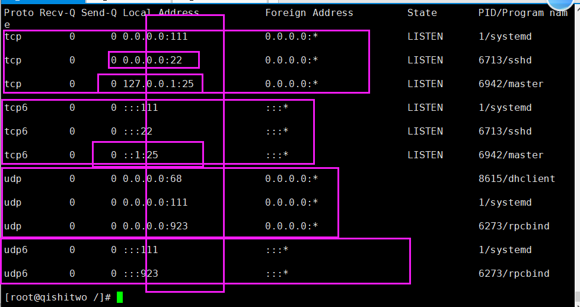


### (19) 管道命令(重要指数\****)


```
ps -ef | grep liulaoshi  # 查看系统中与liulaoshi相关的进程
```

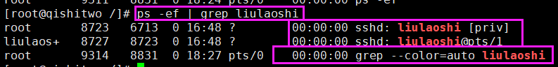


### (20) grep命令(重要指数\****)

```
grep nologin /etc/passwd  # 过滤出/etc/passwd下面所有含有noloing的信息
grep root /etc/passwd  # 过滤出/etc/passwd下面root信息
```

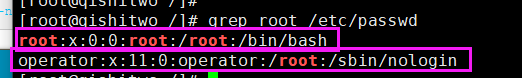

```
语法：
grep [参数] [--color=auto] [字符串] filename
参数详解:
-i : 忽略大小写
-n : 输出行号
-v : 反向选择
--color = auto : 给关键词部分添加颜色
```

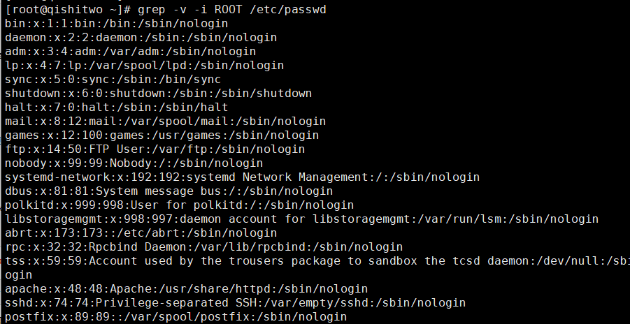

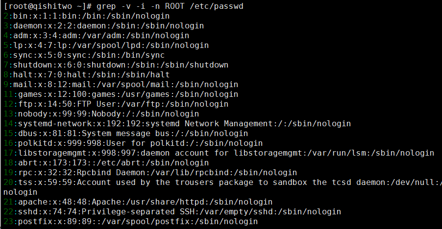

### (21) linux下面的IP地址信息(重要指数\*****)

```
127.0.0.1  # 本机地址, 别人无法访问，只有本机才可以访问
192.168.12.56 # 本机IP地址，别人可以访问
localhost  # 本机主机名
0.0.0.0    # 本机环回地址, 相当于127.0.0.1加上192.168.12.56
```

### (22) head和tail命令(重要指数\***)

```
head显示文件前几行，默认前10行
tail显示文件后几行，默认后10行
```

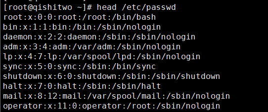

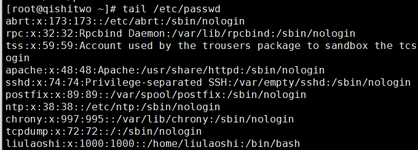

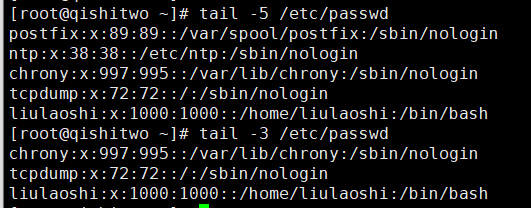

```
想要显示/etc/passwd下面的第10行到第20行， 可以使用管道符进行二次过滤
head -20 /etc/passwd | tail -1
```

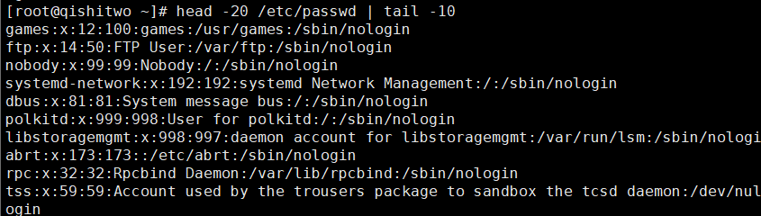

### (23) which 命令(重要指数\*****)

which命令用于查找并显示给定命令的绝对路径，环境变量PATH中保存了查找命令时需要遍历的目录。
which指令会在环境变量$PATH设置的目录里查找符合条件的文件。
也就是说，使用which命令，就可以看到某个系统命令是否存在，以及执行的到底是哪一个位置的命令。

```
which pwd
which python
```


### (24) scp命令(重要指数\*****)

```
语法
scp 【可选参数】 本地源文件 远程文件标记
    -r :递归复制整个目录
    -v:详细方式输出
    -q:不显示传输进度条
    -C：允许压缩
```

```
scp liulaoshi.py root@192.168.12.77:/opt/  
# 将本地的liulaoshi.py拷贝到远程服务器192.168.12.77的/opt目录下
```

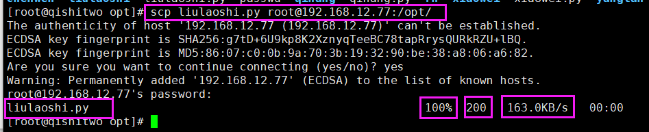

```
scp root@192.168.12.77:/opt/liulaoshi.py /root/
# 将远程服务器192.168.12.77的/opt目录下liulaoshi.py拷贝到本地/root目录下
```

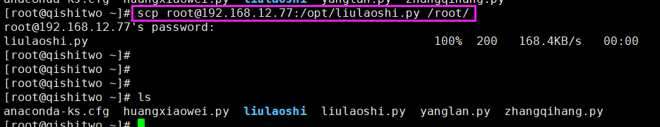

```
scp -r /opt/liulaoshi root@192.168.12.77:/opt  # 递归拷贝目录
```

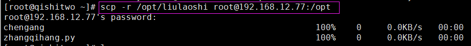

### (25) 查看磁盘占用率命令(重要指数\****)

```
df -h
```


```
du -sh 文件或目录名   # 统计文件或目录的大小，以K,M,G为单位人性化显示
```

### (26)  top命令(重要指数\****)


### (27) chattr命令(重要指数**)

```
chattr +a huangxiaowei.py  # 给文件加锁
chattr -a huangxiaowei.py  # 给文件解锁
lsattr huangxiaowei.py  # 查看文件详细加锁信息
```


### (28) linux时间服务器 (重要指数\***)

```
date  查看系统当前时间
ntpdate -u ntp.aliyun.com   # 从阿里云的NTP服务器更新系统的时间
```


```
硬件时钟的查看
hwclock

//以系统时间为基准，修改硬件时间
hwclock -w

//以硬件时间为基准，修改系统时间
hwclock -s
```


```
date 041215002019  # 修改系统时间 
```


### (29）wget 下载命令(重要指数\*****)

```
wget 链接
```


### (30) lrzsz软件包(重要指数\****)

```
yum install lrzsz
rz   # 上传
sz 文件名   # 下载指定文件
```

### (31) 关机和重启命令(重要指数\*****)

```
reboot或init 6命令用于重启机器
poweroff或init 0用于关闭系统
```

