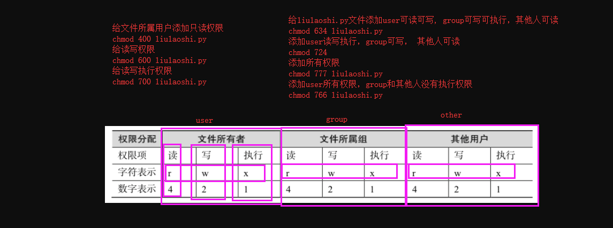
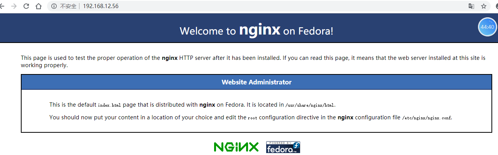

​	pinf www.baidu.com

​	tracert www.baidu.com

### 1. 作业讲解


### 2. vim编辑器


vim 操作命令

在命令模式下操作

```
pageup 往上翻页(重要指数****)
pagedown 往下翻页(重要指数****)
H 移动到屏幕首行
gg 移动光标到文档的首行(重要指数****)
	前面加数字n表示移动到n行内容
G 移动到文档最后一行(重要指数*****)

/nologin  在整个文档中从上往下查找(重要指数*****)
	再按n 选择下一个单词
	N  选择上一个单词

?root  在整个文档中从下往上查找(重要指数*****)
	再按n 选择下一个单词
	N  选择上一个单词

dd 删除光标所在行内容(重要指数*****)
	dd前面加数字n表示删除n行内容
	例  3dd 删除从光标所在行开始3行内容
dG 清空光标(包括当前行)所在位置后的内容(重要指数****)
u 撤销上一步操作(重要指数****)

yy 复制(重要指数*****)
	yy前面加数字n表示复制n行内容
p  粘贴(重要指数*****)

```

底线命令模式:

```
:q!     强制退出
:wq!    强制写入退出
:set nu 显示行号
:数字　　调到数字那行
```

### 3. 用户管理和文件目录权限


QQ群

群主:  拥有至高无上的权利, 可以删除用户，可以添加用户，可以设置管理员

管理员:  可以T掉普通用户，可以添加用户进来

普通用户:  吹水，潜水


你以后到公司上班:

开发组		运维组		DBA组		前端组		测试组

张启航		黄小伟		王明		小李		杨澜

陈刚		刘杰		刘老师


linux下面的用户及权限:

root用户:  超级管理员, 相当于QQ群里面的群主

普通用户:  可以做一些简单的操作, 如果需要做系统服务相关的操作，需要授权


### 4. 文件权限详解


```
r    read可读，可以用cat等命令查看
w    write写入，可以编辑或者删除这个文件
x    executable    可以执行

第一个字母:
- 普通文件
d 文件目录
l 快捷方式,符号链接

```

### 5. sudo命令用法:

```
1 使用liulaoshi用户登录
2 查看/root目录,提示无权限
3 所以我们要使用sudo命令来查看
4 但是提示此用户不在/etc/sudoers文件里面
5 我们需要使用visudo命令将liulaoshi加入到/etc/sudoers文件中,注意最好不要使用vim命令直接编辑此文件
6 将用户加入到文件中后，我们就可以用liulaoshi用户使用sudo命令查看/root目录
```

```
ll /hosts
ll /root  #  dr-xr-x---.   6 root root  288 Apr 15 15:11 root
							所属用户 所属组				用户
			d 文件目录
			r-x|r-x|---
		所属用户|用户组|其他人
		r 读
		w 写
		x 执行
```

```

```


```python
vim /etc/sudoers
visudo
root    ALL=(ALL)       ALL
hello   ALL=(ALL)       ALL  # 添加这行
```

```python
sudo ls /root # hello用户
```


### 6. 给文件和目录添加或删除权限

Linux权限的目的是（保护账户的资料）

Linux权限主要依据三种身份来决定：

- user/owner 文件使用者,文件属于哪个用户
- group 属组,文件属于哪个组
- others 既不是user，也不再group，就是other，其他人


```
第1个字母表示文件类型
第2-4个字母表示所属用户user 简写u
第5-7个字母表示所属用户组group 简写g
第8-10个字母表示其他人other 简写o
```

```
chmod u+r /opt/liulaoshi.py  # 给用户添加只读的权限
chmod u+w /opt/liulaoshi.py  # 给用户添加可写的权限
chmod u+x /opt/liulaoshi.py  # 给用户添加可执行文件的权限

chmod g+r /opt/liulaoshi.py  # 属组, 文件属于哪个组 加只读的权限
chmod g+w /opt/liulaoshi.py	 
chmod g+x /opt/liulaoshi.py

chmod o+r /opt/liulaoshi.py  # 给其他用户(other)加只读权限
chmod o+w /opt/liulaoshi.py
chmod o+x /opt/liulaoshi.py


chmod u-r /opt/liulaoshi.py  # 给用户删除只读的权限
chmod u-w /opt/liulaoshi.py  # 给用户删除可写的权限
chmod u-x /opt/liulaoshi.py  # 给用户删除可执行文件的权限

chmod g-r /opt/liulaoshi.py
chmod g-w /opt/liulaoshi.py
chmod g-x /opt/liulaoshi.py

chmod o-r /opt/liulaoshi.py  # 删除其他用的 读 权限
chmod o-w /opt/liulaoshi.py
chmod o-x /opt/liulaoshi.py
```



```
chmod 777 liulaoshi.py  # 给所有用户及组所有权限
chmod 000 liulaoshi.py  # 给所有用户及组无权限
# 以上是命令语法，详细配置请参照上图
```

我们还可以修改属主和属组:

```
chown root.root liulaoshi.py  # 修改文件所属主和所属组
chown root:root liulaoshi.py  # 修改文件所属主和所属组，这两个命令一样
```


### 7. 软链接

```
ln -s /opt/zhangqihang/lihua.py lihuadashuaige.py
```


 明天我们安装python3解释器，我们要想在linux命令行下面 输入python3直接进入python3解释器的话，就需要配置软链接，或者另一个方法, 配置环境变量(推荐)

1  配置软链接


```
ln -s /opt/python36/bin/python3  /usr/bin/python3
ln -s /opt/python36/bin/pip3  /usr/bin/pip3
```

配置软链接之后，就可以直接输入python3命令进入解释器

2  配置环境变量(建议使用此方法，配置方便)

```
修改系统环境变量配置文件
vim /etc/profile
添加以下内容:
PATH=/opt/python36/bin:/usr/local/sbin:/usr/local/bin:/usr/sbin:/usr/bin:/root/bin
保存退出
```

## 8. tar解压命令

```
命令语法:
tar命令 参数 文件
	-z  使用gzip命令
	-v  显示压缩解压过程
	-c  压缩文件
	-x  解压文件
	-f  指定文件
```


```
压缩文件
tar -cf allpy.tar *
```


```
tar -cf allpy.tar ./*   # 压缩当前文件夹下面的所有文件到allpy.tar
tar -xf allpy.tar # 解压文件
tar -zcf allpy.tar.gz ./*  # 压缩带gzip的文件
gzip -d allpy.tar.gz   # 解压gzip文件 解压成 .tar问价  再进行 tar -xf allpy.tar 解压
tar -zxvf allpy.tar.gz  # 一条命令解压带gzip和tar的压缩包
```


### 9. netstat命令

```
netstat -tunlp  # 查看系统中开放的端口
```


### 10. ps命令

```
ps -ef # 查看系统运行的进程
!ps  # 运行上一次运行的ps -ef命令
```


### 11. kill命令

```
kill 进程ID  # 杀掉相关进程ID
kill -9 进程ID  # 强制杀掉相关进程ID
pkill 正则匹配相关进程名  # 杀掉匹配到的所有进程
killall 正则匹配相关进程名，类似于pkill
```

### 12. SELinux

查看selinux开启状态

```
getenforce
```

临时关闭selinux

```
setenforce 0
```

一次性永久关闭selinux

```
编辑selinux配置文件
vim /etc/selinux/config
将SELINUX=enforcing改为SELINUX=disabled
保存退出
```

### 13. linux防火墙

```
iptables -L  # 查看系统防火墙规则
iptables -F  # 清空所有防火墙规则

systemctl stop firewalld  # 停止防火墙
systemctl status firewalld # 查看防火墙运行状态
systemctl start firewalld  # 启动
systemctl disable firewalld  # 永久关闭防火墙
```

### 14. df命令

```
df -h 命令查看系统磁盘空间
```

### 15. tree命令

递归显示文件和文件目录(如果没有此命令，需要使用yum install tree安装)


### 16. 设置主机名

```
hostnamectl set-hostname qishi2
```

### 17. DNS

DNS（Domain Name System，域名系统）解析原理：

```
1 我在本地访问www.baidu.com
2 首先会从本地DNS缓存中去查找，如果没有
3 就会去本地hosts文件中去查找，如果没有
4 去公网的DNS服务器查看是否有此域名解析记录,如果还没有
5 说明此域名没有在公网注册解析
```

windows下的hosts文件

```
C:\Windows\System32\drivers\etc\hosts
```

linux下的hosts文件

```
/etc/hosts
```

常见的dns服务器IP有哪些

```
8.8.8.8  #谷歌的DNS
114.114.114.114 #114的DNS
119.29.29.29  # 腾讯的DNS
223.5.5.5  # 马云的DNS
223.6.6.6  # 马云的DNS

电信的DNS
202.96.134.133
202.96.134.134
202.96.128.86
```

### 18. nslookup命令 

```
用来将域名解析为IP
nslookup
nslookup www.baidu.com
```


### 19. 计划任务(分时日月周)

crontab -e #  编辑计划任务

```
crontab （选项）（参数）
-e：编辑该用户的计时器设置；
-l：列出该用户的计时器设置；
-r：删除该用户的计时器设置；
-u<用户名称>：指定要设定计时器的用户名称。
```

```
# Example of job definition:
# .---------------- minute (0 - 59)
# |  .------------- hour (0 - 23)
# |  |  .---------- day of month (1 - 31)
# |  |  |  .------- month (1 - 12) OR jan,feb,mar,apr ...
# |  |  |  |  .---- day of week (0 - 6) (Sunday=0 or 7) OR sun,mon,tue,wed,thu,fri,sat
# |  |  |  |  |
# *  *  *  *  * user-name  command to be executed
分 时  日 月  周
```

```
第1列表示分钟1～59 每分钟用*或者 */1表示
第2列表示小时1～23（0表示0点）
第3列表示日期1～31
第4列表示月份1～12
第5列标识号星期0～6（0表示星期天）
第6列要运行的命令
```


```
#每分钟执行一次命令
* * * * * 执行命令 
#每小时的3,15分钟执行命令
3,15 * * * * 执行命令

#在上午8-11点的第3和第15分钟执行
3,15 8-11 * * * 执行命令

#每晚21:30执行命令
30 21 * * * 执行命令

#每周六、日的1：30执行命令
30 1 * * 6,7 执行命令

#每周一到周五的凌晨1点，清空/tmp目录的所有文件
* 1 * * 1-5 rm -rf /tmp/*

#每晚的21:30重启nginx
30 21 * * * systemctl restart nginx

#每月的1,10,22日的4:45重启nginx
45 4 1,10,22 * 8 systemctl restart nginx

#每个星期一的上午8点到11点的第3和15分钟执行命令
3,15 8-11 * * 1 执行命令
```


### 20. yum工具

#### rpm包(这里不推荐使用)

```
mysql-5-3-4.rpm
redis-3-4-3.rpm
nginx2-3-2.rpm
```

 rpm包的缺点:

```
我想要安装一个mysql-5-3-4.rpm这样的一个软件
while 依赖包 < 需要的依赖包:
    当我安装的时候，它会提示我需要一个依赖包
    当我把这个依赖包安装完成之后，它又会提示我需要安装另一个依赖包
```


#### yum工具


yum提供了查找、安装、删除某一个、一组甚至全部软件包的命令，而且命令简洁而又好记。

[](javascript:void(0);)

```
yum(选项)(参数)
-h：显示帮助信息；
-y：对所有的提问都回答“yes”；
-c：指定配置文件；
-q：安静模式；
-v：详细模式；
-d：设置调试等级（0-10）；
-e：设置错误等级（0-10）；
-R：设置yum处理一个命令的最大等待时间；
-C：完全从缓存中运行，而不去下载或者更新任何头文件。
```


##### 配置阿里云源步骤

1  备份原有的.repo源文件

```
cd  /etc/yum.repos.d
mkdir repobak
mv * repobak
```

2  下载阿里云的源文件和第三方扩展源文件

```
wget -O /etc/yum.repos.d/CentOS-Base.repo http://mirrors.aliyun.com/repo/Centos-7.repo

wget -O /etc/yum.repos.d/epel.repo http://mirrors.aliyun.com/repo/epel-7.repo
```

3  清空yum缓存和创建新的缓存

```
清空yum缓存和创建新的缓存
yum clean all
yum makecache
```

4.安装软件扩展源

```
yum install -y epel-release
```

5  使用yum工具下载安装nginx

```
yum install nginx
```


注意:  只要是使用yum安装的软件，都可以使用systemctl进行管理

6  启动nginx

```
systemctl start nginx
```

7 浏览器访问nginx

```
http://192.168.12.56
```




## 21 linux系统服务管理

centos7的服务管理命令

```
systemctl start 服务名称   
systemctl stop 服务名称
systemctl status 服务名称
systemctl restart 服务名称
```

centos6的服务管理命令

```
service 服务名称 start
service 服务名称 stop
service 服务名称 status
service 服务名称 restart
```


