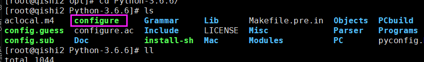

## 1. 作业讲解


## 2. CentOS下编译安装python3

编译安装python3.6的步骤

1.下载python3源码包

wget  https://www.python.org/ftp/python/3.6.6/Python-3.6.6.tgz

2.下载python3编译的依赖包

```
yum install -y gcc patch libffi-devel python-devel  zlib-devel bzip2-devel openssl-devel ncurses-devel sqlite-devel readline-devel tk-devel gdbm-devel db4-devel libpcap-devel xz-devel
```

3.解压缩源码包 

tar -zxvf Python-3.6.6.tgz

4.进入源码包文件夹 

cd Python-3.6.6

5.编译且安装
​    1.进入源码包目录

2. ls查看源码包内容

3. 释放编译文件 Makefile  

   ```
   ./configure --prefix=/opt/python36   # 指定安装目录为/opt/python36
   ```


4.编译

```
make   # 相当于把源码包里面的代码编译成linux服务器可以识别的代码
```

5.编译安装,此步才会最终生成 /opt/python36/

```
make install
```

注意:  第4步和第5步可以合并执行, 但是中间需要用&&隔开

```
make && make install  # 先进行make，执行完成之后，才开始执行make install
```


当看到这个提示，说明已经安装成功

6.进入/opt目录查看python36文件夹,我们要的python3都在这里了

```
/opt/python36/bin/python3
/opt/python36/bin/pip3
.....
```


6.更改linux的path变量，添加python3

```
~/.bash_profile  # 这个是用户环境变量配置文件
/etc/profile  # 系统环境变量配置文件
```

修改/etc/profile系统环境变量配置文件，添加以下内容

```
PATH=/opt/python36/bin:/usr/local/sbin:/usr/local/bin:/usr/sbin:/usr/bin:/root/bin
```

​        ​    注意:  一定要将python3的目录放在第一位

​            注意:  一定要将python3的目录放在第一位

​            注意:  一定要将python3的目录放在第一位

​            为了永久生效path设置，添加到/etc/profile全局环境变量配置文件中
​            重载配置文件/etc/profile

```
source /etc/profile
```


7.安装django模块

```
pip3 install -i https://pypi.douban.com/simple django==2.0
```


```
127.0.0.1 本机环回地址
192.168.12.56 本机对外IP地址
0.0.0.0 本机环回地址 127.0.0.1加上192.168.12.56

```


8.查看当前解释器的python模块有哪些

```
pip3 list
```


新需求: 

我想要在这台服务器上安装两个版本的django， 一个django2.0, 一个django2.1.17，该怎么做?

1. 直接安装django2.1.17
2. 重新编译安装一个python366解释器，用这个解释器去跑(这个方法很low)
3. virtualenv


## 3. python虚拟环境

#### 什么是虚拟环境virtualenv


以python3为本体(孙大圣)

再创建多个分身(猴儿们)

分身一(虚拟环境一  qishi2_1)

​	django2.0

分身二(虚拟环境一  qishi2_2)

​	django2.1.8

分身三(虚拟环境一  qishi2_3)

​	flask


#### 使用虚拟环境virtualenv

1.安装virtualenv

pip3 install -i https://pypi.douban.com/simple virtualenv 

2.创建目录
mkdir Myproject
cd Myproject
3.创建独立运行环境-命名

```
virtualenv --no-site-packages --python=/opt/python36/bin/python3 qishi2_dj20  #得到独立第三方包的环境，并且指定解释器是python3

virtualenv --no-site-packages --python=/opt/python36/bin/python3 qishi2_dj217 # 再创建一个qishi2_dj217虚拟环境，用来跑django-2.1.7
```

4.进入虚拟环境

source env_1/bin/activate#此时进入虚拟环境(创建虚拟环境的目录)Myproject
5.安装第三方包
(venv)Myproject: pip3 install django==1.9.8

```
#  分别在qishi2_dj20和qishi2_dj217两个虚拟环境安装django2.0和django2.1.7
pip3 install -i https://pypi.douban.com/simple django==2.0
pip3 install -i https://pypi.douban.com/simple django==2.1.7
```


#此时pip的包都会安装到venv环境下，venv是针对Myproject创建的
6.退出venv环境
deactivate命令
7.

virtualenv是如何创建“独立”的Python运行环境的呢？原理很简单，就是把系统Python复制一份到virtualenv的环境，用命令source venv/bin/activate进入一个virtualenv环境时，virtualenv会修改相关环境变量，让命令python和pip均指向当前的virtualenv环境

8  分别在两个虚拟环境下创建两个django项目

```
1  在qishi2_dj20下创建dj20项目
2  在qishi2_dj217下创建dj217项目
dj20用8000端口跑起来，dj217用9000端口跑起来
```


## 4. 虚拟环境之virtualenvwrapper

原来的virtualenv工具使用特别麻烦，主要体现在以下几点

1 创建虚拟环境的命令太长，太难记

2 管理特别麻烦

3  进入虚拟环境需要找到这个虚拟环境的存放目录才行，如果没有统一的存放目录，很难找到


virtualenvwrapper的优点

1  创建、管理、删除虚拟环境非常方便，一条简短的命令就可以完成

2  进入虚拟环境也很方便, workon


##### 注意： 安装时一定要安装在python3解释器本身下

##### 注意： 安装时一定要安装在python3解释器本身下

##### 注意： 安装时一定要安装在python3解释器本身下

1  安装virtualenvwrapper

```
pip3 install virtualenvwrapper
```

2 设置Linux的用户个人配置文件

```
vim ~/.bash_profile
添加以下几行内容
WORKON_HOME=~/Envs
VIRTUALENVWRAPPER_VIRTUALENV_ARGS='--no-site-packages'
VIRTUALENVWRAPPER_PYTHON=/opt/python36/bin/python3
source /opt/python36/bin/virtualenvwrapper.sh
```

3  重新读取此环境变量文件

```
source ~/.bash_profile
```

4  退出会话，重新登录用户


### 基本使用virtualenvwrapper

```
1. 创建一个虚拟环境：
$ mkvirtualenv my_django115
这会在 ~/Envs 中创建 my_django115 文件夹。

2. 在虚拟环境上工作：激活虚拟环境my_django115
$ workon my_django115

3. 再创建一个新的虚拟环境
$ mkvirtualenv my_django2

virtualenvwrapper 提供环境名字的tab补全功能。
当有很多环境， 并且很难记住它们的名字时，这就显得很有用。

4. workon还可以任意停止你当前的环境，可以在多个虚拟环境中来回切换
workon django1.15
workon django2.0

5. 也可以手动停止虚拟环境
deactivate

6. 删除虚拟环境，需要先退出虚拟环境
rmvirtualenv my_django115
```

### virtualenvwrapper其他常用命令

```
1. 列举所有的虚拟环境。
lsvirtualenv

2. 导航到当前激活的虚拟环境的目录中，比如说这样您就能够浏览它的 site-packages 。
cdvirtualenv

3. 和上面的类似，但是是直接进入到 site-packages 目录中。
cdsitepackages

4. 显示 site-packages 目录中的内容。
lssitepackages

完整官网介绍：https://virtualenvwrapper.readthedocs.io/en/latest/command_ref.html
```


## 5. linux下安装软件方法

1  rpm （不推荐使用）

2 yum 安装(非常方便快捷)

3 编译安装(需要自定制的时候才使用)


### 你公司的技术栈有哪些

```
#闭源收费的技术栈:
svn + java + apache(web服务器) + oracle + nagios(监控软件) + redhat 

#开源技术栈
git + python + java + nginx（web服务软件） + mysql(mariadb) + zabbix + centos 
```


### 6. 安装mariadb(mysql)

1  使用官方源安装mariadb

```
vim /etc/yum.repos.d/MariaDB.repo
添加repo仓库配置内容
[mariadb]
name=MariaDB
baseurl=http://yum.mariadb.org/10.1/centos7-amd64
gpgkey=https://yum.mariadb.org/RPM-GPG-KEY-MariaDB
gpgcheck=1
```

2  一条命令安装官方的最新版本mariadb数据库

```
yum install MariaDB-server MariaDB-client -y
```


3  由于官方链接可能会很慢，我们上课教学就用阿里云的源下载5.x的版本

```
yum install mariadb-server mariadb -y
```

4  启动mariadb数据库

```
systemctl start mariadb
```

5  确保mariadb服务器启动后，执行命令初始化

```
mysql_secure_installation
```

6  进入mysql，创建一个库和一个表

7 发现不支持中文

```
\s  # 查看数据库编码信息
show create database qishi2_haohaio
show create table zhuanqq
```

8 停止mariadb服务

```
systemctl stop mariadb
```

9 修改配置文件，使mariadb支持中文

```
vim /etc/my.cnf
添加以下配置文件
[mysqld]
character-set-server=utf8
collation-server=utf8_general_ci
log-error=/var/log/mysqld.log
[client]
default-character-set=utf8
[mysql]
default-character-set=utf8
```

10 启动mariadb服务

```
systemctl stop mariadb
```

11 再进入mysql， 发现之前已经被创建的中文数据不会被修改，所以，我们要把之前的乱码中文数据删除掉，重新再创建

注意:  所以我们在一开始安装mariadb时，就要将配置文件改为支持中文编码的状态

注意:  所以我们在一开始安装mariadb时，就要将配置文件改为支持中文编码的状态

注意:  所以我们在一开始安装mariadb时，就要将配置文件改为支持中文编码的状态


### 7. 安装redis

什么是redis

redis是一个内存型的数据库，有以下特点:

1 断电数据丢失

2 服务器停止数据丢失

3 redis服务停止数据丢失


安装redis步骤

1.下载redis源码

```
wget http://download.redis.io/releases/redis-4.0.10.tar.gz
```

2.解压缩

```
tar -zxf redis-4.0.10.tar.gz
```

3.切换redis源码目录

```
cd redis-4.0.10
```

4.编译  源文件

```
make
```

5.编译好后，src/目录下有编译好的redis指令
6.make install 安装到指定目录，默认在/usr/local/bin

```
make install
```

7 创建一个专门存放redis配置文件目录

```
mkdir /opt/redis_conf
vim redis-6379.conf
写入以下配置
port 6379
daemonize yes
pidfile /data/6379/redis.pid
loglevel notice
logfile "/data/6379/redis.log"
protected-mode yes
```

```
systemctl start redis
```


##### redis配置文件详解

```
port 6379                         # 运行在6379的redis数据库实例
daemonize yes                     # 后台运行redis  
pidfile /data/6379/redis.pid      # 存放redis pid的文件
loglevel notice                   # 日志等级
logfile "/data/6379/redis.log"    # 指定redis日志文件的生成目录
dir /data/6379                    # 指定redis数据文件夹的目录
protected-mode yes                # 安全模式
requirepass   haohaio             # 设置redis的密码
```


## 8. 今天的练习:

第一个任务: 

1 分别创建两个虚拟环境(名字自定义)


2  在两个虚拟环境下分别创建django1.0版本和django2.0版本

3 django1.0版本用8000端口跑起来，django2.0版本用9000端口跑起来

4 在物理机上通过浏览器分别访问，能够正常访问django的欢迎界面

第二个任务:

安装mariadb，配置好root用户的密码, 支持中文

第三个任务:

安装redis, 跑两个redis服务起来,一个6379， 一个6380

```
重载配置文件/etc/profile
刷新配置
source /etc/profile
```


