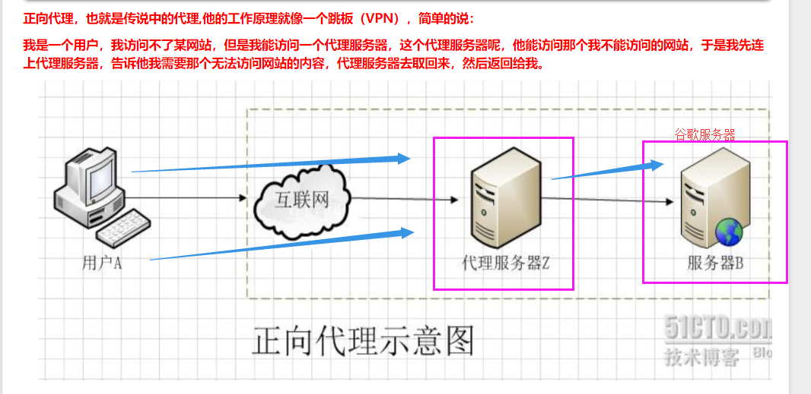
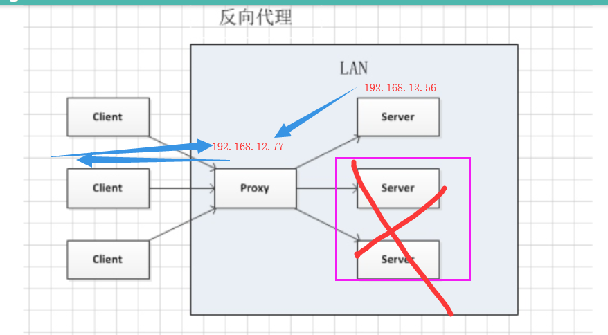

## nginx入门

```
systemctl restart network
```

```
保存，重新加载 systemd
systemctl daemon-reload

which 命令
echo $PATH
source /etc/profile	
```


### 1. 常用的WEB框架有哪些:

django  重量级别的框架，功能大而全, form表单，ORM， 内置的模块非常多   600-2000req/s

flask  轻量级的框架, 从第三方引入过来的   2500req/s

tornado(没学过)   异步非阻塞  支持多用户并发访问3000req/s

sanic  是python3.5之后的一个框架,  20000req/s


我们的WEB框架是用来处理用户请求，获取数据并返回给用户查看

在上面开发应用程序用的


### 2. web服务器

是用来对外提供服务的, www服务

IIS

apache  非常普通的WEB服务器 对高并发没有太大的支持

#### nginx  开源的，支持高并发，高性能的服务器

tengine   淘宝自己的nginx服务器，其实它的配置和nginx一样


面试回答nginx技巧

```
支持高并发，能支持几万并发连接
资源消耗少，在3万并发连接下开启10个nginx线程消耗的内存不到200M
可以做http反向代理和负载均衡
支持异步网络i/o事件模型epoll
```


linux下测试访问网站命令

```
curl -i 域名   # 访问网站并返回网站内容(源代码)
curl -I 域名   # 返回网站的服务器信息
```


### 3. nginx编译安装

1  安装所需要的依赖库

```
yum install -y gcc patch libffi-devel python-devel zlib-devel bzip2-devel openssl openssl-devel ncurses-devel sqlite-devel readline-devel tk-devel gdbm-devel db4-devel libpcap-devel xz-devel
```

2  下载nginx安装源码包
wget -c https://nginx.org/download/nginx-1.12.0.tar.gz

3.解压缩源码
tar -zxvf nginx-1.12.0.tar.gz

4.配置，编译安装

cd nginx-1.12.0

./configure --prefix=/opt/nginx112

```
make && make install 
```

5.启动nginx，进入sbin目录,找到nginx启动命令

```
cd /opt/nginx112/sbin
./nginx #启动
./nginx -s stop #关闭
./nginx -s reload # 平滑重启 ，修改了nginx.conf之后，可以不重启服务，加载新的配置
或者  /opt/nginx112/sbin/nginx -s reload  # 绝对路径平滑重启
```

6  nginx的目录结构


7 nginx配置文件详解


```python
#定义nginx工作进程数
worker_processes  5;
#错误日志
#error_log  logs/error.log;
#http定义代码主区域
http {
    include       mime.types;
    default_type  application/octet-stream;
    #定义nginx的访问日志功能
    #nginx会有一个accses.log功能，查看用户访问的记录
    log_format  main  '$remote_addr - $remote_user [$time_local] "$request" '
                      '$status $body_bytes_sent "$http_referer" '
                      '"$http_user_agent" "$http_x_forwarded_for"';

    #开启日志功能
    access_log  logs/access.log  main;
    sendfile        on;
    keepalive_timeout  65;
    #开启gzip压缩传输
    gzip  on;
    #虚拟主机1  定义一个 斗鱼网站 
    server {
        #定义nginx的访问入口端口，访问地址是  192.168.11.37:80
        listen       80;
        #定义网站的域名www.woshidouyu.tv
        #如果没有域名，就填写服务器的ip地址  192.168.11.37
        server_name  www.woshidouyu.tv;
        #nginx的url域名匹配
        #只要请求来自于www.woshidouyu.tv/111111111
        #只要请求来自于www.woshidouyu.tv/qweqwewqe
        #最低级的匹配，只要来自于www.woshidouyu.tv这个域名，都会走到这个location
        location / {
            #这个root参数，也是关键字，定义网页的根目录
            #以nginx安装的目录为相对路径  /opt/nginx112/html 
            #可以自由修改这个root定义的网页根目录
            root   html;
            #index参数定义网站的首页文件名，默认的文件名
            index  index.html index.htm;
        }
        #错误页面的优化(只要是遇到前面4系列的错误，就会直接跳转到相对目录下的40x.html页面)
        error_page  400 401  402  403  404   /40x.html;
    }
}
```

8  跑一个斗鱼网站出来

```
    server {
        listen       80;
        server_name  www.qishi2douyu.com;
        #access_log  logs/host.access.log  main;
        location / {
            root   /opt/qishi2douyu/;
            index  index.html index.htm;
        }

        #error_page  404              /404.html;
        error_page   500 502 503 504  /50x.html;
        location = /50x.html {
            root   html;
        }
    }

```


### 4. nginx多虚拟主机的配置

1  在192.168.12.56服务器上，跑3个网站出来

 www.qishi2douyu.com

www.qishi2huya.com

www.qishi2jd.com

配置文件如下:

```python
server {
        listen       80;
        server_name  www.qishi2douyu.com;
        #access_log  logs/host.access.log  main;
        location / {
            root   /opt/qishi2douyu/;
            index  index.html index.htm;
        }

        #error_page  404              /404.html;
        error_page   500 502 503 504  /50x.html;
        location = /50x.html {
            root   html;
        }
    }
    server {
        listen 80;
        server_name www.qishi2huya.com;
        location / {
            root   /opt/qishi2huya/;
            index  index.html index.htm;
        }

    }
    server {
        listen 80;
        server_name www.qishi2jd.com;
        location / {
            root   /opt/qishi2jd/;
            index  index.html index.htm;
        }

    }

```


2  分别在/opt目录下创建qishi2douyu、qishi2huya、qishi2jd这三个目录

分别在目录下创建index.html

3   平滑重启nginx

```
/opt/nginx112/sbin/nginx -s reload
```


nginx错误页面优化

1 修改配置文件

```
vim /opt/nginx112/conf/nginx.conf
在www.qishi2douyu.com虚拟主机下添加以下内容(server代码块下)

error_page  400 401 402 403 404   /40x.html;
        location = /40x.html {
            root /opt/qishi2douyu/;
        }

```

2  在/opt/qishi2douyu/目录下创建40x.html, 把淘宝的错误页面源代码拷贝过来

```
vim 40x.html
```

3 平滑重启nginx

4 随便访问一个不存在的页面

```
http://www.qishi2douyu.com/sladfj243
```

5 就可以看到我们配置的错误页面


### 5. nginx访问日志功能

1  打开nginx配置文件nginx.conf

```
vim /opt/nginx112/conf/nginx.conf
```

2  修改配置文件, 启用日志功能

```
log_format  main  '$remote_addr - $remote_user [$time_local] "$request" '
                      '$status $body_bytes_sent "$http_referer" '
                      '"$http_user_agent" "$http_x_forwarded_for"';

    access_log  logs/access.log  main;
```


3  平滑重启nginx

```
tail -f/opt/nginx112/logs/access.log
```


4  浏览器访问192.168.12.56


### 6. nginx限制IP访问


## 7. nginx代理功能

生活中的代理:

要想去租房:

租客 —> 中介  —>房东

代购, 海淘


#### 正向代理




反向代理


### nginx反向代理

1 准备两台机器

```
192.168.12.56   # 内部的django服务器
192.168.12.77   # 代理服务器
```

```
请求数据: windows   ——>   192.168.12.77   ——>   192.168.12.56
返回数据: windows   <——   192.168.12.77   <——   192.168.12.56
```




2  修改代理服务器192.168.12.77的配置文件

```
vim /opt/nginx112/conf/nginx.conf
```


## 8. nginx负载均衡


#### nginx负载均衡配置

1 准备三台机器

```
1. nginx负载均衡器(192.168.12.77)
2  另外两台应用服务器(192.168.12.56 +  192.168.12.65)
```


2  先确保两台应用服务器能够正常访问

```
http://192.168.12.56
http://192.168.12.65:8001
```

3  配置负载均衡器(192.168.12.77)

```
修改配置文件
vim /opt/nginx112/conf/nginx.conf
```

```

worker_processes  1;

#error_log  logs/error.log;
events {
    worker_connections  1024;
}
http {
    include       mime.types;
    default_type  application/octet-stream;

    #log_format  main  '$remote_addr - $remote_user [$time_local] "$request" '
    #                  '$status $body_bytes_sent "$http_referer" '
    #                  '"$http_user_agent" "$http_x_forwarded_for"';

    #access_log  logs/access.log  main;
    sendfile        on;
    keepalive_timeout  65;
    #gzip  on;

    upstream qishi2_xiaowei {
       server 192.168.12.56;
       server 192.168.12.65 weight=5;
    }

    server {
        listen       80;
        server_name  www.qs.com;
        location / {
            root   html;
            index  index.html index.htm;
            proxy_pass http://qishi2_xiaowei;
        }

        #error_page  404              /404.html;
        error_page   500 502 503 504  /50x.html;
        location = /50x.html {
            root   html;
        }
    }
}

```


### 今天的实验任务

1 编译安装nginx， 跑三个虚拟主机出来

```
注意，先把yum安装的nginx卸载掉
yum remove nginx

再跑三个虚拟主机
www.qishi21.com
www.qishi22.com
www.qishi23.com
三个虚拟主机能够正常访问
```

2  配置nginx反向代理

3  配置nginx负载均衡


