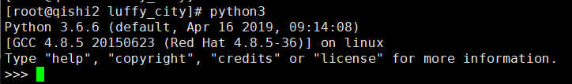
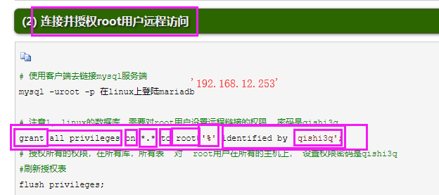
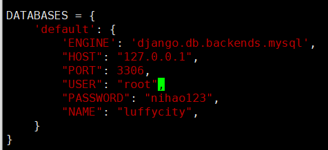
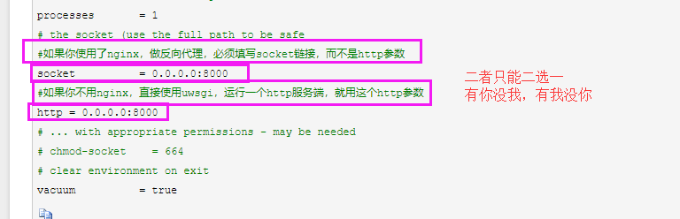
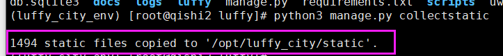
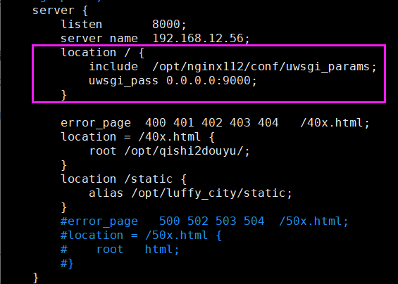
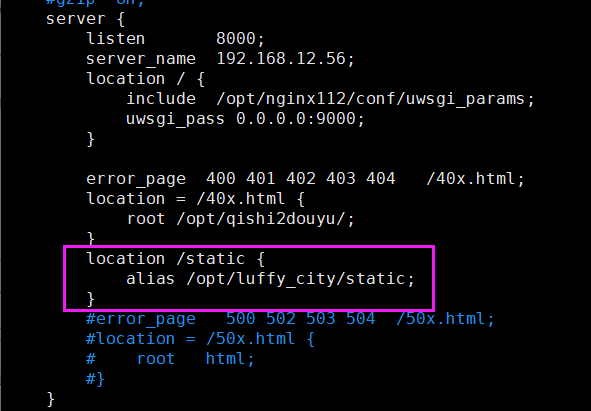
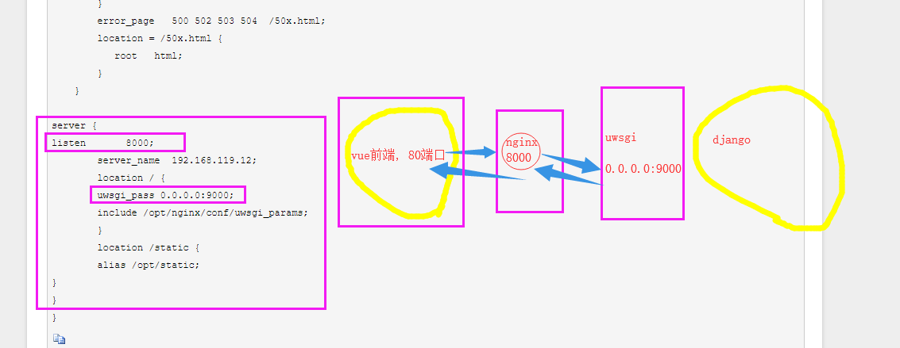
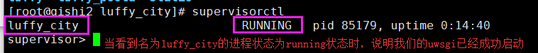

# 部署路飞学城


### 1 熟悉linux操作
### 2 上传路飞学城项目到linux服务器

​	xftp上传到服务器

​	lrzsz工具


### 3 完成python3解释器的安装

在linux命令行模式下， 输入python3，能够正常进入python3的解释器



### 4 完成virtualenvwrapper工具的配置，解决虚拟环境问题

​	1 安装虚拟环境virtualenv

​        2 安装virtualenvwrapper工具

​	3 确认virtualenvwrapper.sh脚本正常使用

​        4 确认用户环境变量配置文件(~/.bash_profile)，有virtualenvwrapper.sh的四行配置

```
vim ~/.bash_profile

WORKON_HOME=~/Envs
VIRTUALENVWRAPPER_VIRTUALENV_ARGS='--no-site-packages'
VIRTUALENVWRAPPER_PYTHON=/opt/python36/bin/python3
source /opt/python36/bin/virtualenvwrapper.sh
```

​	5  创建路飞学城专用虚拟环境luffy_city_env

```
mkvirtualenv luffy_city_env
```

​	6  上传requirements.txt

​	7  安装路飞学城项目所需要的所有模块


```
pip freeze > requirements.txt # 打包所有软件
pip install -i https://pypi.douban.com/simple -r requirements.txt # 下载所有包
pip install https://codeload.github.com/sshwsfc/xadmin/zip/django2
```


### 5 完成centos7下安装配置mariadb数据库，且创建数据库数据，迁移导入路飞学城数据
​     #centos7底下，mariadb就是mysql数据库，只是包名的不同
​     #启动mariadb服务端
​     #使用客户端去链接mysql服务端

#### 1 导出数据库数据

```
有两种方法
第一种:
mysqldump -u root -p --all-databases >  luffy_city.sql
第二种:
直接从navicat导出数据库的数据
   (1) 先从navicat导出数据库数据，导出为luffycity.sql
   (2) 将luffycity.sql上传到服务器的/opt目录下
   (3) 在服务器上进入mysql,然后创建数据库luffycity
   (4) 进入数据库luffycity
   (5) 使用命令source luffycity.sql导入luffycity.sql数据
        source /opt/luffycity.sql 
   (6) 使用show tables命令查看数据是否成功导入
```

#### 2 使用mysql -uroot -p 在linux上登陆mariadb

#### 3 刷新授权表 
出路飞学城项目的数据库, 允许root用户远程登录



```
# 允许root用户远程登录，并且给予所有数据库所有表的所有权限
grant all privileges on *.* to root@'%' identified by '123';
flush privileges;
```

#### 4 上传这个数据文件到linux数据库中
linux的mysql，导入这个数据文件

```
(1) 进入mysql
	mysql -u root -p
(2) 进入数据库
	use luffycity
(3) 导入数据
	source /opt/luffycity.sql
```

##### 注意1，linux的数据库，需要对root用户设置远程链接的权限, 密码是123
##### 注意2，SELinux和linux的防火墙要给关闭，否则windows去链接linux的3306端口可能被拒绝

```
getenforce
编辑selinux配置文件
vim /etc/selinux/config
将SELINUX=enforcing改为SELINUX=disabled
保存退出

linux防火墙
iptables -L  # 查看系统防火墙规则
iptables -F  # 清空所有防火墙规则

systemctl stop firewalld  # 停止防火墙
systemctl status firewalld # 查看防火墙运行状态
systemctl start firewalld  # 启动
systemctl disable firewalld  # 永久关闭防火墙
```


##### 注意3: 第4步一定要确认OK之后才能继续往下操作


### 6 测试使用linux的python解释器去运行项目 切换到 项目中运行(注意要解决解释器的模块问题，才能正常运转项目)

(1) 先修改路飞学城项目的settings.py文件

```
ALLOW_HOSTS=["*"]
数据库连接配置
注意: mariadb就是mysql,这里的ENGINE不用修改
DATABASES = {
    'default': {
        'ENGINE': 'django.db.backends.mysql',
        "HOST": "127.0.0.1",
        "PORT": 3306,
        "USER": "root",
        "PASSWORD": "nihao123",
        "NAME": "luffycity",
    }
}

```



(2) 使用命令把django跑起来

```
python3 manage.py runserver 0.0.0.0:8000
```


### 7 完成uWSGI命令学习，使用uWSGI启动路飞学城，支持多进程

#### 1  安装uwsgi

```
(1) 进入luffy_city_env虚拟环境
	workon luffy_city_env
(2) 安装uwsgi
    pip3 install uwsgi
```

#### 2 uwsgi 启动测试文件

```
(1) 创建一个testqishi2.py
(2) 写入以下几行代码
def application(env, start_response):
    start_response('200 OK', [('Content-Type','text/html')])
    return [b"Hello World"] # python3
(3) 通过uwsgi命令将测试文件跑起来
uwsgi --http :9000 --wsgi-file testqishi2.py
(4) 测试通过IP+端口访问
http://192.168.12.56:9000

```

##### 3 uwsgi启动django项目

```
uwsgi --http :9000 --module luffy.wsgi
```

##### 4 uwsgi热加载启 动

##### 注意:  以后面试可能会问到, uwsgi是否支持热加载启动

##### 注意:  以后面试可能会问到, uwsgi是否支持热加载启动

##### 注意:  以后面试可能会问到, uwsgi是否支持热加载启动

```
uwsgi --http :9000 --module luffy_h.wsgi --py-autoreload=1
```

##### 5 使用uwsgi配置文件启动django项目 

```
(1) 创建一个配置文件uwsgi.ini(注意，这个配置文件不管放在哪里都可以，但是启动的时候，需要找到这个配置文件)
(2) 写入以下配置
[uwsgi]

chdir           = /opt/luffy_city/luffy
module          = luffy.wsgi
home            = /root/Envs/luffy_city_env
master          = true
processes       = 1
socket          = 0.0.0.0:8000
http            = 0.0.0.0:8000
vacuum          = true

(3) 通过指定uwsgi.ini配置文件把django跑起来
uwsgi uwsgi.ini
```

##### 6 uwsgi.ini配置详解

```
[uwsgi]
# Django-related settings
# the base directory (full path)
# 写上项目的绝对路径
chdir           = /opt/Luffy_M/luffy_h
# Django's wsgi file
# 填写找到django的wsgi文件，填写相对路径，以chdir参数为相对路径
module          = luffy_h.wsgi
# the virtualenv (full path)
# 填写虚拟环境的绝对路径
home            = /root/Envs/luffy_city_env
# process-related settings
# master
#启动uwsgi主进程
master          = true
# maximum number of worker processes
processes       = 1
# the socket (use the full path to be safe
#如果你使用了nginx，做反向代理，必须填写socket链接，而不是http参数
socket          = 0.0.0.0:8000
#如果你不用nginx，直接使用uwsgi，运行一个http服务端，就用这个http参数
http = 0.0.0.0:8000
# ... with appropriate permissions - may be needed
# chmod-socket    = 664
# clear environment on exit
vacuum          = true
```

#### 注意:  socket和http参数二选一，一定要注意!!!!!!!!!!!!!!!!!!

#### 注意:  socket和http参数二选一，一定要注意!!!!!!!!!!!!!!!!!!

#### 注意:  socket和http参数二选一，一定要注意!!!!!!!!!!!!!!!!!!



由于uwsgi 不支持处理静态文件，所以，我们需要配置nginx与uwsgi结合，通过nginx来处理静态文件

### 8 完成nginx的安装配置，了解nginx.conf如何配置

##### 1 收集静态文件

(1)  修改settings.py配置文件， 加入以下一行配置

```
STATIC_ROOT='/opt/luffy_city/static'
```

(2)  创建静态文件存放目录/opt/luffy_city/static

```
mkdir -p /opt/luffy_city/static
```

(3)  一条命令收集django项目下面的所有静态文件

```
python3 manage.py collectstatic
```



看到这个信息说明已经成功收集


##### 2 配置nginx结合uwsgi进行转发

（1）在nginx.conf配置文件下添加以下配置文件

```
location / {
            include  /opt/nginx112/conf/uwsgi_params;
            uwsgi_pass 0.0.0.0:9000;
        }
```



(2) 将uwsgi.ini配置文件里面的http注释掉，启用socket

```
socket          = 0.0.0.0:9000   # 启用此行
# http            = 0.0.0.0:9000  # 停用此行
```

(3) 在nginx.conf中添加静态文件地址

```
location /static {
            alias /opt/luffy_city/static;
        }

```



(4)  平滑重启nginx

/opt/nginx112/sbin/nginx -s reload

(5)  在物理机上添加hosts

```
192.168.12.56    www.qishi2.com
```

### 9 验证所有流程是否正常

1  验证域名是否正常访问

2  验证静态文件是否正常显示

3  验证数据库是否连接正常

4 验证redis数据库是否连接正常

5  验证uwsgi是否正常启动


### 10 安装node , 配置vue前端

(1)  下载安装node软件包

```
wget https://nodejs.org/download/release/v8.6.0/node-v8.6.0-linux-x64.tar.gz
```

(2) 解压缩

```
tar -zxvf node-v8.6.0-linux-x64.tar.gz
```

(3) 添加环境变量

```
vim /etc/profile
PATH=/opt/node-v8.6.0-linux-x64/bin:/opt/python36/bin:/usr/local/sbin:/usr/local/bin:/usr/sbin:/usr/bin:/root/bin
```

(4)  将vue项目里面的所有127.0.0.1和所有的localhost全部改为我们的服务器地址192.168.12.56

##### 注意:   此步非常重要, 讲师机上面的vue项目里面，这个IP没有创建全局变量，导致127.0.0.1和localhost分布在很多个文件中，所以需要一个一个替换

(5) 进入到vue前端的项目目录, 使用npm run build生成dist项目静态文件

```
cd /opt/luffy_city/luffy_pc

npm run build
```

(6) 在luffy_pc目录下就可以看到dist文件夹

```
/opt/luffy_city/luffy_pc/dist
```




### 11 supervisor守护进程工具

1  安装supervisor

**由于supervisor在python3下无法使用，因此只能用python2去下载！！！！！！**

**由于supervisor在python3下无法使用，因此只能用python2去下载！！！！！！**

**由于supervisor在python3下无法使用，因此只能用python2去下载！！！！！！**

```
# 注意此时已经退出虚拟环境了！！！！！
easy_install supervisor

# 如果没有easy_install的话，就yum安装一个setuptools工具就可以用了
yum install python-setuptools
```

2  生成supervisord配置文件

```
echo_supervisord_conf > /etc/supervisord.conf
```

3  在/etc/supervisord.conf下添加以下两行配置

```
[program:luffy_city]
command=/root/Envs/luffy_city_env/bin/uwsgi /opt/luffy_city/luffy/uwsgi.ini

```

4  启动supervisor

```
supervisord -c /etc/supervisord.conf # 启动supervisor
supervisorctl -c /etc/supervisord.conf # 启动和进入supervisor交互模式
```

5 查看supervisor运行状态

```
supervisorctl  # 使用此命令后将会进入supervisor交互式管理界面
status  # 查看进程运行状态
```



6  管理supervisor里面的进程

```
stop luffy_city    # 关闭luffy_city进程
stop all           # 关闭所有进程
start luffy_city   # 开启luffy_city进程
start all          # 开启所有进程
status             # 查看所有进程运行状态

supervisorctl status  # 可以不用进入交互模式查看
```


### 12 最终效果

访问nginx的80端口，即可找到路飞学城应用，且保证静态文件页面正常


