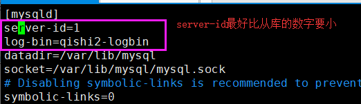
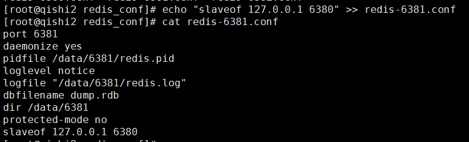

# 一. MariaDB主从复制


### mysql基本操作

1 连接数据库

```
mysql -u root -p -h 127.0.0.1
mysql -u root -p -h 192.168.12.56
```

2  授予远程连接的权限

```
grant all privileges on *.* to root@"%" identified by "nihao123"
```

3  修改root用户的密码

```
先进入mysql的交互式
模式
set password = PASSWORD('redhat123');
```

4  创建mysql用户

```
create user liulaoshi@"%" identified by "lls666"
```

5 给予刘老师查询所有库和所有表的权限

```
grant select on *.* to liulaoshi@"%" identified by "lls666"
```

6.查询mysql库中的用户信息

```
use mysql;
select host,user,password from  user;
```

7.再给刘老师创建所有库和所有表的权限, 再给修改权限，再加上删除权限

```
grant create on *.* to liulaoshi@"%" identified by "lls666"
grant update on *.* to liulaoshi@"%" identified by "lls666"
grant delete on *.* to liulaoshi@"%" identified by "lls666"
```

8  授予mysql权限的语法

```
mysql使用grant命令对账户进行授权，grant命令常见格式如下

grant 权限 on 数据库.表名 to 账户@主机名            对特定数据库中的特定表授权
grant 权限 on 数据库.* to 账户@主机名            　　对特定数据库中的所有表给与授权
grant 权限1,权限2,权限3 on *.* to 账户@主机名   　　 对所有库中的所有表给与多个授权
grant all privileges on *.* to 账户@主机名   　　 对所有库和所有表授权所有权限
```

9  移除刘老师的创建权限

```
revoke create on *.* from xiaochun@"%" identified by 'lls666';
revoke delete on *.* from xiaochun@"%" identified by 'lls666;
revoke all on *.* from hui@"%";

```

10.数据库的备份与恢复
#备份

```
mysqldump -u root -p --all-databases > /tmp/db.sql
```

备份单个数据库

```
mysqldump -u root -p luffycity > /tmp/luffycity.sql
```

#数据导入，方式有3种

第一种方法:

```
进入mysql交互模式
source /tmp/luffycity.sql;
```

第二种方法

```
mysql -u root -p < /tmp/luffycity.sql
```

第三种方法

navicat


### mariadb主从复制


#### mysql主从复制部署

1  准备两台机器

```
192.168.12.56   # 主服务器master(可读可写)
192.168.12.77   # 从服务器slave(可读)
实际工作中数据库读取操作比较多，由于从服务器是读，所以从服务器的配置要强悍一些
```

2  两台机器上分别安装mariadb数据库

```
192.168.12.56
用户名: root
密码: nihao123

192.168.12.77
用户名: root
密码: liulaoshi
```

### 配置主数据库

3  在主数据库(192.168.12.56)上操作

```
停mariadb
systemctl stop mariadb
```

4  修改主数据库的配置文件

```
vim /etc/my.cnf
添加以下内容
[mysqld]   # 如果配置文件里面有这一行，就只需要加以下两行配置就可以了
server-id=1
log-bin=qishi2-logbin
```



5  重启主数据库

```
systemctl restart mariadb
```

6  创建主从复制用户账号

```
create user 'qihang'@'%' identified by 'qh666';
```

7 给从库账号授权,说明给tiger从库复制的权限，在10.0.0.8机器上复制

```
grant replication slave on *.* to 'qihang'@'%';
```

8 实现对主数据库锁表只读，防止数据写入，数据复制失败

```
flush table with read lock;
```

9  查看并记录主数据库的状态

```
show master status;
```


10 确认主数据库是否已经成功锁表


11 导出主数据库的数据为alldb.sql

```
mysqldump -u root -p --all-databases > /opt/alldb.sql
```

12 把这个数据库文件拷贝到从数据库的/opt目录下

```
scp /opt/alldb.sql 192.168.12.77:/opt/
```


### 配置从数据库

13 停止从数据库服务

```
systemctl stop mariadb
```

14 修改从数据库的配置文件

```
vim /etc/my.cnf
添加以下配置
[mysqld]
server-id=5
read-only=true
```


15 启动从数据库服务

```
systemctl start mariadb
```

16 在从 库上导入主数据库数据

```
mysql -u root -p 
source /opt/alldb.sql
```

17  现在，主从两台数据库的数据就完全一致

18 配置复制的参数，Slave从库连接Master主库的配置(最重要的一步)

```
change master to master_host='192.168.220.128',
master_user='hui',
master_password='123',
master_log_file='hui-logbin.000001',
master_log_pos=360;
```

19  启动从库的同步开关，测试主从复制的情况

```
start slave
```

20 查看从库的状态

```
show slave status\G;
```


###　在主库上操作

21  导出数据完毕，并配置好从库开启主从同步后，再解锁主库，恢复可写；

```
unlock tables;
```

22 验证主从复制情况

```
在主库上创建数据，查看从库数据同步状态
```

23 在主库上给予qihang用户select的权限, 并刷新授权表

```
grant select on *.* to qihang@"%" identified by "qh666";
flush privileges;
```

24  在从库上登录qihang用户, 并尝试创建一个库

```
create database aaaa;

ERROR 1290 (HY000): The MariaDB server is running with the --read-only option so it cannot execute this statement
```

25 验证主从读写分离状态


26 从库上提示read-only表示主从同步读写分离已经成功完成


# 二. redis发布订阅和持久化

redis发布订阅

发布者

```
publish xinwen 66nouyou
```

订阅者

```
sub
```


### redis 持久化

redis是一个内存型的数据库

断电数据会消失

重启服务数据会消失

重启服务器数据会消失


mysql的数据存在硬盘中，但是数据是存在哪个路径下呢?

```
/var/lib/mysql
```

#### redis持久化之 RDB


RDB持久化配置:

1  创建redis配置文件

```
vim /opt/redis_conf/reids-6379.conf
```

写入以下配置

```
port 6379
daemonize yes
dir /data/6379
pidfile /data/6379/redis.pid
loglevel notice
logfile "/data/6379/redis.log"
protected-mode yes
dbfilename  dbmp.rdb
save 900 1
save 300 10
save 60 10000
```


2  进入redis 数据库，创建几条数据，并使用save命令开启rdb持久化

```
redis-cli

set name liujie
set age 18
set sex nam

save   # 开启rdb持久化, 也可以不用
```


#### redis AOF持久化

1  修改reids配置文件

```
vim /opt/redis_conf/redis-6379.con
```

加入以下两行配置

```
appendonly yes
appendfsync everysec
```

保存退出

2  重启redis服务

```
pkill reids
redis-server /opt/redis_conf/redis-6379.conf
```

3  验证appendonly.aof文件里面的数据和redis里面的数据是否健在


#### redis不重启，从RDB切换到AOF

1  配置RDB持久化，确保没有AOF的配置

```
daemonize yes
port 6379
logfile /data/6379/redis.log
dir /data/6379
dbfilename  dbmp.rdb
save 900 1                    #rdb机制 每900秒 有1个修改记录
save 300 10                    #每300秒        10个修改记录
save 60  10000                #每60秒内        10000修改记录
```


2启动redis服务端

```
redis-server redis.conf
```

3 登录redis-cli插入数据，手动持久化

```
127.0.0.1:6379> set name tiger
OK
127.0.0.1:6379> set age 18
OK
127.0.0.1:6379> set addr daxuecheng
OK
127.0.0.1:6379> save
OK
```

4  检查RDB文件


5  备份RDB文件


6  执行命令，开启AOF持久化

```
CONFIG set appendonly yes   # 开启AOF功能

CONFIG SET save ""          # 关闭RDB功能
```


7  验证旧的RDB数据库数据是否转入AOF， 以及AOF持久化文件是否正常写入


# 三. redis主从同步

1  准备三个redis配置文件

```
cd /opt/redis_conf

redis-6380.conf   # 主数据库master
redis-6381.conf   # 从库slave
redis-6382.conf   # 从库slave
```

2 写入以下配置

```
port 6380
daemonize yes
pidfile /data/6380/redis.pid
loglevel notice
logfile "/data/6380/redis.log"
dbfilename dump.rdb
dir /data/6380
protected-mode no
```

3  目前这三个配置文件配置一样，只是端口的不同

```
可以使用这一条命令通过redis-6380.conf生成6381和6382的配置文件
sed "s/6380/6381/g" redis-6380.conf > redis-6381.conf
sed "s/6380/6382/g" redis-6380.conf > redis-6382.conf
```

4  在6381和6382下添加以下配置，使之成为从数据库

```
slaveof 127.0.0.1 6380
```

可以使用以下一行命令直接追加写入到配置文件中

```
echo "slaveof 127.0.0.1 6380" >> redis-6381.conf
```




5  确认三个配置文件无误

6  开启这三个redis服务，确保三个服务启动正常


7  查看redis主从数据库的状态

```
redis-cli -p 6380 info replication
redis-cli -p 6381 info replication
redis-cli -p 6382 info replication
```


8  验证redis主从复制情况

（1）先验证三个数据库是否能正常连接


(2)  在6380上面写入数据，查看6381和6382是否能够正常同步


9 手动进行主从复制故障切换

（1） 杀掉6380的进程，模拟主库故障

```
kill -9 进程ID
```

（2）在6381和6382上手动指定一个主库（我现在指定6382为主库）

(3) 在6382的redis上执行这一行命令

```
slaveof no one
```


(4)  在6381上执行以下命令，将原来的指向6380改为指向6382

原来的配置指向:


执行命令:

```
slaveof no one
slaveof 127.0.0.1 6382
```

(5) 验证新的主从架构状态

在6382上查看主从信息


再到6381上面查看主从信息


(6) 验证新的主从架构是否可以正常写入数据，同步数据

如果可以，说明主从正常


## 今天的实验练习：

##### 1  完成Maridb的主从复制

##### 2  redis持久化RDB和AOF

##### 3 redis不重启，从RDB切换到AOF

##### 4  redis的主从同步 