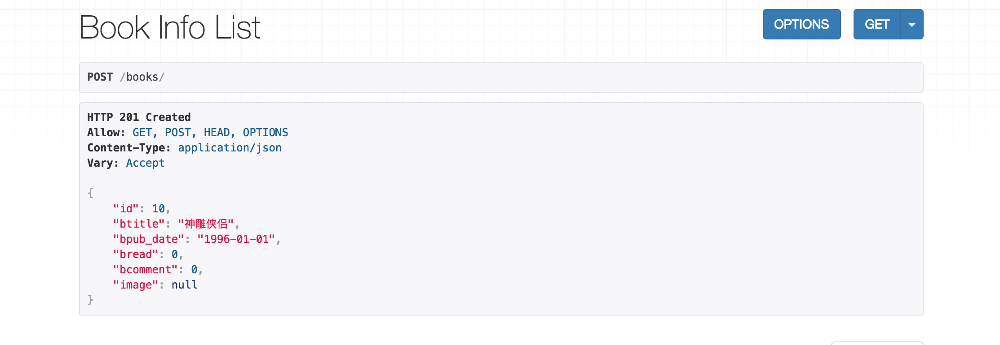
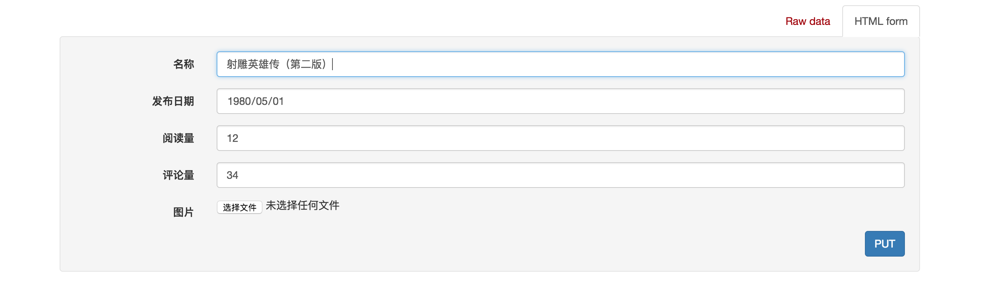
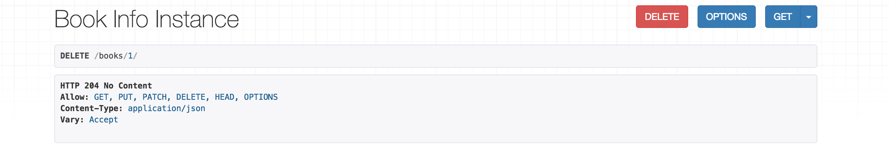

# 1. Web应用模式

在开发Web应用中，有两种应用模式：

1. 前后端不分离


2. 前后端分离


# 2. api接口

为了在团队内部形成共识、防止个人习惯差异引起的混乱，我们需要找到一种大家都觉得很好的接口实现规范，而且这种规范能够让后端写的接口，用途一目了然，减少双方之间的合作成本。

目前市面上大部分公司开发人员使用的接口服务架构主要有：restful、rpc。


rpc: 翻译成中文:远程过程调用[远程服务调用].

http://www.lufei.com/api

post请求

action=get_all_student&params=301&sex=1


接口多了,对应函数名和参数就多了,前端在请求api接口时,就会比较难找.容易出现重复的接口


restful: 翻译成中文: 资源状态转换.

把后端所有的数据/文件都看成资源. 

那么接口请求数据,本质上来说就是对资源的操作了.

web项目中操作资源,无非就是增删查改.所以要求在地址栏中声明要操作的资源是什么,然后通过http请求动词来说明对资源进行哪一种操作.

POST http://www.lufei.com/api/students/   添加数据

GET    http://www.lufei.com/api/students/   获取所有学生


# 3. RESTful API规范


REST全称是Representational State Transfer，中文意思是表述（编者注：通常译为表征）性状态转移。 它首次出现在2000年Roy Fielding的博士论文中。

RESTful是一种定义Web API接口的设计风格，尤其适用于前后端分离的应用模式中。

这种风格的理念认为后端开发任务就是提供数据的，对外提供的是数据资源的访问接口，所以在定义接口时，客户端访问的URL路径就表示这种要操作的数据资源。

而对于数据资源分别使用POST、DELETE、GET、UPDATE等请求动作来表达对数据的增删查改。

| 请求方法 | 请求地址    | 后端操作          |
| -------- | ----------- | ----------------- |
| GET      | /students   | 获取所有学生      |
| POST     | /students   | 增加学生          |
| GET      | /students/1 | 获取编号为1的学生 |
| PUT      | /students/1 | 修改编号为1的学生 |
| DELETE   | /students/1 | 删除编号为1的学生 |


事实上，我们可以使用任何一个框架都可以实现符合restful规范的API接口。

参考文档：http://www.runoob.com/w3cnote/restful-architecture.html


# 4. 序列化

api接口开发，最核心最常见的一个过程就是序列化，所谓序列化就是把**数据转换格式**，序列化可以分两个阶段：

**序列化**： 把我们识别的数据转换成指定的格式提供给别人。

例如：我们在django中获取到的数据默认是模型对象，但是模型对象数据无法直接提供给前端或别的平台使用，所以我们需要把数据进行序列化，变成字符串或者json数据，提供给别人。

**反序列化**：把别人提供的数据转换/还原成我们需要的格式。

例如：前端js提供过来的json数据，对于python而言就是字符串，我们需要进行反序列化换成模型类对象，这样我们才能把数据保存到数据库中。


# 5. Django Rest_Framework

核心思想: 缩减编写api接口的代码

Django REST framework是一个建立在Django基础之上的Web 应用开发框架，可以快速的开发REST API接口应用。在REST framework中，提供了序列化器Serialzier的定义，可以帮助我们简化序列化与反序列化的过程，不仅如此，还提供丰富的类视图、扩展类、视图集来简化视图的编写工作。REST framework还提供了认证、权限、限流、过滤、分页、接口文档等功能支持。REST framework提供了一个API 的Web可视化界面来方便查看测试接口。


中文文档：https://q1mi.github.io/Django-REST-framework-documentation/#django-rest-framework

github: https://github.com/encode/django-rest-framework/tree/master

### 特点

- 提供了定义序列化器Serializer的方法，可以快速根据 Django ORM 或者其它库自动序列化/反序列化；
- 提供了丰富的类视图、Mixin扩展类，简化视图的编写；
- 丰富的定制层级：函数视图、类视图、视图集合到自动生成 API，满足各种需要；
- 多种身份认证和权限认证方式的支持；[jwt]
- 内置了限流系统；
- 直观的 API web 界面；
- 可扩展性，插件丰富


# 6. 环境安装与配置

DRF需要以下依赖：

- Python (2.7, 3.2, 3.3, 3.4, 3.5, 3.6)
- Django (1.10, 1.11, 2.0)

**DRF是以Django扩展应用的方式提供的，所以我们可以直接利用已有的Django环境而无需从新创建。（若没有Django环境，需要先创建环境安装Django）**


## 6.1 安装DRF

```python
pip install djangorestframework
```


## 6.2 添加rest_framework应用

在**settings.py**的**INSTALLED_APPS**中添加'rest_framework'。

```python
INSTALLED_APPS = [
    ...
    'rest_framework',
]
```

接下来就可以使用DRF进行开发了。在项目中如果使用rest_framework框架实现API接口，主要有以下三个步骤：

- 将请求的数据（如JSON格式）转换为模型类对象
- 操作数据库
- 将模型类对象转换为响应的数据（如JSON格式）


## 1. 创建序列化器

在booktest应用目录中新建serializers.py用于保存该应用的序列化器。

创建一个BookInfoSerializer用于序列化与反序列化。

```python
class BookInfoSerializer(serializers.ModelSerializer):
    """图书数据序列化器"""
    class Meta:
        model = BookInfo
        fields = '__all__'
```

- **model** 指明该序列化器处理的数据字段从模型类BookInfo参考生成
- **fields** 指明该序列化器包含模型类中的哪些字段，'__all__'指明包含所有字段

## 2. 编写视图

在booktest应用的views.py中创建视图BookInfoViewSet，这是一个视图集合。

```python
from rest_framework.viewsets import ModelViewSet
from .serializers import BookInfoSerializer
from .models import BookInfo

class BookInfoViewSet(ModelViewSet):
    queryset = BookInfo.objects.all()
    serializer_class = BookInfoSerializer	
```

- **queryset** 指明该视图集在查询数据时使用的查询集
- **serializer_class** 指明该视图在进行序列化或反序列化时使用的序列化器

## 3. 定义路由

在booktest应用的urls.py中定义路由信息。

```python
from . import views
from rest_framework.routers import DefaultRouter

urlpatterns = [
    ...
]

router = DefaultRouter()  # 可以处理视图的路由器
router.register(r'books', views.BookInfoViewSet)  # 向路由器中注册视图集

urlpatterns += router.urls  # 将路由器中的所以路由信息追到到django的路由列表中
```

## 4. 运行测试

运行当前程序（与运行Django一样）

```shell
python manage.py runserver
```

在浏览器中输入网址127.0.0.1:8000，可以看到DRF提供的API Web浏览页面：


1）点击链接127.0.0.1:8000/books/ 可以访问**获取所有数据的接口**，呈现如下页面：


2）在页面底下表单部分填写图书信息，可以访问**添加新图书的接口**，保存新书：


点击POST后，返回如下页面信息：



3）在浏览器中输入网址127.0.0.1:8000/books/1/，可以访问**获取单一图书信息的接口**（id为1的图书），呈现如下页面：


4）在页面底部表单中填写图书信息，可以访问**修改图书的接口**：



点击PUT，返回如下页面信息：


5）点击DELETE按钮，可以访问**删除图书的接口**：


返回，如下页面：




# 7. 序列化器-Serializer

作用：

    1. 序列化,序列化器会把模型对象转换成字典,经过response以后变成json字符串
    2. 完成数据校验功能
    3. 反序列化,把客户端发送过来的数据,经过request以后变成字典,序列化器可以把字典转成模型


## 7.1 定义序列化器

Django REST framework中的Serializer使用类来定义，须继承自rest_framework.serializers.Serializer。

例如，我们已有了一个数据库模型类BookInfo

```python
class BookInfo(models.Model):
    btitle = models.CharField(max_length=20, verbose_name='名称')
    bpub_date = models.DateField(verbose_name='发布日期', null=True)
    bread = models.IntegerField(default=0, verbose_name='阅读量')
    bcomment = models.IntegerField(default=0, verbose_name='评论量')
    image = models.ImageField(upload_to='booktest', verbose_name='图片', null=True)
```

我们想为这个模型类提供一个序列化器，可以定义如下：

```python
class BookInfoSerializer(serializers.Serializer):
    """图书数据序列化器"""
    id = serializers.IntegerField(label='ID', read_only=True)
    btitle = serializers.CharField(label='名称', max_length=20)
    bpub_date = serializers.DateField(label='发布日期', required=False)
    bread = serializers.IntegerField(label='阅读量', required=False)
    bcomment = serializers.IntegerField(label='评论量', required=False)
    image = serializers.ImageField(label='图片', required=False)
```

**注意：serializer不是只能为数据库模型类定义，也可以为非数据库模型类的数据定义。**serializer是独立于数据库之外的存在。


**常用字段类型**：

| 字段                    | 字段构造方式                                                 |
| ----------------------- | ------------------------------------------------------------ |
| **BooleanField**        | BooleanField()                                               |
| **NullBooleanField**    | NullBooleanField()                                           |
| **CharField**           | CharField(max_length=None, min_length=None, allow_blank=False, trim_whitespace=True) |
| **EmailField**          | EmailField(max_length=None, min_length=None, allow_blank=False) |
| **RegexField**          | RegexField(regex, max_length=None, min_length=None, allow_blank=False) |
| **SlugField**           | SlugField(max*length=50, min_length=None, allow_blank=False) 正则字段，验证正则模式 [a-zA-Z0-9*-]+ |
| **URLField**            | URLField(max_length=200, min_length=None, allow_blank=False) |
| **UUIDField**           | UUIDField(format='hex_verbose')  format:  1) `'hex_verbose'` 如`"5ce0e9a5-5ffa-654b-cee0-1238041fb31a"`  2） `'hex'` 如 `"5ce0e9a55ffa654bcee01238041fb31a"`  3）`'int'` - 如: `"123456789012312313134124512351145145114"`  4）`'urn'` 如: `"urn:uuid:5ce0e9a5-5ffa-654b-cee0-1238041fb31a"` |
| **IPAddressField**      | IPAddressField(protocol='both', unpack_ipv4=False, **options) |
| **IntegerField**        | IntegerField(max_value=None, min_value=None)                 |
| **FloatField**          | FloatField(max_value=None, min_value=None)                   |
| **DecimalField**        | DecimalField(max_digits, decimal_places, coerce_to_string=None, max_value=None, min_value=None) max_digits: 最多位数 decimal_palces: 小数点位置 |
| **DateTimeField**       | DateTimeField(format=api_settings.DATETIME_FORMAT, input_formats=None) |
| **DateField**           | DateField(format=api_settings.DATE_FORMAT, input_formats=None) |
| **TimeField**           | TimeField(format=api_settings.TIME_FORMAT, input_formats=None) |
| **DurationField**       | DurationField()                                              |
| **ChoiceField**         | ChoiceField(choices) choices与Django的用法相同               |
| **MultipleChoiceField** | MultipleChoiceField(choices)                                 |
| **FileField**           | FileField(max_length=None, allow_empty_file=False, use_url=UPLOADED_FILES_USE_URL) |
| **ImageField**          | ImageField(max_length=None, allow_empty_file=False, use_url=UPLOADED_FILES_USE_URL) |
| **ListField**           | ListField(child=, min_length=None, max_length=None)          |
| **DictField**           | DictField(child=)                                            |

**选项参数：**

| 参数名称            | 作用             |
| ------------------- | ---------------- |
| **max_length**      | 最大长度         |
| **min_lenght**      | 最小长度         |
| **allow_blank**     | 是否允许为空     |
| **trim_whitespace** | 是否截断空白字符 |
| **max_value**       | 最小值           |
| **min_value**       | 最大值           |

通用参数：

| 参数名称           | 说明                                          |
| ------------------ | --------------------------------------------- |
| **read_only**      | 表明该字段仅用于序列化输出，默认False         |
| **write_only**     | 表明该字段仅用于反序列化输入，默认False       |
| **required**       | 表明该字段在反序列化时必须输入，默认True      |
| **default**        | 反序列化时使用的默认值                        |
| **allow_null**     | 表明该字段是否允许传入None，默认False         |
| **validators**     | 该字段使用的验证器                            |
| **error_messages** | 包含错误编号与错误信息的字典                  |
| **label**          | 用于HTML展示API页面时，显示的字段名称         |
| **help_text**      | 用于HTML展示API页面时，显示的字段帮助提示信息 |


## 7.2 创建Serializer对象

定义好Serializer类后，就可以创建Serializer对象了。

Serializer的构造方法为：

```python
Serializer(instance=None, data=empty, **kwarg)
```

说明：

1）用于序列化时，将模型类对象传入**instance**参数

2）用于反序列化时，将要被反序列化的数据传入**data**参数

3）除了instance和data参数外，在构造Serializer对象时，还可通过**context**参数额外添加数据，如

```python
serializer = AccountSerializer(account, context={'request': request})
```

**通过context参数附加的数据，可以通过Serializer对象的context属性获取。**


1. 使用序列化器的时候一定要注意，序列化器声明了以后，不会自动执行，需要我们在视图中进行调用才可以。
2. 序列化器无法直接接收数据，需要我们在视图中创建序列化器对象时把使用的数据传递过来。
3. 序列化器的字段声明类似于我们前面使用过的表单系统。
4. 开发restful api时，序列化器会帮我们把模型数据转换成字典.
5. drf提供的视图会帮我们把字典转换成json,或者把客户端发送过来的数据转换字典.


## 7.3 序列化器的使用

序列化器的使用分两个阶段：

1. 在客户端请求时，使用序列化器可以完成对数据的反序列化。
2. 在服务器响应时，使用序列化器可以完成对数据的序列化。


### 7.3.1 序列化

#### 7.3.1.1 基本使用

1） 先查询出一个图书对象

```python
from booktest.models import BookInfo

book = BookInfo.objects.get(id=2)
```

2） 构造序列化器对象

```python
from booktest.serializers import BookInfoSerializer

serializer = BookInfoSerializer(book)
```

3）获取序列化数据

通过data属性可以获取序列化后的数据

```python
serializer.data
# {'id': 2, 'btitle': '天龙八部', 'bpub_date': '1986-07-24', 'bread': 36, 'bcomment': 40, 'image': None}
```


4）如果要被序列化的是包含多条数据的查询集QuerySet，可以通过添加**many=True**参数补充说明

```python
book_qs = BookInfo.objects.all()
serializer = BookInfoSerializer(book_qs, many=True)
serializer.data
# [OrderedDict([('id', 2), ('btitle', '天龙八部'), ('bpub_date', '1986-07-24'), ('bread', 36), ('bcomment', 40), ('image', N]), OrderedDict([('id', 3), ('btitle', '笑傲江湖'), ('bpub_date', '1995-12-24'), ('bread', 20), ('bcomment', 80), ('image'ne)]), OrderedDict([('id', 4), ('btitle', '雪山飞狐'), ('bpub_date', '1987-11-11'), ('bread', 58), ('bcomment', 24), ('ima None)]), OrderedDict([('id', 5), ('btitle', '西游记'), ('bpub_date', '1988-01-01'), ('bread', 10), ('bcomment', 10), ('im', 'booktest/xiyouji.png')])]
```


### 7.3.2  反序列化

#### 7.3.2.1 数据验证

使用序列化器进行反序列化时，需要对数据进行验证后，才能获取验证成功的数据或保存成模型类对象。

在获取反序列化的数据前，必须调用**is_valid()**方法进行验证，验证成功返回True，否则返回False。

验证失败，可以通过序列化器对象的**errors**属性获取错误信息，返回字典，包含了字段和字段的错误。如果是非字段错误，可以通过修改REST framework配置中的**NON_FIELD_ERRORS_KEY**来控制错误字典中的键名。

验证成功，可以通过序列化器对象的**validated_data**属性获取数据。

在定义序列化器时，指明每个字段的序列化类型和选项参数，本身就是一种验证行为。

如我们前面定义过的BookInfoSerializer

```python
class BookInfoSerializer(serializers.Serializer):
    """图书数据序列化器"""
    id = serializers.IntegerField(label='ID', read_only=True)
    btitle = serializers.CharField(label='名称', max_length=20)
    bpub_date = serializers.DateField(label='发布日期', required=False)
    bread = serializers.IntegerField(label='阅读量', required=False)
    bcomment = serializers.IntegerField(label='评论量', required=False)
    image = serializers.ImageField(label='图片', required=False)
```

通过构造序列化器对象，并将要反序列化的数据传递给data构造参数，进而进行验证

```python
from booktest.serializers import BookInfoSerializer
data = {'bpub_date': 123}
serializer = BookInfoSerializer(data=data)
serializer.is_valid()  # 返回False
serializer.errors
# {'btitle': [ErrorDetail(string='This field is required.', code='required')], 'bpub_date': [ErrorDetail(string='Date has wrong format. Use one of these formats instead: YYYY[-MM[-DD]].', code='invalid')]}
serializer.validated_data  # {}

data = {'btitle': 'python'}
serializer = BookInfoSerializer(data=data)
serializer.is_valid()  # True
serializer.errors  # {}
serializer.validated_data  #  OrderedDict([('btitle', 'python')])
```

is_valid()方法还可以在验证失败时抛出异常serializers.ValidationError，可以通过传递**raise_exception=True**参数开启，REST framework接收到此异常，会向前端返回HTTP 400 Bad Request响应。

```python
# Return a 400 response if the data was invalid.
serializer.is_valid(raise_exception=True)
```

如果觉得这些还不够，需要再补充定义验证行为，可以使用以下三种方法：

##### 1) validate_字段名

对`<field_name>`字段进行验证，如

```python
class BookInfoSerializer(serializers.Serializer):
    """图书数据序列化器"""
    ...

    def validate_btitle(self, value):
        if 'django' not in value.lower():
            raise serializers.ValidationError("图书不是关于Django的")
        return value
```

测试

```python
from booktest.serializers import BookInfoSerializer
data = {'btitle': 'python'}
serializer = BookInfoSerializer(data=data)
serializer.is_valid()  # False   
serializer.errors
#  {'btitle': [ErrorDetail(string='图书不是关于Django的', code='invalid')]}
```

##### 2) validate

在序列化器中需要同时对多个字段进行比较验证时，可以定义validate方法来验证，如

```python
class BookInfoSerializer(serializers.Serializer):
    """图书数据序列化器"""
    ...

    def validate(self, attrs):
        bread = attrs['bread']
        bcomment = attrs['bcomment']
        if bread < bcomment:
            raise serializers.ValidationError('阅读量小于评论量')
        return attrs
```

测试

```python
from booktest.serializers import BookInfoSerializer
data = {'btitle': 'about django', 'bread': 10, 'bcomment': 20}
s = BookInfoSerializer(data=data)
s.is_valid()  # False
s.errors
#  {'non_field_errors': [ErrorDetail(string='阅读量小于评论量', code='invalid')]}
```

##### 3) validators

在字段中添加validators选项参数，也可以补充验证行为，如

```python
def about_django(value):
    if 'django' not in value.lower():
        raise serializers.ValidationError("图书不是关于Django的")

class BookInfoSerializer(serializers.Serializer):
    """图书数据序列化器"""
    id = serializers.IntegerField(label='ID', read_only=True)
    btitle = serializers.CharField(label='名称', max_length=20, validators=[about_django])
    bpub_date = serializers.DateField(label='发布日期', required=False)
    bread = serializers.IntegerField(label='阅读量', required=False)
    bcomment = serializers.IntegerField(label='评论量', required=False)
    image = serializers.ImageField(label='图片', required=False)
```

测试：

```python
from booktest.serializers import BookInfoSerializer
data = {'btitle': 'python'}
serializer = BookInfoSerializer(data=data)
serializer.is_valid()  # False   
serializer.errors
#  {'btitle': [ErrorDetail(string='图书不是关于Django的', code='invalid')]}
```


#### 7.3.2.2  反序列化-保存数据

前面的验证数据成功后,我们可以使用序列化器来完成数据反序列化的过程.这个过程可以把数据转成模型类对象.

可以通过实现create()和update()两个方法来实现。

```python
class BookInfoSerializer(serializers.Serializer):
    """图书数据序列化器"""
    ...

    def create(self, validated_data):
        """新建"""
        return BookInfo(**validated_data)

    def update(self, instance, validated_data):
        """更新，instance为要更新的对象实例"""
        instance.btitle = validated_data.get('btitle', instance.btitle)
        instance.bpub_date = validated_data.get('bpub_date', instance.bpub_date)
        instance.bread = validated_data.get('bread', instance.bread)
        instance.bcomment = validated_data.get('bcomment', instance.bcomment)
        return instance
```

如果需要在返回数据对象的时候，也将数据保存到数据库中，则可以进行如下修改

```python
class BookInfoSerializer(serializers.Serializer):
    """图书数据序列化器"""
    ...

    def create(self, validated_data):
        """新建"""
        return BookInfo.objects.create(**validated_data)

    def update(self, instance, validated_data):
        """更新，instance为要更新的对象实例"""
        instance.btitle = validated_data.get('btitle', instance.btitle)
        instance.bpub_date = validated_data.get('bpub_date', instance.bpub_date)
        instance.bread = validated_data.get('bread', instance.bread)
        instance.bcomment = validated_data.get('bcomment', instance.bcomment)
        instance.save()
        return instance
```

实现了上述两个方法后，在反序列化数据的时候，就可以通过save()方法返回一个数据对象实例了

```python
book = serializer.save()
```

如果创建序列化器对象的时候，没有传递instance实例，则调用save()方法的时候，create()被调用，相反，如果传递了instance实例，则调用save()方法的时候，update()被调用。

```python
from db.serializers import BookInfoSerializer
data = {'btitle': '封神演义'}
serializer = BookInfoSerializer(data=data)
serializer.is_valid()  # True
serializer.save()  # <BookInfo: 封神演义>

from db.models import BookInfo
book = BookInfo.objects.get(id=2)
data = {'btitle': '倚天剑'}
serializer = BookInfoSerializer(book, data=data)
serializer.is_valid()  # True
serializer.save()  # <BookInfo: 倚天剑>
book.btitle  # '倚天剑'
```


#### 7.3.2.3 附加说明

1） 在对序列化器进行save()保存时，可以额外传递数据，这些数据可以在create()和update()中的validated_data参数获取到

```python
# request.user 是django中记录当前登录用户的模型对象
serializer.save(owner=request.user)
```

2）默认序列化器必须传递所有required的字段，否则会抛出验证异常。但是我们可以使用partial参数来允许部分字段更新

```python
# Update `comment` with partial data
serializer = CommentSerializer(comment, data={'content': u'foo bar'}, partial=True)
```


### 7.3.3 模型类序列化器

如果我们想要使用序列化器对应的是Django的模型类，DRF为我们提供了ModelSerializer模型类序列化器来帮助我们快速创建一个Serializer类。

ModelSerializer与常规的Serializer相同，但提供了：

- 基于模型类自动生成一系列字段
- 基于模型类自动为Serializer生成validators，比如unique_together
- 包含默认的create()和update()的实现

#### 7.3.3.1 定义

比如我们创建一个BookInfoSerializer

```python
class BookInfoSerializer(serializers.ModelSerializer):
    """图书数据序列化器"""
    class Meta:
        model = BookInfo
        fields = '__all__'
```

- model 指明参照哪个模型类
- fields 指明为模型类的哪些字段生成

我们可以在python manage.py shell中查看自动生成的BookInfoSerializer的具体实现

```python
>>> from booktest.serializers import BookInfoSerializer
>>> serializer = BookInfoSerializer()
>>> serializer
BookInfoSerializer():
    id = IntegerField(label='ID', read_only=True)
    btitle = CharField(label='名称', max_length=20)
    bpub_date = DateField(allow_null=True, label='发布日期', required=False)
    bread = IntegerField(label='阅读量', max_value=2147483647, min_value=-2147483648, required=False)
    bcomment = IntegerField(label='评论量', max_value=2147483647, min_value=-2147483648, required=False)
    image = ImageField(allow_null=True, label='图片', max_length=100, required=False)
```

#### 7.3.3.2 指定字段

1) 使用**fields**来明确字段，`__all__`表名包含所有字段，也可以写明具体哪些字段，如

```python
class BookInfoSerializer(serializers.ModelSerializer):
    """图书数据序列化器"""
    class Meta:
        model = BookInfo
        fields = ('id', 'btitle', 'bpub_date')
```

2) 使用**exclude**可以明确排除掉哪些字段

```python
class BookInfoSerializer(serializers.ModelSerializer):
    """图书数据序列化器"""
    class Meta:
        model = BookInfo
        exclude = ('image',)
```

3) 显示指明字段，如：

```python
class HeroInfoSerializer(serializers.ModelSerializer):
    hbook = BookInfoSerializer()

    class Meta:
        model = HeroInfo
        fields = ('id', 'hname', 'hgender', 'hcomment', 'hbook')
```

4) 指明只读字段

可以通过**read_only_fields**指明只读字段，即仅用于序列化输出的字段

```python
class BookInfoSerializer(serializers.ModelSerializer):
    """图书数据序列化器"""
    class Meta:
        model = BookInfo
        fields = ('id', 'btitle', 'bpub_date'， 'bread', 'bcomment')
        read_only_fields = ('id', 'bread', 'bcomment')
```


#### 7.3.3.3 添加额外参数

我们可以使用**extra_kwargs**参数为ModelSerializer添加或修改原有的选项参数

```python
class BookInfoSerializer(serializers.ModelSerializer):
    """图书数据序列化器"""
    class Meta:
        model = BookInfo
        fields = ('id', 'btitle', 'bpub_date', 'bread', 'bcomment')
        extra_kwargs = {
            'bread': {'min_value': 0, 'required': True},
            'bcomment': {'min_value': 0, 'required': True},
        }

# BookInfoSerializer():
#    id = IntegerField(label='ID', read_only=True)
#    btitle = CharField(label='名称', max_length=20)
#    bpub_date = DateField(allow_null=True, label='发布日期', required=False)
#    bread = IntegerField(label='阅读量', max_value=2147483647, min_value=0, required=True)
#    bcomment = IntegerField(label='评论量', max_value=2147483647, min_value=0, required=True)
```
