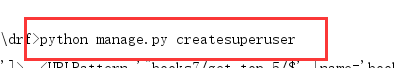
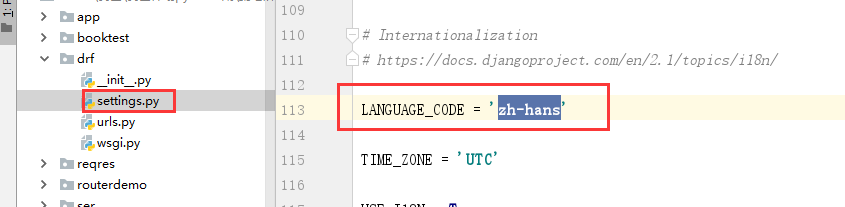

[TOC]

因为接下来的功能中需要使用到登陆功能，所以我们使用django内置admin站点并创建一个管理员.

```shell
python manage.py createsuperuser
```




创建管理员以后，访问admin站点，先修改站点的语言配置

settings.py

```

```




访问admin 站点效果：


# 1. 认证Authentication

可以在配置文件中配置全局默认的认证方案

```python
REST_FRAMEWORK = {
    'DEFAULT_AUTHENTICATION_CLASSES': (
        'rest_framework.authentication.BasicAuthentication',   # 基本认证
        'rest_framework.authentication.SessionAuthentication',  # session认证
    )
}
```

也可以在每个视图中通过设置authentication_classess属性来设置

```python
from rest_framework.authentication import SessionAuthentication, BasicAuthentication
from rest_framework.views import APIView

class ExampleView(APIView):
    authentication_classes = (SessionAuthentication, BasicAuthentication)
    ...
```

认证失败会有两种可能的返回值：

- 401 Unauthorized 未认证
- 403 Permission Denied 权限被禁止


# 2. 权限Permissions

权限控制可以限制用户对于视图的访问和对于具体数据对象的访问。

- 在执行视图的dispatch()方法前，会先进行视图访问权限的判断
- 在通过get_object()获取具体对象时，会进行模型对象访问权限的判断

### 使用

可以在配置文件中设置默认的权限管理类，如

```python
REST_FRAMEWORK = {
    'DEFAULT_PERMISSION_CLASSES': (
        'rest_framework.permissions.IsAuthenticated',
    )
}
```

如果未指明，则采用如下默认配置

```python
'DEFAULT_PERMISSION_CLASSES': (
   'rest_framework.permissions.AllowAny',
)
```

也可以在具体的视图中通过permission_classes属性来设置，如

```python
from rest_framework.permissions import IsAuthenticated
from rest_framework.views import APIView

class ExampleView(APIView):
    permission_classes = (IsAuthenticated,)
    ...
```

### 提供的权限

- AllowAny 允许所有用户
- IsAuthenticated 仅通过认证的用户
- IsAdminUser 仅管理员用户
- IsAuthenticatedOrReadOnly 已经登陆认证的用户可以对数据进行增删改操作，没有登陆认证的只能查看数据。

### 举例

```python
from rest_framework.authentication import SessionAuthentication
from rest_framework.permissions import IsAuthenticated
from rest_framework.generics import RetrieveAPIView

class BookDetailView(RetrieveAPIView):
    queryset = BookInfo.objects.all()
    serializer_class = BookInfoSerializer
    authentication_classes = [SessionAuthentication]
    permission_classes = [IsAuthenticated]
```


### 自定义权限

如需自定义权限，需继承rest_framework.permissions.BasePermission父类，并实现以下两个任何一个方法或全部

- `.has_permission(self, request, view)`

  是否可以访问视图， view表示当前视图对象

- `.has_object_permission(self, request, view, obj)`

  是否可以访问数据对象， view表示当前视图， obj为数据对象

例如：

```python
class MyPermission(BasePermission):
    def has_object_permission(self, request, view, obj):
        """控制对obj对象的访问权限，此案例决绝所有对对象的访问"""
        return False

class BookInfoViewSet(ModelViewSet):
    queryset = BookInfo.objects.all()
    serializer_class = BookInfoSerializer
    permission_classes = [IsAuthenticated, MyPermission]
```


# 3. 限流Throttling

可以对接口访问的频次进行限制，以减轻服务器压力。

一般用于付费购买次数,投票等场景使用.

## 使用

可以在配置文件中，使用`DEFAULT_THROTTLE_CLASSES` 和 `DEFAULT_THROTTLE_RATES`进行全局配置，

```python
REST_FRAMEWORK = {
    'DEFAULT_THROTTLE_CLASSES': (
        'rest_framework.throttling.AnonRateThrottle',
        'rest_framework.throttling.UserRateThrottle'
    ),
    'DEFAULT_THROTTLE_RATES': {
        'anon': '100/day',
        'user': '1000/day'
    }
}
```

`DEFAULT_THROTTLE_RATES` 可以使用 `second`, `minute`, `hour` 或`day`来指明周期。

也可以在具体视图中通过throttle_classess属性来配置，如

```python
from rest_framework.throttling import UserRateThrottle
from rest_framework.views import APIView

class ExampleView(APIView):
    throttle_classes = (UserRateThrottle,)
    ...
```

### 可选限流类

1） AnonRateThrottle

限制所有匿名未认证用户，使用IP区分用户。

使用`DEFAULT_THROTTLE_RATES['anon']` 来设置频次

2）UserRateThrottle

限制认证用户，使用User id 来区分。

使用`DEFAULT_THROTTLE_RATES['user']` 来设置频次

3）ScopedRateThrottle

限制用户对于每个视图的访问频次，使用ip或user id。

例如：

```
class ContactListView(APIView):
    throttle_scope = 'contacts'
    ...

class ContactDetailView(APIView):
    throttle_scope = 'contacts'
    ...

class UploadView(APIView):
    throttle_scope = 'uploads'
    ...
REST_FRAMEWORK = {
    'DEFAULT_THROTTLE_CLASSES': (
        'rest_framework.throttling.ScopedRateThrottle',
    ),
    'DEFAULT_THROTTLE_RATES': {
        'contacts': '1000/day',
        'uploads': '20/day'
    }
}
```

## 实例

```python
from rest_framework.authentication import SessionAuthentication
from rest_framework.permissions import IsAuthenticated
from rest_framework.generics import RetrieveAPIView
from rest_framework.throttling import UserRateThrottle

class BookDetailView(RetrieveAPIView):
    queryset = BookInfo.objects.all()
    serializer_class = BookInfoSerializer
    authentication_classes = [SessionAuthentication]
    permission_classes = [IsAuthenticated]
    throttle_classes = (UserRateThrottle,)
```


# 4. 过滤Filtering

对于列表数据可能需要根据字段进行过滤，我们可以通过添加django-fitlter扩展来增强支持。

```shel
pip install django-filter
```

在配置文件中增加过滤后端的设置：

```python
INSTALLED_APPS = [
    ...
    'django_filters',  # 需要注册应用，
]

REST_FRAMEWORK = {
    ...
    'DEFAULT_FILTER_BACKENDS': ('django_filters.rest_framework.DjangoFilterBackend',)
}
```

在视图中添加filter_fields属性，指定可以过滤的字段

```python
class BookListView(ListAPIView):
    queryset = BookInfo.objects.all()
    serializer_class = BookInfoSerializer
    filter_fields = ('btitle', 'bread')

# 127.0.0.1:8000/books/?btitle=西游记
```


# 5. 排序

对于列表数据，REST framework提供了**OrderingFilter**过滤器来帮助我们快速指明数据按照指定字段进行排序。

#### 使用方法：

在类视图中设置filter_backends，使用`rest_framework.filters.OrderingFilter`过滤器，REST framework会在请求的查询字符串参数中检查是否包含了ordering参数，如果包含了ordering参数，则按照ordering参数指明的排序字段对数据集进行排序。

前端可以传递的ordering参数的可选字段值需要在ordering_fields中指明。

示例：

```python
class BookListView(ListAPIView):
    queryset = BookInfo.objects.all()
    serializer_class = BookInfoSerializer
    filter_backends = [OrderingFilter]
    ordering_fields = ('id', 'bread', 'bpub_date')

# 127.0.0.1:8000/books/?ordering=-bread
```


# 6. 分页Pagination

REST framework提供了分页的支持。

我们可以在配置文件中设置全局的分页方式，如：

```python
REST_FRAMEWORK = {
    'DEFAULT_PAGINATION_CLASS':  'rest_framework.pagination.PageNumberPagination',
    'PAGE_SIZE': 100  # 每页数目
}
```

也可通过自定义Pagination类，来为视图添加不同分页行为。在视图中通过`pagination_clas`属性来指明。

```python
class LargeResultsSetPagination(PageNumberPagination):
    page_size = 1000
    page_size_query_param = 'page_size'
    max_page_size = 10000
class BookDetailView(RetrieveAPIView):
    queryset = BookInfo.objects.all()
    serializer_class = BookInfoSerializer
    pagination_class = LargeResultsSetPagination
```

**注意：如果在视图内关闭分页功能，只需在视图内设置**

```python
pagination_class = None
```

## 可选分页器

1） **PageNumberPagination**

前端访问网址形式：

```http
GET  http://api.example.org/books/?page=4
```

可以在子类中定义的属性：

- page_size 每页数目
- page_query_param 前端发送的页数关键字名，默认为"page"
- page_size_query_param 前端发送的每页数目关键字名，默认为None
- max_page_size 前端最多能设置的每页数量

```python
from rest_framework.pagination import PageNumberPagination

class StandardPageNumberPagination(PageNumberPagination):
    page_size_query_param = 'page_size'
    max_page_size = 10

class BookListView(ListAPIView):
    queryset = BookInfo.objects.all().order_by('id')
    serializer_class = BookInfoSerializer
    pagination_class = StandardPageNumberPagination

# 127.0.0.1/books/?page=1&page_size=2
```

2）**LimitOffsetPagination**

前端访问网址形式：

```http
GET http://api.example.org/books/?limit=100&offset=400
```

可以在子类中定义的属性：

- default_limit 默认限制，默认值与`PAGE_SIZE`设置一直
- limit_query_param limit参数名，默认'limit'
- offset_query_param offset参数名，默认'offset'
- max_limit 最大limit限制，默认None

```python
from rest_framework.pagination import LimitOffsetPagination

class BookListView(ListAPIView):
    queryset = BookInfo.objects.all().order_by('id')
    serializer_class = BookInfoSerializer
    pagination_class = LimitOffsetPagination

# 127.0.0.1:8000/books/?offset=3&limit=2
```


# 7. 异常处理 Exceptions

REST framework提供了异常处理，我们可以自定义异常处理函数。

```python
from rest_framework.views import exception_handler

def custom_exception_handler(exc, context):
    # 先调用REST framework默认的异常处理方法获得标准错误响应对象
    response = exception_handler(exc, context)

    # 在此处补充自定义的异常处理
    if response is not None:
        response.data['status_code'] = response.status_code

    return response
```

在配置文件中声明自定义的异常处理

```python
REST_FRAMEWORK = {
    'EXCEPTION_HANDLER': 'my_project.my_app.utils.custom_exception_handler'
}
```

如果未声明，会采用默认的方式，如下

```python
REST_FRAMEWORK = {
    'EXCEPTION_HANDLER': 'rest_framework.views.exception_handler'
}
```

例如：

补充上处理关于数据库的异常

```python
from rest_framework.views import exception_handler as drf_exception_handler
from rest_framework import status
from django.db import DatabaseError

def exception_handler(exc, context):
    response = drf_exception_handler(exc, context)

    if response is None:
        view = context['view']
        if isinstance(exc, DatabaseError):
            print('[%s]: %s' % (view, exc))
            response = Response({'detail': '服务器内部错误'}, status=status.HTTP_507_INSUFFICIENT_STORAGE)

    return response
```


### REST framework定义的异常

- APIException 所有异常的父类
- ParseError 解析错误
- AuthenticationFailed 认证失败
- NotAuthenticated 尚未认证
- PermissionDenied 权限决绝
- NotFound 未找到
- MethodNotAllowed 请求方式不支持
- NotAcceptable 要获取的数据格式不支持
- Throttled 超过限流次数
- ValidationError 校验失败


# 8. 自动生成接口文档

REST framework可以自动帮助我们生成接口文档。

接口文档以网页的方式呈现。

自动接口文档能生成的是继承自`APIView`及其子类的视图。

## 8.1. 安装依赖

REST framewrok生成接口文档需要`coreapi`库的支持。

```python
pip install coreapi
```

## 8.2. 设置接口文档访问路径

在总路由中添加接口文档路径。

文档路由对应的视图配置为`rest_framework.documentation.include_docs_urls`，

参数`title`为接口文档网站的标题。

```python
from rest_framework.documentation import include_docs_urls

urlpatterns = [
    ...
    path('docs/', include_docs_urls(title='站点页面标题'))
]
```

## 8.3. 文档描述说明的定义位置

1） 单一方法的视图，可直接使用类视图的文档字符串，如

```python
class BookListView(generics.ListAPIView):
    """
    返回所有图书信息.
    """
```

2）包含多个方法的视图，在类视图的文档字符串中，分开方法定义，如

```python
class BookListCreateView(generics.ListCreateAPIView):
    """
    get:
    返回所有图书信息.

    post:
    新建图书.
    """
```

3）对于视图集ViewSet，仍在类视图的文档字符串中封开定义，但是应使用action名称区分，如

```python
class BookInfoViewSet(mixins.ListModelMixin, mixins.RetrieveModelMixin, GenericViewSet):
    """
    list:
    返回图书列表数据

    retrieve:
    返回图书详情数据

    latest:
    返回最新的图书数据

    read:
    修改图书的阅读量
    """
```

## 8.4. 访问接口文档网页

浏览器访问 127.0.0.1:8000/docs/，即可看到自动生成的接口文档。


#### 两点说明：

1） 视图集ViewSet中的retrieve名称，在接口文档网站中叫做read

2）参数的Description需要在模型类或序列化器类的字段中以help_text选项定义，如：

```python
class BookInfo(models.Model):
    ...
    bread = models.IntegerField(default=0, verbose_name='阅读量', help_text='阅读量')
    ...
```

或

```python
class BookReadSerializer(serializers.ModelSerializer):
    class Meta:
        model = BookInfo
        fields = ('bread', )
        extra_kwargs = {
            'bread': {
                'required': True,
                'help_text': '阅读量'
            }
        }
```


# 9. Xadmin

xadmin是Django的第三方扩展，可是使Django的admin站点使用更方便。

文档：https://xadmin.readthedocs.io/en/latest/index.html

## 9.1. 安装

通过如下命令安装xadmin的最新版

```shell
pip install https://codeload.github.com/sshwsfc/xadmin/zip/django2
```

在配置文件中注册如下应用

```python
BASE_DIR = os.path.dirname(os.path.dirname(os.path.abspath(__file__)))
# 把apps目录设置环境变量中的导包路径
sys.path.append( os.path.join(BASE_DIR,"luffy/apps") )


INSTALLED_APPS = [
    ...
    'xadmin',
    'crispy_forms',
    'reversion',
    ...
]

# 修改使用中文界面
LANGUAGE_CODE = 'zh-Hans'

# 修改时区
TIME_ZONE = 'Asia/Shanghai'
```


xadmin有建立自己的数据库模型类，需要进行数据库迁移

```shell
python manage.py makemigrations
python manage.py migrate
```


在总路由中添加xadmin的路由信息

```python
import xadmin
xadmin.autodiscover()

# version模块自动注册需要版本控制的 Model
from xadmin.plugins import xversion
xversion.register_models()

urlpatterns = [
    path(r'xadmin/', xadmin.site.urls)
]
```


创建超级用户

```python
python manage.py createsuperuser
```


## 9.2. 使用

- xadmin不再使用Django的admin.py，而是需要编写代码在adminx.py文件中。
- xadmin的站点管理类不用继承`admin.ModelAdmin`，而是直接继承`object`即可。

例如：在子应用中创建adminx.py文件。

#### 站点的全局配置

```python
import xadmin
from xadmin import views

class BaseSetting(object):
    """xadmin的基本配置"""
    enable_themes = True  # 开启主题切换功能
    use_bootswatch = True

xadmin.site.register(views.BaseAdminView, BaseSetting)

class GlobalSettings(object):
    """xadmin的全局配置"""
    site_title = "路飞学城"  # 设置站点标题
    site_footer = "路飞学城有限公司"  # 设置站点的页脚
    menu_style = "accordion"  # 设置菜单折叠

xadmin.site.register(views.CommAdminView, GlobalSettings)
```


#### 站点Model管理

xadmin可以使用的页面样式控制基本与Django原生的admin一直。

- **list_display** 控制列表展示的字段

  ```
  list_display = ['id', 'btitle', 'bread', 'bcomment']
  ```

- **search_fields** 控制可以通过搜索框搜索的字段名称，xadmin使用的是模糊查询

  ```
  search_fields = ['id','btitle']
  ```

- **list_filter** 可以进行过滤操作的列，对于分类、性别、状态

  ```
  list_filter = ['is_delete']
  ```

- **ordering** 默认排序的字段

- **readonly_fields** 在编辑页面的只读字段

- **exclude** 在编辑页面隐藏的字段

- **list_editable** 在列表页可以快速直接编辑的字段

- **show_detail_fields** 在列表页提供快速显示详情信息

- **refresh_times** 指定列表页的定时刷新

  ```
  refresh_times = [5, 10,30,60]  # 设置允许后端管理人员按多长时间(秒)刷新页面
  ```

- **list_export** 控制列表页导出数据的可选格式

  ```
  list_export = ('xls', 'xml', 'json')   list_export设置为None来禁用数据导出功能
  list_export_fields = ('id', 'btitle', 'bpub_date')
  ```

- **show_bookmarks** 控制是否显示书签功能

  ```
  show_bookmarks = True
  ```

- **data_charts** 控制显示图表的样式

  ```python
  data_charts = {
          "order_amount": {
            'title': '图书发布日期表', 
            "x-field": "bpub_date", 
            "y-field": ('btitle',),
            "order": ('id',)
          },
      #    支持生成多个不同的图表
      #    "order_amount": {
      #      'title': '图书发布日期表', 
      #      "x-field": "bpub_date", 
      #      "y-field": ('btitle',),
      #      "order": ('id',)
      #    },
      }
  ```

  - title 控制图标名称
  - x-field 控制x轴字段
  - y-field 控制y轴字段，可以是多个值
  - order 控制默认排序


- **model_icon** 控制菜单的图标

  ```
  class BookInfoAdmin(object):
      model_icon = 'fa fa-gift'
  
  xadmin.site.register(models.BookInfo, BookInfodmin)
  ```
