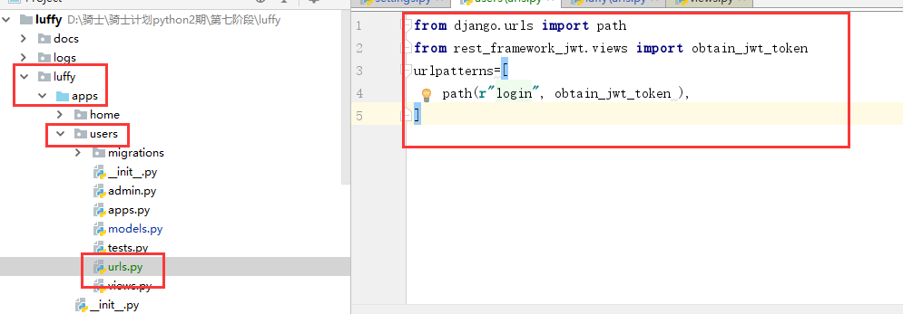
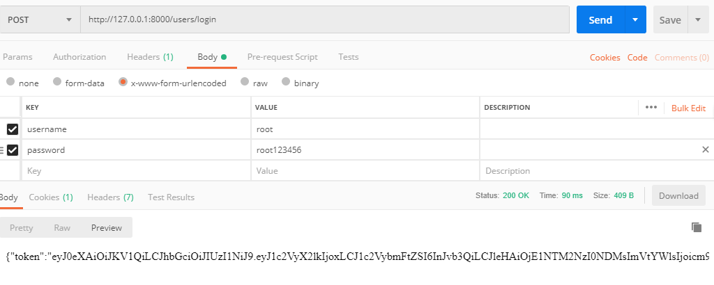
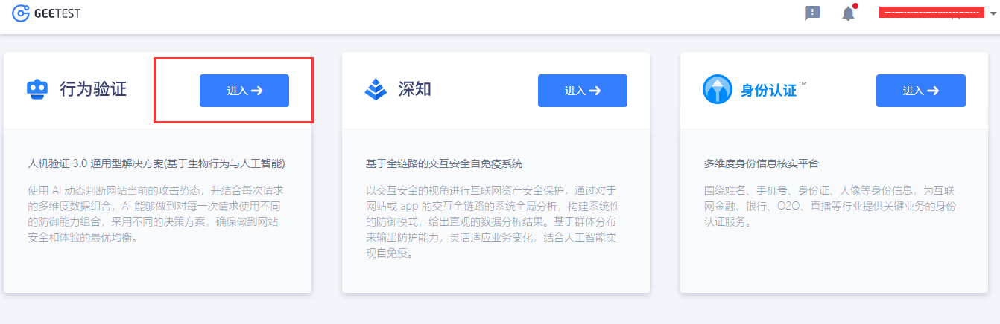
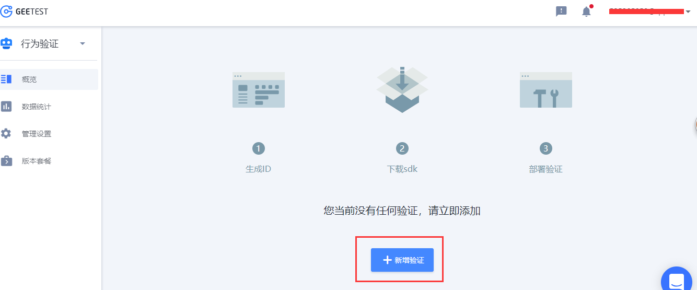
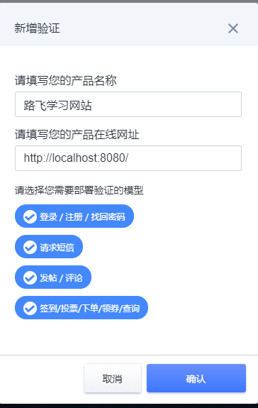
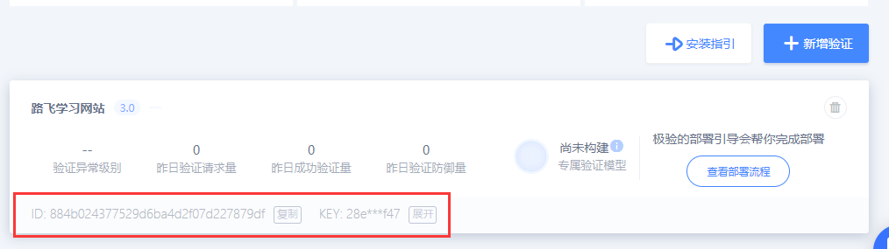
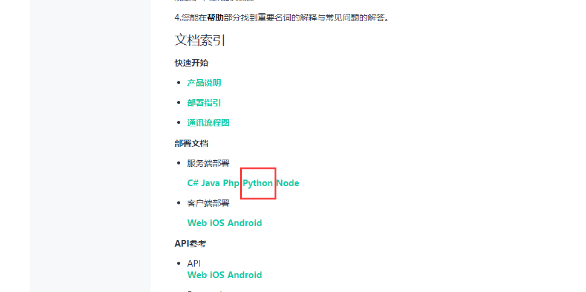

### 安装配置JWT


安装

```shell
pip install djangorestframework-jwt
```

配置

```python
REST_FRAMEWORK = {
    'DEFAULT_AUTHENTICATION_CLASSES': (
        'rest_framework_jwt.authentication.JSONWebTokenAuthentication',
        'rest_framework.authentication.SessionAuthentication',
        'rest_framework.authentication.BasicAuthentication',
    ),
}

JWT_AUTH = {
    'JWT_EXPIRATION_DELTA': datetime.timedelta(days=1),
}
```

- JWT_EXPIRATION_DELTA 指明token的有效期


### 2.3.6 使用

Django REST framework JWT 扩展的说明文档中提供了手动签发JWT的方法

```python
from rest_framework_jwt.settings import api_settings

jwt_payload_handler = api_settings.JWT_PAYLOAD_HANDLER
jwt_encode_handler = api_settings.JWT_ENCODE_HANDLER

payload = jwt_payload_handler(user)
token = jwt_encode_handler(payload)
```


在用户注册或登录成功后，在序列化器中返回用户信息以后同时返回token即可。

默认情况下，djangorestframework-jwt这个模块已经内置了一个登陆视图接口给我们了。我们直接使用

当前users的urls.py文件代码：

```python
from django.urls import path
# jwt内部实现的登陆视图
from rest_framework_jwt.views import obtain_jwt_token
urlpatterns=[
    path(r"login", obtain_jwt_token ),
]
```




在总路由文件中，urls.py中注册子应用路由：

```python
path('users/', include("users.urls")),
```

我们可以通过postman来完成测试：



经过上面的测试，登陆视图已经完成了。

接下来，我们就可以在前端实现登陆提交用户名和密码功能了。

Login.vue登陆视图组件，代码：

```vue
<button class="login_btn" @click="loginhander">登录</button>
```

在js代码中，完成登陆请求操作

```python
  export default{
    name:"Login",
    data(){
      return {
          login_type:2,
          username:"",
          password:"",
          mobile:"",
          sms:"",
      }
    },
    components:{

    },
    methods:{
      loginhander(){
        this.$axios.post("http://127.0.0.1:8000/users/login",{"username":this.username,"password":this.password}).
          then(response=>{
            console.log(response.data);
        }).catch(error=>{
          console.log(error);
        })
      }
    }
  }
```


### 2.3.7 前端保存jwt

我们可以将JWT保存在cookie中，也可以保存在浏览器的本地存储里，我们保存在浏览器本地存储中

浏览器的本地存储提供了sessionStorage 和 localStorage 两种：

- **sessionStorage** 会话存储，浏览器关闭即失效
- **localStorage** 永久存储，长期有效

使用方法

```js
sessionStorage.变量名 = 变量值   // 保存数据
sessionStorage.变量名  // 读取数据
sessionStorage.clear()  // 清除所有sessionStorage保存的数据

localStorage.变量名 = 变量值   // 保存数据
localStorage.变量名  // 读取数据
localStorage.clear()  // 清除所有localStorage保存的数据
```


代码：

```javascript
    methods:{
      loginhander(){
        this.$axios.post("http://127.0.0.1:8000/users/login",{
          "username":this.username,
          "password":this.password
        },{
          responseType:"json"
        }).
          then(response=>{
            // 请求成功，保存登陆状态
            if(this.remember){
              // 记住密码
              sessionStorage.removeItem("token");
              let data = response.data;
              localStorage.token = data.token;
            }else{
              // 不记住密码
              localStorage.removeItem("token");
              let data = response.data;
              sessionStorage.token = data.token;
            }

            // 登录成功以后,跳转页面
            this.$router.go(-1);
            // this.$router.push("/home");
        }).catch(error=>{
          console.log(error);
        })
      }
    }
```


### 前台首页判断登录状态显示对应信息

Header.vue

```vue
<template>
  <div class="header">
    <el-container>
      <el-header height="80px">
         <el-row>
           <el-col class="logo" :span="3">
             <router-link to="/"></router-link>
           </el-col>
           <el-col :span="16">
             <!-- gutter每一列之间的间隔空隙 -->
             <el-row class="nav" :gutter="20">
                <el-col :span="3"><router-link :class="current_page==1?'active':''" to="/courses">免费课</router-link></el-col>
                <el-col :span="3"><router-link :class="current_page==2?'active':''" to="/courses">轻课</router-link></el-col>
                <el-col :span="3"><router-link :class="current_page==3?'active':''" to="/courses">学位课</router-link></el-col>
                <el-col :span="3"><router-link :class="current_page==4?'active':''" to="/courses">题库</router-link></el-col>
                <el-col :span="3"><router-link :class="current_page==5?'active':''" to="/courses">教育</router-link></el-col>
              </el-row>
           </el-col>
           <el-col v-if="is_login" class="login-bar" :span="5">
             <div class="cart-ico">
                 <b></b>
                 
               <span>购物车</span>
             </div>
             <div class="study">学习中心</div>
             <div class="member">
               <el-dropdown>
                  <span class="el-dropdown-link">
                    
                  </span>
                  <el-dropdown-menu slot="dropdown">
                    <el-dropdown-item>我的账户 <i class="el-icon-arrow-right"></i></el-dropdown-item>
                    <el-dropdown-item>我的账户 <i class="el-icon-arrow-right"></i></el-dropdown-item>
                    <el-dropdown-item>我的账户 <i class="el-icon-arrow-right"></i></el-dropdown-item>
                    <el-dropdown-item><span @click="logout">退出登录</span> <i class="el-icon-arrow-right"></i></el-dropdown-item>
                  </el-dropdown-menu>
                </el-dropdown>
             </div>
           </el-col>
           <el-col v-else class="login-bar" :span="5">
             <div class="cart-ico">
                 
               <span>购物车</span>
             </div>
             <span class="header-login"><router-link to="/login">登录</router-link></span>
             &nbsp;&nbsp;|&nbsp;&nbsp;
             <span class="header-register">注册</span>
           </el-col>
         </el-row>
      </el-header>
    </el-container>
  </div>
</template>

<script>
  export default {
    name:"Header",
    props:["current_page"],
    data(){
      return {
        token: localStorage.token || sessionStorage.token,
        is_login: false, /* 是否登录 */
      }
    },
    created(){
      // 登录状态判断
      if(this.token){
        this.is_login=true;
      }else{
        this.is_login=false;
      }
    },
    methods:{
      logout(){
        localStorage.clear();
        sessionStorage.clear();
        this.is_login=false;
        alert("退出登录成功");
      }
    }
  }
</script>
```


### 2.3.8 jwt后端认证

Django REST framework JWT提供了登录签发JWT的视图，可以直接使用

```python
from rest_framework_jwt.views import obtain_jwt_token

urlpatterns = [
    path(r'login/$', obtain_jwt_token),
]
```

但是默认的返回值仅有token，我们还需在返回值中增加username和user_id。

通过修改该视图的返回值可以完成我们的需求。

在users/utils.py 中，创建

```python
def jwt_response_payload_handler(token, user=None, request=None):
    """
    自定义jwt认证成功返回数据
    :token  返回的jwt
    :user   当前登录的用户信息[对象]
    :request 当前本次客户端提交过来的数据
    """
    return {
        'token': token,
        'id': user.id,
        'username': user.username,
    }
```

修改settings.py配置文件

```python
# JWT
JWT_AUTH = {
    'JWT_EXPIRATION_DELTA': datetime.timedelta(days=1),
    'JWT_RESPONSE_PAYLOAD_HANDLER': 'users.utils.jwt_response_payload_handler',
}
```


### 2.3.9 多条件登录

JWT扩展的登录视图，在收到用户名与密码时，也是调用Django的认证系统中提供的**authenticate()**来检查用户名与密码是否正确。

我们可以通过修改Django认证系统的认证后端（主要是authenticate方法）来支持登录账号既可以是用户名也可以是手机号。

**修改Django认证系统的认证后端需要继承django.contrib.auth.backends.ModelBackend，并重写authenticate方法。**

`authenticate(self, request, username=None, password=None, **kwargs)`方法的参数说明：

- request 本次认证的请求对象
- username 本次认证提供的用户账号
- password 本次认证提供的密码

**我们想要让用户既可以以用户名登录，也可以以手机号登录，那么对于authenticate方法而言，username参数即表示用户名或者手机号。**

重写authenticate方法的思路：

1. 根据username参数查找用户User对象，username参数可能是用户名，也可能是手机号
2. 若查找到User对象，调用User对象的check_password方法检查密码是否正确

在users/utils.py中编写：

```python
def get_user_by_account(account):
    """
    根据帐号获取user对象
    :param account: 账号，可以是用户名，也可以是手机号
    :return: User对象 或者 None
    """
    try:
        if re.match('^1[3-9]\d{9}$', account):
            # 帐号为手机号
            user = User.objects.get(mobile=account)
        else:
            # 帐号为用户名
            user = User.objects.get(username=account)
    except User.DoesNotExist:
        return None
    else:
        return user


class UsernameMobileAuthBackend(ModelBackend):
    """
    自定义用户名或手机号认证
    """

    def authenticate(self, request, username=None, password=None, **kwargs):
        user = get_user_by_account(username)
        if user is not None and user.check_password(password):
            return user
```

在配置文件settings.py中告知Django使用我们自定义的认证后端

```python
AUTHENTICATION_BACKENDS = [
    'users.utils.UsernameMobileAuthBackend',
]
```

## 在登陆功能中集成极验验证码









创建好了应用以后，就可以得到APPID和APPKEY。



app id : 884b024377529d6ba4d2f07d227879df

app key: 28e7f92b7c66f718d65ede8feb26f477


有了id和key以后,就可以根据官方的文档进行集成了.

官方: https://docs.geetest.com/install/overview/start/



python集成文档:  https://docs.geetest.com/install/deploy/server/python/

SDK: 开发集成工具包

安装依赖模块:

```python
pip install requests
```

安装完成模块以后,可以参考官方文档中的案例,把提供验证码和校验验证码的功能集成到视图类中.

文档: https://github.com/GeeTeam/gt3-python-sdk

users/views.py

```python
from rest_framework.response import Response
from rest_framework.views import APIView
import random
from luffy.libs.geetest import  GeetestLib
class VerifyCode(APIView):
    gt = None
    """验证码类"""
    def get(self,request):
        """获取验证码"""
        user_id = random.randint(1, 100)
        APP_ID = "884b024377529d6ba4d2f07d227879df"
        APP_KEY = "28e7f92b7c66f718d65ede8feb26f477"
        gt = GeetestLib(APP_ID,APP_KEY)

        status = gt.pre_process(user_id)
        request.session[gt.GT_STATUS_SESSION_KEY] = status
        print("session=%s" % status )
        request.session["user_id"] = user_id
        data = gt.get_response_str()
        return Response(data, headers={"Access-Control-Allow-Credentials":True})


    def post(self,request):
        """校验验证码"""
        print( request.COOKIES )
        APP_ID = "884b024377529d6ba4d2f07d227879df"
        APP_KEY = "28e7f92b7c66f718d65ede8feb26f477"
        gt = GeetestLib(APP_ID, APP_KEY)
        print(request.session.get("SESSION_ID"))
        status = request.session[gt.GT_STATUS_SESSION_KEY]
        challenge = request.data.get(gt.FN_CHALLENGE)
        validate = request.data.get(gt.FN_VALIDATE)
        seccode = request.data.get(gt.FN_SECCODE)
        user_id = request.session["user_id"]

        if status:
            result = gt.success_validate(challenge, validate, seccode, user_id)
        else:
            result = gt.failback_validate(challenge, validate, seccode)

        result = {"status": "success"} if result else {"status": "fail"}

        return Response(result,headers={"Access-Control-Allow-Credentials":True})

    # def get(self,request):
    #     result = request.session["user"] = "hellow"
    #     return Response({"message": "设置session"})
    #
    # def post(self,request):
    #     result = request.session["user"]
    #     return Response({"message":result})
```


上面代码存在cookie无法提交到服务端的问题，回头我们可以通过配置axios来完成解决方案。