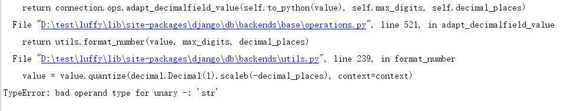

## 双向校验

```
客户端验证: 使用js进行识别判断和校验,但是这里的验证不能保存百分百的安全,
后端验证: 入库前最后判断, 最后一道防火墙.

```

settings.py中设置一个新的redis数据库保存后端生成的随机码

```python
CACHES = {
    ...
    "verify_code":{
        "BACKEND": "django_redis.cache.RedisCache",
        "LOCATION": "redis://127.0.0.1:6379/3",
        "OPTIONS": {
            "CLIENT_CLASS": "django_redis.client.DefaultClient",
        }
    }
}
```


users/views.py

```python
class VerifyCode(APIView):
	    def post(self,request):
        """校验验证码"""
        print( request.COOKIES )
        APP_ID = "884b024377529d6ba4d2f07d227879df"
        APP_KEY = "28e7f92b7c66f718d65ede8feb26f477"
        gt = GeetestLib(APP_ID, APP_KEY)
        print(request.session.get("SESSION_ID"))
        status = request.session[gt.GT_STATUS_SESSION_KEY]
        challenge = request.data.get(gt.FN_CHALLENGE)
        validate = request.data.get(gt.FN_VALIDATE)
        seccode = request.data.get(gt.FN_SECCODE)
        user_id = request.session["user_id"]

        if status:
            result = gt.success_validate(challenge, validate, seccode, user_id)
        else:
            result = gt.failback_validate(challenge, validate, seccode)

        if result:
            # 验证通过了,生成一个随机值保存到redis中,在用户再次提交注册信息的时候,验证是否附带了唯一值
            verify_code = "%08d" % random.randint(0, 99999999)
            # 保存到redis中
            redis = get_redis_connection("verify_code")
            redis.setex(verify_code,60*10,1)

            result = {"status": "success","code":verify_code } if result else {"status": "fail","code":-1}

        return Response(result)
```

前端在post成功返回数据以后,保存code,并提交给注册页面

```javascript
// export default {
//   name: 'Register',
//   data(){
//     return {
//         region:"+86",
//         sms_code:"",
//         password:"",
//         password2:"",
//         mobile:"",
//         validateResult:false,
//         get_sms_text:"获取验证码",
         verify_code:'-1',
//     }
//   },
//   created(){
//     // 页面初始化的时候设置号码的地区号
//     // this.region_list = this.$nation;
//
//     // 显示图片验证码
//     this.$axios.get("http://127.0.0.1:8000/users/verify").then(response=>{
//           // 请求成功
//           let data = response.data;
//           // 使用initGeetest接口
//           // 参数1：配置参数
//           // 参数2：回调，回调的第一个参数验证码对象，之后可以使用它做appendTo之类的事件
//           console.log(response.data);
//           data = JSON.parse(data);
//           initGeetest({
//               gt: data.gt,
//               challenge: data.challenge,
//               width: "350px",
//               product: "embed", // 产品形式，包括：float，embed，popup。注意只对PC版验证码有效
//               offline: !data.success // 表示用户后台检测极验服务器是否宕机，一般不需要关注
//               // 更多配置参数请参见：http://www.geetest.com/install/sections/idx-client-sdk.html#config
//           }, this.handlerPopup);
//     }).catch(error=>{
//       console.log(error)
//     })
//
//   },
//   methods:{
//     send_sms(){
//       let reg = /1[1-9]{2}\d{8}/;
//       if( !reg.test(this.mobile) ){
//         return false;
//       }
//
//       // 如果get_sms_text 不是文本,而是数字,则表示当前手机号码还在60秒的发送短信间隔内
//       if(this.get_sms_text != "获取验证码"){
//         return false;
//       }
//
//       // 发送短信
//       let _this = this;
//       this.$axios.get("http://127.0.0.1:8000/users/sms?mobile="+this.mobile).then(response=>{
//         console.log(response);
//         // 显示发送短信以后的文本倒计时
//         let time = 60;
//         let timer = setInterval(()=>{
//           --time;
//           if(time <=1){
//             // 如果倒计时为0,则关闭当前定时器
//              _this.get_sms_text = "获取验证码";
//             clearInterval(timer);
//           }else{
//               _this.get_sms_text = time;
//           }
//         },1000)
//       }).catch(error=>{
//         console.log(error);
//       })
//
//     },
//     registerHander(){
//       // 注册信息提交
//       // 提交数据前判断用户是否通过了验证码校验
//       if(!this.validateResult){
//           alert("验证码验证有误");
//           return false;
//       }
//
//       this.$axios.post("http://127.0.0.1:8000/users/user",{
//           "mobile":this.mobile,
//           "password":this.password,
//           "password2":this.password2,
//           "sms_code":this.sms_code,
           "verify_code":this.verify_code,
//         },{
//           responseType:"json",
//         }).
//           then(response=>{
//             // 请求成功，保存登陆状态
//             localStorage.removeItem("token");
//             let data = response.data;
//             sessionStorage.token = data.token;
//             sessionStorage.id = data.id;
//             sessionStorage.username = data.mobile;
//             // 注册成功以后默认表示已经登录了,跳转用户中心的页面
//             // this.$router.push("/user");
//             alert("注册成功!");
//         }).catch(error=>{
//             alert("注册失败!");
//             // error 就是一个对象,里面会保存在错误响应时的http状态码以及后端抛出的错误信息
//         })
//       },
//     handlerPopup(captchaObj){
//         // 验证码成功的回调
//         let _this = this;
//         captchaObj.onSuccess(function () {
//             var validate = captchaObj.getValidate();
//             _this.$axios.post("http://127.0.0.1:8000/users/verify",{
//                     geetest_challenge: validate.geetest_challenge,
//                     geetest_validate: validate.geetest_validate,
//                     geetest_seccode: validate.geetest_seccode
//                 },{
//                   responseType:"json",
//             }).then(response=>{
//               // 请求成功
//               console.log(response.data);
//               if(response.data.status == "success") {
//                   _this.validateResult = true;  // 获取验证结果
                   _this.verify_code = response.data.code;
                   console.log(_this.verify_code)
//               }
//             }).catch(error=>{
//               // 请求失败
//               console.log(error)
//             })
//         });
//         // 将验证码加到id为captcha的元素里
//         captchaObj.appendTo("#geetest");
//       }
//   },
//
// };
```

后端注册用户视图调用序列化器,需要验证当前验证码.

```python
# from rest_framework import serializers
# from .models import User
# import re
# from django_redis import get_redis_connection
# 
# class UserModelSerializer(serializers.ModelSerializer):
#     """用户信息序列化器"""
#     sms_code = serializers.CharField(label='手机验证码', required=True, allow_null=False, allow_blank=False, write_only=True)
#     password2 = serializers.CharField(label='确认密码', required=True, allow_null=False, allow_blank=False, write_only=True)
#     token = serializers.CharField(label='jwt', read_only=True)
     verify_code = serializers.CharField(label="极验验证验的验证字符串",write_only=True)
#     class Meta:
#         model=User
         fields = ('id','sms_code', 'mobile', 'password','password2','token',"verify_code")
#         extra_kwargs={
#             "password":{
#                 "write_only":True
#             },
#             "id":{
#                 "read_only":True,
#             }
#         }
# 
    def validate_verify_code(self,value):
        """验证当前客户端是否已经通过了极验验证码的验证"""
        redis = get_redis_connection("verify_code")
        verify_code = redis.get(value)
        print(verify_code)
        if(not verify_code):
            raise serializers.ValidationError('验证码失效~')

        return value


#     def validate_mobile(self, value):
#         """验证手机号"""
#         if not re.match(r'^1[345789]\d{9}$', value):
#             raise serializers.ValidationError('手机号格式错误')
# 
#         # 验证手机号是否已经被注册了
#         # try:
#         #     user = User.objects.get(mobile=value)
#         # except:
#         #     user = None
#         #
#         # if user:
#         #     raise serializers.ValidationError('当前手机号已经被注册')
# 
#         # 上面验证手机号是否存在的代码[优化版]
#         try:
#             User.objects.get(mobile=value)
#             # 如果有获取到用户信息,则下面的代码不会被执行,如果没有获取到用户信息,则表示手机号没有注册过,可以直接pass
#             raise serializers.ValidationError('当前手机号已经被注册')
#         except:
#             pass
# 
#         return value
# 
#     def validate(self,data):
#         """验证密码"""
#         password = data.get("password")
#         password2 = data.get("password2")
#         if len(password)<6:
#             raise serializers.ValidationError('密码太短不安全~')
# 
#         if password !=password2:
#             raise serializers.ValidationError('密码和确认必须一致~')
# 
#         """验证短信验证码"""
# 
#         mobile = data.get("mobile")
#         sms_code = data.get("sms_code")
# 
#         # 从redis中提取短信验证码
#         redis = get_redis_connection("sms_code")
#         # 注意,在redis中保存数据的格式,最终都是bytes类型的字符串,所以提取数据时,要转下编码
#         redis_sms_code = redis.get("sms_%s" % mobile).decode()
#         # 把redis中的短信验证码和客户端提交的验证码进行匹配
#         if not (redis_sms_code and redis_sms_code == sms_code):
#             raise serializers.ValidationError('手机验证码无效~')
# 
#         return data
# 
#     def create(self, validated_data):
#         # 删除一些不需要保存到数据库里面的字段
#         del validated_data['password2']
#         del validated_data['sms_code']
         del validated_data['verify_code']
# 
#         # 可以补充删除redis的验证码逻辑
# 
#         # 因为数据库中默认用户名是唯一的,所以我们把用户手机号码作为用户名
#         validated_data["username"] = validated_data["mobile"]
# 
#         # 继续调用ModelSerializer内置的添加数据功能
#         user = super().create(validated_data)
# 
#         # 针对密码要加密
#         user.set_password(user.password)
#         # 修改密码等用于更新了密码,所以需要保存
#         user.save()
# 
#         # 一旦注册成功以后,则默认表示当前用户已经登录了
#         # 所以后端要生成一个jwt提供给客户端
#         from rest_framework_jwt.settings import api_settings
#         jwt_payload_handler = api_settings.JWT_PAYLOAD_HANDLER
#         jwt_encode_handler = api_settings.JWT_ENCODE_HANDLER
# 
#         payload = jwt_payload_handler(user)
#         # 把jwt生成的token作为user模型的字段
#         user.token = jwt_encode_handler(payload)
# 
#         return users
```


# 课程列表页

## 前端显示课程列表页面

把之前切好的课程列表页面组件放到项目中.

```vue
<template>
  <div class="courses">
      <Header :current_page="current_page"/>
      <div class="main">
          <div class="filter">
            <el-row class="filter-el-row1">
              <el-col :span="2" class="filter-text">课程分类:</el-col>
              <el-col :span="2" class="current">全部</el-col>
              <el-col :span="2">Python</el-col>
              <el-col :span="2">Linux运维</el-col>
              <el-col :span="2">Python进阶</el-col>
              <el-col :span="2">开发工具</el-col>
              <el-col :span="2">Go语言</el-col>
              <el-col :span="2">机器学习</el-col>
              <el-col :span="2">技术生涯</el-col>
            </el-row>
            <el-row class="filter-el-row2">
              <el-col :span="2" class="filter-text filter-text2">筛&nbsp;&nbsp;&nbsp;&nbsp;&nbsp;&nbsp;&nbsp;选:</el-col>
              <el-col :span="2" class="current">默认</el-col>
              <el-col :span="2">人气</el-col>
              <el-col :span="2" class="">
                <span @click.stop="filter_price=!filter_price">价格</span>
                <div class="filter-price">
                  <span class="up" @click.stop="filter_price=true" :class="filter_price==true?'active':''"><i class="el-icon-caret-top"></i></span>
                  <span class="down" @click.stop="filter_price=false"  :class="filter_price==false?'active':''"><i class="el-icon-caret-bottom"></i></span>
                </div>
              </el-col>
            </el-row>
          </div>
          <div class="courses_list">
              <el-row class="course-item">
                <el-col :span="24" class="course-item-box">
                  <el-row>
                    <el-col :span="12" class="course-item-left"></el-col>
                    <el-col :span="12" class="course-item-right">
                        <div class="course-title">
                          <p class="box-title">Go编程33天从入门到放弃系列</p>
                          <p class="box-number">30074人已加入学习</p>
                        </div>
                        <div class="author">
                          <p class="box-author">Alex 金角大王 老男孩Python教学总监</p>
                          <p class="lession">共154课时<span>/更新完成</span></p>
                        </div>
                        <el-row class="course-content">
                            <el-col :span="12"><i class="el-icon-caret-right"></i>01 | 常用模块学习-模块的种类和... <span class="free">免费</span> </el-col>
                            <el-col :span="12"><i class="el-icon-caret-right"></i>02 | 常用模块学习-模块的种类和... <span class="free">免费</span> </el-col>
                            <el-col :span="12"><i class="el-icon-caret-right"></i>03 | 三元运算符... <span class="free">免费</span> </el-col>
                            <el-col :span="12"><i class="el-icon-caret-right"></i>04 | 常用模块学习-模块的种类和... <span class="free">免费</span> </el-col>
                        </el-row>
                        <div class="course-price">
                            <p class="course-price-left">
                              <span class="discount">限时免费</span>
                              <span class="count">¥0.00</span>
                              <span class="old_count">原价: ¥8.00元</span>
                            </p>
                            <button class="buy">立即购买</button>
                        </div>
                    </el-col>
                  </el-row>
                </el-col>
              </el-row>
              <el-row class="course-item">
                <el-col :span="24" class="course-item-box">
                  <el-row>
                    <el-col :span="12" class="course-item-left"></el-col>
                    <el-col :span="12" class="course-item-right">
                        <div class="course-title">
                          <p class="box-title">Go编程33天从入门到放弃系列</p>
                          <p class="box-number">30074人已加入学习</p>
                        </div>
                        <div class="author">
                          <p class="box-author">Alex 金角大王 老男孩Python教学总监</p>
                          <p class="lession">共154课时<span>/更新完成</span></p>
                        </div>
                        <el-row class="course-content">
                            <el-col :span="12"><i class="el-icon-caret-right"></i>01 | 常用模块学习-模块的种类和... <span class="free">免费</span> </el-col>
                            <el-col :span="12"><i class="el-icon-caret-right"></i>02 | 常用模块学习-模块的种类和... <span class="free">免费</span> </el-col>
                            <el-col :span="12"><i class="el-icon-caret-right"></i>03 | 三元运算符... <span class="free">免费</span> </el-col>
                            <el-col :span="12"><i class="el-icon-caret-right"></i>04 | 常用模块学习-模块的种类和... <span class="free">免费</span> </el-col>
                        </el-row>
                        <div class="course-price">
                            <p class="course-price-left">
                              <span class="discount">限时免费</span>
                              <span class="count">¥0.00</span>
                              <span class="old_count">原价: ¥8.00元</span>
                            </p>
                            <button class="buy">立即购买</button>
                        </div>
                    </el-col>
                  </el-row>
                </el-col>
              </el-row>
              <el-row class="course-item">
                <el-col :span="24" class="course-item-box">
                  <el-row>
                    <el-col :span="12" class="course-item-left"></el-col>
                    <el-col :span="12" class="course-item-right">
                        <div class="course-title">
                          <p class="box-title">Go编程33天从入门到放弃系列</p>
                          <p class="box-number">30074人已加入学习</p>
                        </div>
                        <div class="author">
                          <p class="box-author">Alex 金角大王 老男孩Python教学总监</p>
                          <p class="lession">共154课时<span>/更新完成</span></p>
                        </div>
                        <el-row class="course-content">
                            <el-col :span="12"><i class="el-icon-caret-right"></i>01 | 常用模块学习-模块的种类和... <span class="free">免费</span> </el-col>
                            <el-col :span="12"><i class="el-icon-caret-right"></i>02 | 常用模块学习-模块的种类和... <span class="free">免费</span> </el-col>
                            <el-col :span="12"><i class="el-icon-caret-right"></i>03 | 三元运算符... <span class="free">免费</span> </el-col>
                            <el-col :span="12"><i class="el-icon-caret-right"></i>04 | 常用模块学习-模块的种类和... <span class="free">免费</span> </el-col>
                        </el-row>
                        <div class="course-price">
                            <p class="course-price-left">
                              <span class="discount">限时免费</span>
                              <span class="count">¥0.00</span>
                              <span class="old_count">原价: ¥8.00元</span>
                            </p>
                            <button class="buy">立即购买</button>
                        </div>
                    </el-col>
                  </el-row>
                </el-col>
              </el-row>
              <el-row class="course-item">
                <el-col :span="24" class="course-item-box">
                  <el-row>
                    <el-col :span="12" class="course-item-left"></el-col>
                    <el-col :span="12" class="course-item-right">
                        <div class="course-title">
                          <p class="box-title">Go编程33天从入门到放弃系列</p>
                          <p class="box-number">30074人已加入学习</p>
                        </div>
                        <div class="author">
                          <p class="box-author">Alex 金角大王 老男孩Python教学总监</p>
                          <p class="lession">共154课时<span>/更新完成</span></p>
                        </div>
                        <el-row class="course-content">
                            <el-col :span="12"><i class="el-icon-caret-right"></i>01 | 常用模块学习-模块的种类和... <span class="free">免费</span> </el-col>
                            <el-col :span="12"><i class="el-icon-caret-right"></i>02 | 常用模块学习-模块的种类和... <span class="free">免费</span> </el-col>
                            <el-col :span="12"><i class="el-icon-caret-right"></i>03 | 三元运算符... <span class="free">免费</span> </el-col>
                            <el-col :span="12"><i class="el-icon-caret-right"></i>04 | 常用模块学习-模块的种类和... <span class="free">免费</span> </el-col>
                        </el-row>
                        <div class="course-price">
                            <p class="course-price-left">
                              <span class="discount">限时免费</span>
                              <span class="count">¥0.00</span>
                              <span class="old_count">原价: ¥8.00元</span>
                            </p>
                            <button class="buy">立即购买</button>
                        </div>
                    </el-col>
                  </el-row>
                </el-col>
              </el-row>
          </div>
      </div>
      <Footer/>
  </div>
</template>

<script>
  import Header from "./common/Header"
  import Footer from "./common/Footer"
  export default {
    name:"Courses",
    data(){
      return {
        current_page:1,
        filter_price:false,
      }
    },
    components:{
      Header,
      Footer,
    },
    methods:{
    }
  }
</script>


<style scoped>
.courses{
  padding-top: 80px;
}
.main{
    width: 1100px;
    height: auto;
    margin: 0 auto;
    padding-top: 35px;
}
.main .filter{
    width: 100%;
    height: auto;
    margin-bottom: 35px;
    padding: 25px 0px 25px 0px;
    background: #fff;
    border-radius: 4px;
    box-shadow: 0 2px 4px 0 #f0f0f0;
}
.filter .el-col{
  text-align: center;
  padding: 6px 0px;
  line-height: 16px;
  margin-left: 14px;
  position: relative;
  transition: all .3s ease;
  cursor: pointer;
  color: #4a4a4a;
}
.filter-el-row1{
  padding-bottom: 18px;
  margin-bottom: 17px;
}
.filter .filter-text{
  text-align: right;
  font-size: 16px;
  color: #888;
}
.filter .filter-text2{
}
.filter .filter-el-row1 .current{
    color: #ffc210;
    border: 1px solid #ffc210!important;
    border-radius: 30px;
}
.filter .filter-el-row2 .current{
    color: #ffc210;
}
.filter-price{
  display:inline-block;
  vertical-align: middle;
}
.filter-price .up, .filter-price .down{
  display: block;
  line-height: 8px;
  font-size: 13px;
  margin: -4px;
  color: #d8d8d8;
}
.current .filter-price .active{
  color: #ffc210;
}
.course-item{
  margin-bottom: 35px;
}
.course-item .course-item-box{
   padding: 20px 30px 20px 20px;
}
.course-item{
     box-shadow: 2px 3px 16px rgba(0,0,0,.1);
    transition: all .2s ease;
}
.course-item .course-item-left{
    width: 423px;
    height: 210px;
    margin-right: 30px;
}
.course-title{
  overflow: hidden;/* 在父元素中使用可以清除子元素的浮动影响 */
}
.course-title .box-title{
  font-size: 26px;
  color: #333333;
  float: left;
  margin-bottom: 8px;
}
.course-title .box-number{
    font-size: 14px;
    color: #9b9b9b;
    font-family: PingFangSC-Light;
    float: right;
    padding-top: 12px;
}
.course-item-right{
  width: 56.6%;
}
.author{
    font-size: 14px;
    color: #9b9b9b;
    margin-bottom: 14px;
    padding-bottom: 14px;
    overflow: hidden;
}
.author .box-author{
  float:left;
}
.author .lession{
  float: right;
}
.course-content .el-icon-caret-right{
  border: 1px solid #000;
  border-radius: 50%;
  margin-right: 6px;
}
.course-content .el-col{
  font-size: 14px;
  color: #666;
  width: 50%;
  margin-bottom: 15px;
  cursor: pointer;
}
.course-content .el-col:hover{
  color: #ffc210;
}
.course-content .el-col:hover .el-icon-caret-right,.course-content .el-col:hover .free{
  border-color: #ffc210;
  color: #ffc210;
}
.course-content .el-col .free{
    width: 34px;
    height: 20px;
    color: #fd7b4d;
    margin-left: 10px;
    border: 1px solid #fd7b4d;
    border-radius: 2px;
    text-align: center;
    font-size: 13px;
    white-space: nowrap;
}
.course-price{
  overflow: hidden;
}
.course-price .course-price-left{
  float: left;
}
.course-price .discount{
    padding: 6px 10px;
    display: inline-block;
    font-size: 16px;
    color: #fff;
    text-align: center;
    margin-right: 8px;
    background: #fa6240;
    border: 1px solid #fa6240;
    border-radius: 10px 0 10px 0;
}
.course-price .course-price-left{
  line-height: 22px;
}
.course-price .count{
    font-size: 24px;
    color: #fa6240;
}
.course-price .old_count{
    font-size: 14px;
    color: #9b9b9b;
    text-decoration: line-through;
    margin-left: 10px;
}
.course-price .buy{
  float: right;
  width: 120px;
  height: 38px;
  font-size: 16px;
  border-radius: 3px;
  border: 1px solid #fd7b4d;
  background: transparent;/* 透明 */
  color: #fa6240;
  cursor: pointer;
  transition: all .2s ease-in-out;/* css3新版本的样式中支持支持 jQuery里面的动画预设效果 */
  /* all表示当前元素的所有样式  .2s表示改变样式完成的时间  ease-in-out */
}
.course-price .buy:hover{
    color: #fff;
    background: #ffc210;
    border: 1px solid #ffc210;
}
</style>
```


### 注册路由

```javascript
// import Vue from "vue"
// import Router from "vue-router"
//
// // 导入需要注册路由的组件
// import Home from "../components/Home"
// import Login from "../components/Login"
// import Register from "../components/Register"
 import Courses from "../components/Courses"
// Vue.use(Router);
//
// // 配置路由列表
// export default new Router({
//   mode:"history",
//   routes:[
//     // 路由列表
//     {
//       name:"Home",
//       path: "/home",
//       component:Home,
//     },
//     {
//       name:"Home",
//       path: "/",
//       component:Home,
//     },
//     {
//       name:"Login",
//       path: "/login",
//       component:Login,
//     },
//     {
//       name:"Register",
//       path: "/register",
//       component:Register,
     },
    {
      name:"Courses",
      path: "/courses",
      component: Courses,
    }
//   ]
// })

```

#### 

### 分析课程内容的数据关系

```
课程分类: 
课程表:
课程章节:
老师表:
价格服务表:(限时免费\限时折扣\限时满减)


```


## 子应用创建

```python
python ../../manage.py startapp courses
```

### 注册子应用

```python
INSTALLED_APPS = [
		...
    'courses',
]
```


## 数据模型创建

```python
from django.db import models

# Create your models here.
class CourseCategory(models.Model):
    """
    课程分类
    """
    name = models.CharField(max_length=64, unique=True, verbose_name="分类名称")
    is_show = models.BooleanField(default=True, verbose_name="是否上线")
    is_delete = models.BooleanField(default=False, verbose_name="逻辑删除")
    class Meta:
        db_table = "ly_course_category"
        verbose_name = "课程分类"
        verbose_name_plural = "课程分类"


    def __str__(self):
        return "%s" % self.name


class Course(models.Model):
    """
    专题课程
    """
    course_type = (
        (0, '付费'),
        (1, 'VIP专享'),
        (2, '学位课程')
    )
    level_choices = (
        (0, '初级'),
        (1, '中级'),
        (2, '高级')
    )
    status_choices = (
        (0, '上线'),
        (1, '下线'),
        (2, '预上线')
    )
    name = models.CharField(max_length=128, verbose_name="课程名称")
    course_img = models.ImageField(max_length=255, verbose_name="封面图片", blank=True, null=True)
    course_type = models.SmallIntegerField(choices=course_type, verbose_name="付费类型")
    # 使用这个字段的原因
    brief = models.TextField(max_length=2048, verbose_name="课程概述", null=True, blank=True)
    level = models.SmallIntegerField(choices=level_choices, default=1, verbose_name="难度等级划分")
    pub_date = models.DateField(verbose_name="发布日期", auto_now_add=True)
    period = models.IntegerField(verbose_name="建议学习周期(day)", default=7)
    orders = models.IntegerField(verbose_name="课程排序")
    attachment_path = models.FileField(max_length=128, verbose_name="课件路径", blank=True, null=True)
    status = models.SmallIntegerField(choices=status_choices, default=0, verbose_name="课程状态")
    course_category = models.ForeignKey("CourseCategory", on_delete=models.CASCADE, null=True, blank=True,verbose_name="课程分类")
    students = models.IntegerField(verbose_name="学习人数",default = 0)
    lessons = models.IntegerField(verbose_name="总课时数量",default = 0)
    pub_lessons = models.IntegerField(verbose_name="课时更新数量",default = 0)
    price = models.DecimalField(max_digits=6,decimal_places=2, verbose_name="课程原价",default=0)
    class Meta:
        db_table = "ly_course"
        verbose_name = "专题课程"
        verbose_name_plural = "专题课程"

    def __str__(self):
        return "%s" % self.name


class Teacher(models.Model):
    """讲师、导师表"""
    role_choices = (
        (0, '讲师'),
        (1, '导师'),
    )
    name = models.CharField(max_length=32, verbose_name="讲师title")
    role = models.SmallIntegerField(choices=role_choices, default=0, verbose_name="讲师身份")
    title = models.CharField(max_length=64, verbose_name="职位、职称")
    signature = models.CharField(max_length=255, help_text="导师签名", blank=True, null=True)
    image = models.CharField(max_length=128,verbose_name = "讲师封面")
    brief = models.TextField(max_length=1024, verbose_name="讲师描述")

    class Meta:
        db_table = "ly_teacher"
        verbose_name = "讲师导师"
        verbose_name_plural = "讲师导师"

    def __str__(self):
        return "%s" % self.name


class CourseChapter(models.Model):
    """课程章节"""
    course = models.ForeignKey("Course", related_name='coursechapters', on_delete=models.CASCADE, verbose_name="课程名称")
    chapter = models.SmallIntegerField(verbose_name="第几章", default=1)
    name = models.CharField(max_length=128, verbose_name="章节标题")
    summary = models.TextField(verbose_name="章节介绍", blank=True, null=True)
    pub_date = models.DateField(verbose_name="发布日期", auto_now_add=True)

    class Meta:
        db_table = "ly_course_chapter"
        verbose_name = "课程章节"
        verbose_name_plural = "课程章节"

    def __str__(self):
        return "%s:(第%s章)%s" % (self.course, self.chapter, self.name)


class CourseLesson(models.Model):
    """课程课时"""
    section_type_choices = (
        (0, '文档'),
        (1, '练习'),
        (2, '视频')
    )
    chapter = models.ForeignKey("CourseChapter", related_name='coursesections', on_delete=models.CASCADE,verbose_name="课程章节")
    name = models.CharField(max_length=128,verbose_name = "课时标题")
    orders = models.PositiveSmallIntegerField(verbose_name="课时排序")
    section_type = models.SmallIntegerField(default=2, choices=section_type_choices, verbose_name="课时种类")
    section_link = models.CharField(max_length=255, blank=True, null=True, verbose_name="课时链接", help_text = "若是video，填vid,若是文档，填link")
    duration = models.CharField(verbose_name="视频时长", blank=True, null=True, max_length=32)  # 仅在前端展示使用
    pub_date = models.DateTimeField(verbose_name="发布时间", auto_now_add=True)
    free_trail = models.BooleanField(verbose_name="是否可试看", default=False)

    class Meta:
        db_table = "ly_course_lesson"
        verbose_name = "课程课时"
        verbose_name_plural = "课程课时"

    def __str__(self):
        return "%s-%s" % (self.chapter, self.name)
```


### 执行数据迁移

```python
python manage.py makemigrations
python manage.py migrate
```


#### 执行数据库时,如果发生以下错误



则到 django/db/backends/utils.py : 237,修改代码如下:

```python
    if value is None:
        return None
    if isinstance(value, decimal.Decimal):
        context = decimal.getcontext().copy()
        if max_digits is not None:
            # 增加转型类型转换
            context.prec = int(max_digits)
        if decimal_places is not None:
            # 增加转型类型转换
            value = value.quantize(decimal.Decimal(1).scaleb(-int(decimal_places)), context=context)
        else:
            context.traps[decimal.Rounded] = 1
            value = context.create_decimal(value)
        return "{:f}".format(value)
    if decimal_places is not None:
        return "%.*f" % (decimal_places, value)
    return "{:f}".format(value)
```


把当前新增的模型注册到xadmin里面.

coursers/adminx.py,代码:

```python
import xadmin

from .models import CourseCategory
class CourseCategoryModelAdmin(object):
    """课程分类模型管理类"""
    pass
xadmin.site.register(CourseCategory, CourseCategoryModelAdmin)


from .models import Course
class CourseModelAdmin(object):
    """课程模型管理类"""
    pass
xadmin.site.register(Course, CourseModelAdmin)


from .models import Teacher
class TeacherModelAdmin(object):
    """老师模型管理类"""
    pass
xadmin.site.register(Teacher, TeacherModelAdmin)


from .models import CourseChapter
class CourseChapterModelAdmin(object):
    """课程章节模型管理类"""
    pass
xadmin.site.register(CourseChapter, CourseChapterModelAdmin)


from .models import CourseLesson
class CourseLessonModelAdmin(object):
    """课程课时模型管理类"""
    pass
xadmin.site.register(CourseLesson, CourseLessonModelAdmin)
```


注册账号： http://www.polyv.net/


## 后端实现课程分类列表接口

### 新增一个排序字段

courses/models.py

```python
class CourseCategory(models.Model):
    """
    课程分类
    """
	...
    orders = models.IntegerField(verbose_name="课程排序",null=True)
```


### 执行数据迁移

```python
python manage.py makemigrations
python manage.py migrate
```


### 创建序列化器

courses/serializers.py

```python
from rest_framework import serializers
from .models import CourseCategory
class CourseCategorySerializer(serializers.ModelSerializer):
    class Meta:
        model = CourseCategory
        fields = ("id","name")
```

### 创建视图

courses/views.py

```python
from django.shortcuts import render

# Create your views here.
from rest_framework.generics import ListAPIView
from .models import CourseCategory
from .serializers import CourseCategorySerializer

class CourseCategoryAPIView(ListAPIView):
    queryset = CourseCategory.objects.filter( is_delete=False, is_show=True ).order_by("-orders")
    serializer_class = CourseCategorySerializer
    
```


### 注册路由

```python
# courses/urls.py
from django.urls import path
from . import views
urlpatterns = [
    path(r"cate/",views.CourseCategoryAPIView.as_view()),
]

# 总路由
path('courses/', include("courses.urls")),
```


### 客户端发送请求获取课程分类信息


```vue
<el-row class="filter-el-row1">
  <el-col :span="2" class="filter-text">课程分类:</el-col>
  <el-col :span="2" class="current">全部</el-col>
  <el-col :span="2" v-for="item in cate_list">{{item.name}}</el-col>
  <!--<el-col :span="2">Linux运维</el-col>-->
  <!--<el-col :span="2">Python进阶</el-col>-->
  <!--<el-col :span="2">开发工具</el-col>-->
  <!--<el-col :span="2">Go语言</el-col>-->
  <!--<el-col :span="2">机器学习</el-col>-->
  <!--<el-col :span="2">技术生涯</el-col>-->
</el-row>

<script>
  export default {
    data(){
      return {
        ....
        cate_list:[],
      }
    },
	....
      
    created(){
      // 获取课程分类信息
      this.$axios.get("http://127.0.0.1:8000/courses/cate/").then(response=>{
        console.log( response.data );
        this.cate_list = response.data
      }).catch(error=>{
        console.log(error.response);
      })
    }
  }
</script>
```


## 后端实现课程信息列表接口

创建序列化器，代码

```python
# 开发中一个序列化器 A 中需要同时序列化其他模型 B 的数据返回给客户端,那么直接通过外键默认只会返回主键ID
# 所以我们可以通过再创建一个模型B的序列化器,对模型B的数据进行序列化
# 在序列化器A中直接把模型B的序列化器调用作为字段值来声明即可.

from .models import Teacher
class TeacherSerializer(serializers.ModelSerializer):
    class Meta:
        model = Teacher
        fields = ("id","name","title")

from .models import Course
class CourseSerializer(serializers.ModelSerializer):
    # 这里调用的序列化器,必须事先在前面已经声明好的,否则报错
    teacher = TeacherSerializer()
    class Meta:
        model= Course
        fields = ("id","name","course_img","students","lessons","pub_lessons","price","teacher")

```


视图代码:

```python
from .models import Course
from .serializers import CourseSerializer
class CourseAPIView(ListAPIView):
    queryset = Course.objects.filter(status=0).order_by("-orders","-students")
    serializer_class = CourseSerializer
```

### 补充!

```python
# 之前的课程模型并没有声明老师的字段,所以补充进来
# courses/models.py

class Course(models.Model):
	teacher = models.ForeignKey("Teacher",on_delete=models.DO_NOTHING, null=True, blank=True,verbose_name="授课老师")
```


### 客户端发送请求获取课程列表信息

```vue
<template>
  <div class="courses">
      <Header :current_page="current_page"/>
      <div class="main">
          <div class="filter">
            <el-row class="filter-el-row1">
              <el-col :span="2" class="filter-text">课程分类:</el-col>
              <el-col :span="2" class="current">全部</el-col>
              <el-col :span="2" v-for="item in cate_list">{{item.name}}</el-col>
              <!--<el-col :span="2">Linux运维</el-col>-->
              <!--<el-col :span="2">Python进阶</el-col>-->
              <!--<el-col :span="2">开发工具</el-col>-->
              <!--<el-col :span="2">Go语言</el-col>-->
              <!--<el-col :span="2">机器学习</el-col>-->
              <!--<el-col :span="2">技术生涯</el-col>-->
            </el-row>
            <el-row class="filter-el-row2">
              <el-col :span="2" class="filter-text filter-text2">筛&nbsp;&nbsp;&nbsp;&nbsp;&nbsp;&nbsp;&nbsp;选:</el-col>
              <el-col :span="2" class="current">默认</el-col>
              <el-col :span="2">人气</el-col>
              <el-col :span="2" class="">
                <span @click.stop="filter_price=!filter_price">价格</span>
                <div class="filter-price">
                  <span class="up" @click.stop="filter_price=true" :class="filter_price==true?'active':''"><i class="el-icon-caret-top"></i></span>
                  <span class="down" @click.stop="filter_price=false"  :class="filter_price==false?'active':''"><i class="el-icon-caret-bottom"></i></span>
                </div>
              </el-col>
            </el-row>
          </div>
          <div class="courses_list">
              <el-row v-for="course in course_list" class="course-item">
                <el-col :span="24" class="course-item-box">
                  <el-row>
                    <el-col :span="12" class="course-item-left"></el-col>
                    <el-col :span="12" class="course-item-right">
                        <div class="course-title">
                          <p class="box-title">{{course.name}}</p>
                          <p class="box-number">{{course.students}}人已加入学习</p>
                        </div>
                        <div class="author">
                          <p class="box-author">{{course.teacher.name}} {{course.teacher.title}}</p>
                          <p class="lession">共{{course.lessons}}课时<span>/{{course.pub_lessons==course.lessons?"更新完成":course.pub_lessons}}</span></p>
                        </div>
                        <el-row class="course-content">
                            <el-col :span="12"><i class="el-icon-caret-right"></i>01 | 常用模块学习-模块的种类和... <span class="free">免费</span> </el-col>
                            <el-col :span="12"><i class="el-icon-caret-right"></i>02 | 常用模块学习-模块的种类和... <span class="free">免费</span> </el-col>
                            <el-col :span="12"><i class="el-icon-caret-right"></i>03 | 三元运算符... <span class="free">免费</span> </el-col>
                            <el-col :span="12"><i class="el-icon-caret-right"></i>04 | 常用模块学习-模块的种类和... <span class="free">免费</span> </el-col>
                        </el-row>
                        <div class="course-price">
                            <p class="course-price-left">
                              <span class="discount">限时免费</span>
                              <span class="count">¥0.00</span>
                              <span class="old_count">原价: ¥{{course.price}}元</span>
                            </p>
                            <button class="buy">立即购买</button>
                        </div>
                    </el-col>
                  </el-row>
                </el-col>
              </el-row>
          </div>
        <el-pagination
          background
          layout="prev, pager, next"
          :total="1000">
        </el-pagination>
      </div>
      <Footer/>
  </div>
</template>

<script>
  import Header from "./common/Header"
  import Footer from "./common/Footer"
  export default {
    name:"Courses",
    data(){
      return {
        current_page:1,
        filter_price:false,
        cate_list:[],   // 课程分类列表
        course_list:[], // 专题课程列表

      }
    },
    components:{
      Header,
      Footer,
    },
    methods:{
    },
    created(){
      // 获取课程分类信息
      this.$axios.get("http://127.0.0.1:8000/courses/cate/").then(response=>{
        this.cate_list = response.data
      }).catch(error=>{
        console.log(error.response);
      });


      // 获取课程信息
      this.$axios.get("http://127.0.0.1:8000/courses/").then(response=>{
        this.course_list = response.data
      }).catch(error=>{
        console.log(error.response);
      });

    }
  }
</script>


<style scoped>
.courses{
  padding-top: 80px;
}
.main{
    width: 1100px;
    height: auto;
    margin: 0 auto;
    padding-top: 35px;
}
.main .filter{
    width: 100%;
    height: auto;
    margin-bottom: 35px;
    padding: 25px 0px 25px 0px;
    background: #fff;
    border-radius: 4px;
    box-shadow: 0 2px 4px 0 #f0f0f0;
}
.filter .el-col{
  text-align: center;
  padding: 6px 0px;
  line-height: 16px;
  margin-left: 14px;
  position: relative;
  transition: all .3s ease;
  cursor: pointer;
  color: #4a4a4a;
}
.filter-el-row1{
  padding-bottom: 18px;
  margin-bottom: 17px;
}
.filter .filter-text{
  text-align: right;
  font-size: 16px;
  color: #888;
}
.filter .filter-text2{
}
.filter .filter-el-row1 .current{
    color: #ffc210;
    border: 1px solid #ffc210!important;
    border-radius: 30px;
}
.filter .filter-el-row2 .current{
    color: #ffc210;
}
.filter-price{
  display:inline-block;
  vertical-align: middle;
}
.filter-price .up, .filter-price .down{
  display: block;
  line-height: 8px;
  font-size: 13px;
  margin: -4px;
  color: #d8d8d8;
}
.current .filter-price .active{
  color: #ffc210;
}
.course-item{
  margin-bottom: 35px;
}
.course-item .course-item-box{
   padding: 20px 30px 20px 20px;
}
.course-item{
     box-shadow: 2px 3px 16px rgba(0,0,0,.1);
    transition: all .2s ease;
}
.course-item .course-item-left{
    width: 423px;
    height: 210px;
    margin-right: 30px;
}
.course-title{
  overflow: hidden;/* 在父元素中使用可以清除子元素的浮动影响 */
}
.course-title .box-title{
  font-size: 26px;
  color: #333333;
  float: left;
  margin-bottom: 8px;
}
.course-title .box-number{
    font-size: 14px;
    color: #9b9b9b;
    font-family: PingFangSC-Light;
    float: right;
    padding-top: 12px;
}
.course-item-right{
  width: 56.6%;
}
.author{
    font-size: 14px;
    color: #9b9b9b;
    margin-bottom: 14px;
    padding-bottom: 14px;
    overflow: hidden;
}
.author .box-author{
  float:left;
}
.author .lession{
  float: right;
}
.course-content .el-icon-caret-right{
  border: 1px solid #000;
  border-radius: 50%;
  margin-right: 6px;
}
.course-content .el-col{
  font-size: 14px;
  color: #666;
  width: 50%;
  margin-bottom: 15px;
  cursor: pointer;
}
.course-content .el-col:hover{
  color: #ffc210;
}
.course-content .el-col:hover .el-icon-caret-right,.course-content .el-col:hover .free{
  border-color: #ffc210;
  color: #ffc210;
}
.course-content .el-col .free{
    width: 34px;
    height: 20px;
    color: #fd7b4d;
    margin-left: 10px;
    border: 1px solid #fd7b4d;
    border-radius: 2px;
    text-align: center;
    font-size: 13px;
    white-space: nowrap;
}
.course-price{
  overflow: hidden;
}
.course-price .course-price-left{
  float: left;
}
.course-price .discount{
    padding: 6px 10px;
    display: inline-block;
    font-size: 16px;
    color: #fff;
    text-align: center;
    margin-right: 8px;
    background: #fa6240;
    border: 1px solid #fa6240;
    border-radius: 10px 0 10px 0;
}
.course-price .course-price-left{
  line-height: 22px;
}
.course-price .count{
    font-size: 24px;
    color: #fa6240;
}
.course-price .old_count{
    font-size: 14px;
    color: #9b9b9b;
    text-decoration: line-through;
    margin-left: 10px;
}
.course-price .buy{
  float: right;
  width: 120px;
  height: 38px;
  font-size: 16px;
  border-radius: 3px;
  border: 1px solid #fd7b4d;
  background: transparent;/* 透明 */
  color: #fa6240;
  cursor: pointer;
  transition: all .2s ease-in-out;/* css3新版本的样式中支持支持 jQuery里面的动画预设效果 */
  /* all表示当前元素的所有样式  .2s表示改变样式完成的时间  ease-in-out */
}
.course-price .buy:hover{
    color: #fff;
    background: #ffc210;
    border: 1px solid #ffc210;
}
</style>

```


