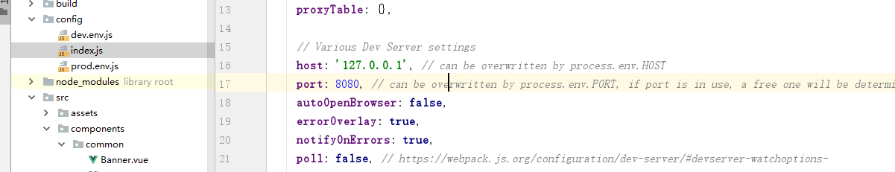
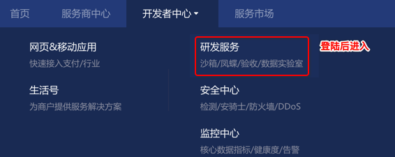
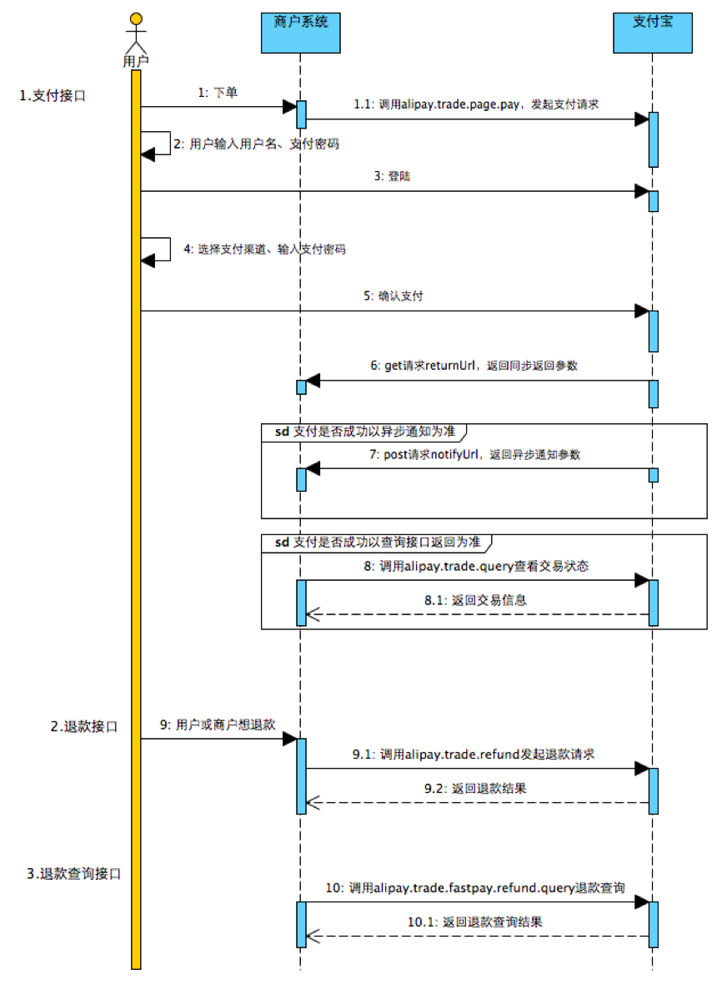
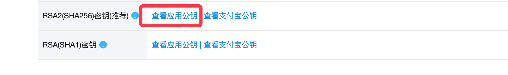
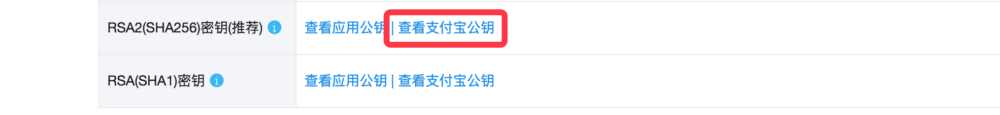

# CKEditor富文本编辑器

富文本即具备丰富样式格式的文本。在运营后台，运营人员需要录入课程的相关描述，可以是包含了HTML语法格式的字符串。为了快速简单的让用户能够在页面中编辑带格式的文本，我们引入富文本编辑器。

### 1. 安装

```shell
pip install django-ckeditor
```

### 2. 添加应用

在INSTALLED_APPS中添加

```python
INSTALLED_APPS = [
    ...
    'ckeditor',  # 富文本编辑器
    'ckeditor_uploader',  # 富文本编辑器上传图片模块
    ...
]
```

### 3. 添加CKEditor设置

在settings/dev.py中添加

```python
# 富文本编辑器ckeditor配置
CKEDITOR_CONFIGS = {
    'default': {
        'toolbar': 'full',  # 工具条功能
        'height': 300,      # 编辑器高度
        # 'width': 300,     # 编辑器宽
    },
}
CKEDITOR_UPLOAD_PATH = ''  # 上传图片保存路径
```

### 4. 添加ckeditor路由

在总路由中添加

```python
url(r'^ckeditor/', include('ckeditor_uploader.urls')),
```

### 5. 为模型类添加字段

ckeditor提供了两种类型的Django模型类字段

- `ckeditor.fields.RichTextField` 不支持上传文件的富文本字段
- `ckeditor_uploader.fields.RichTextUploadingField` 支持上传文件的富文本字段\

修改course/models.py里面的字段信息,记得要重新数据迁移

```python

from ckeditor_uploader.fields import RichTextUploadingField
class Course(models.Model):
    """
    专题课程
    """
	...
    
    brief = RichTextUploadingField(max_length=2048, verbose_name="课程概述", null=True, blank=True)
    
```


# 购物车实现

### 创建子应用 cart

```
cd luffy/apps
python ../../manage.py startapp cart
```


### 注册子应用cart

```python
INSTALLED_APPS = [
    'ckeditor',  # 富文本编辑器
    'ckeditor_uploader',  # 富文本编辑器上传图片模块

    'home',
    'users',
    'courses',
    'cart',
]
```


### 配置信息

```python
# 当前站点的域名
HOST = "http://127.0.0.1:8000"  # 方便提供图片给客户端
# 设置redis缓存
CACHES = {
    # 默认缓存
    ....
    
    "cart":{
        "BACKEND": "django_redis.cache.RedisCache",
        "LOCATION": "redis://127.0.0.1:6379/4",
        "OPTIONS": {
            "CLIENT_CLASS": "django_redis.client.DefaultClient",
        }
    },
}
```


## 添加购物车

```python
from rest_framework import status
from rest_framework.response import Response
from django_redis import get_redis_connection
from rest_framework.views import APIView
from courses.models import Course
from rest_framework.permissions import IsAuthenticated

class CartAPIView(APIView):
    permission_classes = [IsAuthenticated]
    """购物车"""
    def post(self,request):
        """添加课程到购物车"""
        # 接受客户端提交过来的课程ID
        course_id = request.data.get("course_id")
        # 到数据库中查询当前课程ID是否存在
        try:
            course = Course.objects.get(pk=course_id,status=0)
        except:
            return Response({"message":"当前课程不存在或者已经下架了"},status=status.HTTP_400_BAD_REQUEST)

        # 把课程id和课程价格保存到购物车中redis中
        # redis中使用hash类型保存数据
        redis = get_redis_connection("cart")
        # 获取当前登陆用户的ID
        user_id = request.user.id
        pl = redis.pipeline()
        pl.multi()
        pl.hset("cart_%s" % user_id, course_id, str(course.price) )
        # 把当前课程默认为勾选状态[勾选状态也要保存到redis中]
        # redis中使用set类型保存数据
        pl.sadd("cart_select_%s" % user_id, course_id )
        pl.execute()

        # 返回响应操作
        return Response({"message":"success"},status=status.HTTP_200_OK)

    def get(self,request):
        """获取购物车中的所有课程信息"""
        pass

    def update(self,request):
        """修改购物车中指定商品的数据信息"""
        pass

    def delete(self,request):
        """从购物车中把商品删除"""
        pass

```

## 提供访问路由

```python
# 总路由,代码:
urlpatterns = [
	...
    path('cart/', include("cart.urls")),
]

# 子应用路由,代码:
from django.urls import path
from . import views
urlpatterns=[
    path(r"", views.CartAPIView.as_view()),
]
```


前端提交课程到后端添加购物车数据

因为前面已经使用jw认证,所以需要完成以下配置



重启项目


Course.vue

```vue
<template>
  <div class="courses">
      <Header :current_page="current_page"/>
      <div class="main">
          <div class="filter">

            <el-row class="filter-el-row1">
              <el-col :span="2" class="filter-text">课程分类:</el-col>
              <div>
              <el-col :span="2" :data-id="0" class="current"><span @click="url_paramiter.course_category=0">全部</span></el-col>
              <el-col :span="2" :data-id="item.id" v-for="item in cate_list"><span @click="url_paramiter.course_category=item.id">{{item.name}}</span></el-col>
              </div>
            </el-row>
            <el-row class="filter-el-row2">
              <el-col :span="2" class="filter-text filter-text2">筛&nbsp;&nbsp;&nbsp;&nbsp;&nbsp;&nbsp;&nbsp;选:</el-col>
              <el-col :span="2" class="current"><span @click="url_paramiter.ordering='-id'">默认</span></el-col>
              <el-col :span="2"><span @click="url_paramiter.ordering='-students'">人气</span></el-col>
              <el-col :span="2">
                <span @click="url_paramiter.ordering='price'">价格</span>
                <div class="filter-price">
                  <span class="up" @click="url_paramiter.ordering='price'" :class="filter_price==true?'active':''"><i class="el-icon-caret-top"></i></span>
                  <span class="down" @click="url_paramiter.ordering='-price'" :class="filter_price==false?'active':''"><i class="el-icon-caret-bottom"></i></span>
                </div>
              </el-col>
            </el-row>
          </div>
          <div class="courses_list">
              <el-row v-for="course in course_list" class="course-item">
                <el-col :span="24" class="course-item-box">
                  <el-row>
                    <el-col :span="12" class="course-item-left"><router-link to="/detail"></router-link></el-col>
                    <el-col :span="12" class="course-item-right">
                        <div class="course-title">
                          <p class="box-title"><router-link to="/detail">{{course.name}}</router-link></p>
                          <p class="box-number">{{course.students}}人已加入学习</p>
                        </div>
                        <div class="author">
                          <p class="box-author">{{course.teacher.name}} {{course.teacher.title}}</p>
                          <p class="lession">共{{course.lessons}}课时<span>/{{course.pub_lessons==course.lessons?"更新完成":course.pub_lessons+'课时'}}</span></p>
                        </div>
                        <el-row class="course-content">
                            <el-col v-for="chapters in course.coursechapters" :span="12"><i class="el-icon-caret-right"></i>{{chapters.chapter<10?"0"+chapters.chapter:chapters.chapter}} | {{chapters.name}} <span class="free">免费</span> </el-col>
                        </el-row>
                        <div class="course-price">
                          <p class="course-price-left">
                              <span v-if="course.price_service_type">
                                  <span class="discount">{{course.price_service_type.name}}</span>
                                  <span class="count">¥{{get_price(course)}}</span>
                                  <span class="old_count">原价: ¥{{course.price}}元</span>
                              </span>
                              <span v-else class="count">¥{{course.price}}</span>
                          </p>
                          <button class="buy"><span @click="add_cart(course.id)">加入购物车</span></button>
                          <button class="buy">立即购买</button>
                        </div>
                    </el-col>
                  </el-row>
                </el-col>
              </el-row>
          </div>
        <el-pagination
          @current-change="handleCurrentChange"
          background
          layout="prev, pager, next"
          :page-size="page_size"
          :total="total">
        </el-pagination>
      </div>
      <Footer/>
  </div>
</template>

<script>
  import Header from "./common/Header"
  import Footer from "./common/Footer"
  export default {
    name:"Courses",
    data(){
      return {
        token: localStorage.token || sessionStorage.token,
        id: localStorage.id || sessionStorage.id,
        current_page:1,
        filter_price:false,
        cate_list:[],   // 课程分类列表
        course_list:[], // 专题课程列表
        page_size:1, // 默认每一页显示的数据量
        total: 10,
        url_paramiter:{
          "ordering":"-price",
          "course_category":0, // 值为0,则表示查询全部
        }, // 保存过滤条件
        course_url:"http://localhost:8000/courses", // 本次请求的课程列表url地址
      }
    },
    components:{
      Header,
      Footer,
    },
    watch:{
      'url_paramiter.ordering':function(){
        let url = this.get_course_params();
        this.get_course_list(url);
      },
      'url_paramiter.course_category':function(){
        let url = this.get_course_params();
        this.get_course_list(url);
      }
    },
    methods:{
      get_course_params(){
        // 组装地址栏参数
        let url = this.course_url+"?";
        for(let key in this.url_paramiter){
          if(key!="course_category" || this.url_paramiter[key]!=0){
            url+=`${key}=${this.url_paramiter[key]}&`
          }
        }
        url = url.slice(0,-1);
        return url;
      },
      get_price(course){
        // 计算价格
        let price = 0;
        course.price = parseInt(course.price);
        // 根据不同的价格服务,计算对应的价格
        let st = course.price_service_type; // 价格服务类型
        if(st != null && st.priceservices){ // 是否有设置了价格服务,没有设置价格服务的课程,服务为值null
            if(st.priceservices[0].condition>0){
              // 1. 优惠条件值大于0,则属于满减
              let list = st.priceservices; // 满减策略
              // 进行满减价格计算
              var real_sale = 0; // 保存满足条件的优惠值
              for(let i = 0;i<list.length;i++){
                list[i].condition = parseInt(list[i].condition);
                list[i].sale = parseInt(list[i].sale);
                if( course.price >= list[i].condition ){
                  // 后端返回的数字也是字符串,所以需要转换
                  if(real_sale<=list[i].sale){
                    real_sale = list[i].sale;
                  }
                }
              }
              console.log(real_sale);
              price = course.price - real_sale;
            }else{
              // 优惠条件值为0,则表示是限时折扣或者限时免费
              if(st.priceservices[0].sale=="-1"){
                // 2. 限时免费
                price = 0;

              }else{
                // 3. 限时折扣
                // 把优惠值sale中的*去掉
                let sale = st.priceservices[0].sale.replace("*","");
                price = course.price * parseFloat(sale)
              }
            }

        }else{
          price = course.price;
        }
        return price.toFixed(2);
      },
      handleCurrentChange(val){
        // 切换页面获取课程数据
        // 名字必须固定
        let url = "http://127.0.0.1:8000/courses/";
        url+="?page="+val+"&page_size="+this.page_size;
        this.$axios.get(url).then(response=>{
          this.course_list = response.data.results;
          this.curser_page_cout =response.data.count
        }).catch(error=>{
          console.log(error.response);
        })
      },
      // orders(field,type){
      //   // 排序
      //   let url = "http://127.0.0.1:8000/courses/";
      //   if(field=='students'){
      //     url+="?ordering=-students";
      //   }else if(field="price"){
      //     if(type=="+"){
      //       url+="?ordering=price";
      //     }else{
      //       url+="?ordering=-price";
      //     }
      //   }
      //   this.$axios.get(url).then(response=>{
      //     this.course_list = response.data
      //   }).catch(error=>{
      //     console.log(error.response);
      //   })
      // },
      addclass(ele,className){
        let class_array = ele.className.split(" ");
        // 判断元素本身是否已经有了一个同名的class,   indexOf返回查询出来的成员的下标
        let index = class_array.indexOf(className);
        // 如果返回值是-1,则表示找不到同名的claass
        if(index==-1){
          ele.className+=" "+className
        }
      },
      removeclass(ele,className){
        // 去除元素的class样式
        // 回头修复下bug,类似 <div class="col-2 current_activate ">
        ele.className = ele.className.replace("current","");
      },
      get_course(event){
        // 获取课程
        // 给当前被点击的分类元素添加外框高亮
        let ele_list = event.target.parentElement.children;
        for(let i = 0;i<ele_list.length;i++){
          this.removeclass(ele_list[i],"current")
        }
        this.addclass(event.target,"current");
        // 获取标签元素的属性,分类ID
        let id = event.target.getAttribute("data-id");
        let url = "http://127.0.0.1:8000/courses/";
        // 如果分类ID不是0,则表示按分类显示课程
        if(id!=0){
            url+="?course_category="+id
        }
        this.get_course_list(url);
      },
      get_course_list(url){
         // 获取课程列表
          this.$axios.get(url).then(response=>{
            this.course_list = response.data
          }).catch(error=>{
            console.log(error.response);
          });
      },
      add_cart(course_id){

        // 判断用户是否已经登录
       if( !this.token || !this.id ){
          alert("请登录!")
        }

        // 添加课程到购物车中
        // 2. 把课程的id发送到后端添加课程的接口中
        let _this = this;
        _this.$axios.post("http://127.0.0.1:8000/cart/",{
          course_id:course_id
        },{
          headers:{
            // 附带已经登录用户的jwt token 提供给后端,一定不能疏忽这个空格
            'Authorization':'JWT '+_this.token
          },
          responseType:"json",
          withCredentials: true,
        }).then(response=>{
          // 3. 获取后端添加课程的接口返回结果
          console.log(response.data);
          // 4. 提示用户最终添加购物车的结果并跳转页面

        })


      }
    },
    created(){
      // 获取课程分类信息
      this.$axios.get(`http://127.0.0.1:8000/courses/cate/`).then(response=>{
        this.cate_list = response.data
      }).catch(error=>{
        console.log(error.response);
      });


      // 获取课程信息
      this.$axios.get(`http://127.0.0.1:8000/courses/?page=${this.current_page}&page_size=${this.page_size}`).then(response=>{
        this.course_list = response.data.results
        this.total = response.data.count
      }).catch(error=>{
        console.log(error.response);
      });

    }
  }
</script>


<style scoped>
.courses{
  padding-top: 80px;
}
.main{
    width: 1100px;
    height: auto;
    margin: 0 auto;
    padding-top: 35px;
}
.main .filter{
    width: 100%;
    height: auto;
    margin-bottom: 35px;
    padding: 25px 0px 25px 0px;
    background: #fff;
    border-radius: 4px;
    box-shadow: 0 2px 4px 0 #f0f0f0;
}
.filter .el-col{
  text-align: center;
  padding: 6px 0px;
  line-height: 16px;
  margin-left: 14px;
  position: relative;
  transition: all .3s ease;
  cursor: pointer;
  color: #4a4a4a;
}
.filter-el-row1{
  padding-bottom: 18px;
  margin-bottom: 17px;
}
.filter .filter-text{
  text-align: right;
  font-size: 16px;
  color: #888;
}
.filter .filter-text2{
}
.filter .filter-el-row1 .current{
    color: #ffc210;
    border: 1px solid #ffc210!important;
    border-radius: 30px;
}
.filter .filter-el-row2 .current{
    color: #ffc210;
}
.filter-price{
  display:inline-block;
  vertical-align: middle;
}
.filter-price .up, .filter-price .down{
  display: block;
  line-height: 8px;
  font-size: 13px;
  margin: -4px;
  color: #d8d8d8;
}
.current .filter-price .active{
  color: #ffc210;
}
.course-item{
  margin-bottom: 35px;
}
.course-item .course-item-box{
   padding: 20px 30px 20px 20px;
}
.course-item{
     box-shadow: 2px 3px 16px rgba(0,0,0,.1);
    transition: all .2s ease;
}
.course-item .course-item-left{
    width: 423px;
    height: 210px;
    margin-right: 30px;
}
.course-title{
  overflow: hidden;/* 在父元素中使用可以清除子元素的浮动影响 */
}
.course-title .box-title{
  font-size: 26px;
  color: #333333;
  float: left;
  margin-bottom: 8px;
}
.course-title .box-number{
    font-size: 14px;
    color: #9b9b9b;
    font-family: PingFangSC-Light;
    float: right;
    padding-top: 12px;
}
.course-item-right{
  width: 56.6%;
}
.author{
    font-size: 14px;
    color: #9b9b9b;
    margin-bottom: 14px;
    padding-bottom: 14px;
    overflow: hidden;
}
.author .box-author{
  float:left;
}
.author .lession{
  float: right;
}
.course-content .el-icon-caret-right{
  border: 1px solid #000;
  border-radius: 50%;
  margin-right: 6px;
}
.course-content .el-col{
  font-size: 14px;
  color: #666;
  width: 50%;
  margin-bottom: 15px;
  cursor: pointer;
}
.course-content .el-col:hover{
  color: #ffc210;
}
.course-content .el-col:hover .el-icon-caret-right,.course-content .el-col:hover .free{
  border-color: #ffc210;
  color: #ffc210;
}
.course-content .el-col .free{
    width: 34px;
    height: 20px;
    color: #fd7b4d;
    margin-left: 10px;
    border: 1px solid #fd7b4d;
    border-radius: 2px;
    text-align: center;
    font-size: 13px;
    white-space: nowrap;
}
.course-price{
  overflow: hidden;
}
.course-price .course-price-left{
  float: left;
}
.course-price .discount{
    padding: 6px 10px;
    display: inline-block;
    font-size: 16px;
    color: #fff;
    text-align: center;
    margin-right: 8px;
    background: #fa6240;
    border: 1px solid #fa6240;
    border-radius: 10px 0 10px 0;
}
.course-price .course-price-left{
  line-height: 22px;
}
.course-price .count{
    font-size: 24px;
    color: #fa6240;
}
.course-price .old_count{
    font-size: 14px;
    color: #9b9b9b;
    margin-left: 10px;
    text-decoration: line-through;
}
.course-price .buy{
  float: right;
  width: 120px;
  height: 38px;
  font-size: 16px;
  border-radius: 3px;
  border: 1px solid #fd7b4d;
  background: transparent;/* 透明 */
  color: #fa6240;
  cursor: pointer;
  transition: all .2s ease-in-out;/* css3新版本的样式中支持支持 jQuery里面的动画预设效果 */
  /* all表示当前元素的所有样式  .2s表示改变样式完成的时间  ease-in-out */
}
.course-price .buy:hover{
    color: #fff;
    background: #ffc210;
    border: 1px solid #ffc210;
}
</style>

```


## 显示购物车数据

### 后端提供获取购物车课程信息

```python
    def get(self,request):
        """获取购物车中的所有课程信息"""
        # 获取当前登陆用户
        user_id = request.user.id
        # 从redis中获取所有的课程信息和勾选状态
        redis = get_redis_connection("cart")
        course_list = redis.hgetall("cart_%s" % user_id)
        selected_list = redis.smembers("cart_select_%s" % user_id )
        # 组装数据
        """
       cart_<user_id>:{
          课程id: 真实价格,
          课程id: 真实价格,
          课程id: 真实价格,
       }
       cart_select_<user_id>:{课程id,课程id}
       
       上面两个数据最终要合并到一个数组中，一起返回给客户端
       [
        {
            课程id:价格,
            selected:True/False,  // 勾选状态
        },
        {
            id:课程id,
            price:价格,
            selected:True/False,  // 勾选状态
        },
       ]
       """
        data = []
        for course_id,price in course_list.items():
            course_id = course_id.decode()
            price = price.decode()

            try:
                course_info = Course.objects.get(pk=course_id)
            except:
                return Response({"message":"请求有误，请联系客服"},status=status.HTTP_507_INSUFFICIENT_STORAGE)
            data.append({
                "id": course_id,
                "price":price,
                "selected": course_id.encode() in selected_list,
                "course_img": course_info.course_img.url,
                "name": course_info.name,
            })

        # 返回给客户端
        return Response(data,status=status.HTTP_200_OK)
```


### 前端请求并显示课程信息

Cart.vue

```vue
<template>
  <div class="cart">
    <Header/>
    <div class="cart-info">
        <h3 class="cart-top">我的购物车 <span>共1门课程</span></h3>
        <div class="cart-title">
           <el-row>
             <el-col :span="2">&nbsp;</el-col>
             <el-col :span="10">课程</el-col>
             <el-col :span="4">有效期</el-col>
             <el-col :span="4">单价</el-col>
             <el-col :span="4">操作</el-col>
           </el-row>
        </div>
        <CartItem v-for="item in course_list" :course="item"/>
        <div class="calc">
            <el-row>
              <el-col :span="2">&nbsp;</el-col>
              <el-col :span="3">
                  <el-checkbox label="全选" name="type"></el-checkbox></el-col>
              <el-col :span="2" class="del"><i class="el-icon-delete"></i>删除</el-col>
              <el-col :span="12" class="count">总计：¥0.0</el-col>
              <el-col :span="3" class="cart-calc">去结算</el-col>
            </el-row>
        </div>
    </div>
    <Footer/>
  </div>
</template>

<script>
  import Header from "./common/Header"
  import Footer from "./common/Footer"
  import CartItem from "./common/CartItem"
  export default {
    name:"Cart",
    data(){
      return {
        token: localStorage.token || sessionStorage.token,
        id: localStorage.id || sessionStorage.id,
        course_list:[]
      }
    },
    components:{
      Header,
      Footer,
      CartItem,
    },
    created(){
      // 判断用户是否已经登陆了。
      if( !this.token || !this.id ){
        this.$router.push("/login");
      }
      let _this = this;
      // 发起请求获取购物车中的商品信息
      _this.$axios.get("http://127.0.0.1:8000/cart/",{
          headers: {
              'Authorization': 'JWT ' + _this.token
          },
          responseType: 'json',
          withCredentials: true
        }).then(response=>{
          _this.course_list = response.data;
        })
    }
  }
</script>

<style scoped>
.cart{
  margin-top: 80px;
}
.cart-info{
  overflow: hidden;
  width: 1200px;
  margin: auto;
}
.cart-top{
  font-size: 18px;
  color: #666;
  margin: 25px 0;
  font-weight: normal;
}
.cart-top span{
    font-size: 12px;
    color: #d0d0d0;
    display: inline-block;
}
.cart-title{
    background: #F7F7F7;
}
.cart-title .el-row,.cart-title .el-col{
    height: 80px;
    font-size: 14px;
    color: #333;
    line-height: 80px;
}
.calc .el-col{
  height: 80px;
  line-height: 80px;
}
.calc .el-row span{
  font-size: 18px!important;
}
.calc .el-row{
    font-size: 18px;
    color: #666;
    margin-bottom: 300px;
    margin-top: 50px;
    background: #F7F7F7;
}
.calc .del{

}
.calc .el-icon-delete{
  margin-right: 15px;
  font-size: 20px;
}
.calc .count{
  text-align: right;
  margin-right:62px;
}
.calc .cart-calc{
    width: 159px;
    height: 80px;
    border: none;
    background: #ffc210;
    font-size: 18px;
    color: #fff;
    text-align: center;
    cursor: pointer;
}
</style>

```


CartItem.vue

```vue
<template>
  <div class="cart-item">
          <el-row>
             <el-col :span="2" class="checkbox"><el-checkbox label="" :checked="course.selected" name="type"></el-checkbox></el-col>
             <el-col :span="10" class="course-info">
               
                <span>{{course.name}}</span>
             </el-col>
             <el-col :span="4">
                 <el-select v-model="course_info.duration">
                    <el-option v-for="item in options" :key="item.value" :label="item.label" :value="item.value"></el-option>
                  </el-select>
             </el-col>
             <el-col :span="4" class="course-price">¥{{course.price}}</el-col>
             <el-col :span="4" class="course-delete">删除</el-col>
           </el-row>
  </div>
</template>

<script>
  export default {
    name:"CartItem",
    props:["course"],
    data(){
      return {
        options:[
          {value:30,label:"一个月有效"},
          {value:60,label:"二个月有效"},
          {value:90,label:"三个月有效"},
          {value:-1,label:"永久有效"},
        ],
        course_info:{
          id:1,
          title:"Python开发21天入门",
          duration: 60,
          src:"../../assets/course_1.jpeg",
        }
      }
    }
  }
</script>

<style scoped>
.cart-item{
  height: 250px;
}
.cart-item .el-row{
  height: 100%;
}
.course-delete{
    font-size: 14px;
    color: #ffc210;
    cursor: pointer;
}
.el-checkbox,.el-select,.course-price,.course-delete{
    display: flex;
    align-items: center;
    justify-content: center;
    height: 100%;
}
.el-checkbox{
    padding-top: 55px;
}
.el-select{
    padding-top: 45px;
    width: 118px;
    height: 28px;
    font-size: 12px;
    color: #666;
    line-height: 18px;
}
.course-info img{
    width: 175px;
    height: 115px;
    margin-right: 35px;
    vertical-align: middle;
}
.cart-item .el-col{
    padding: 67px 10px;
    vertical-align: middle!important;
}
.course-info{

}
</style>

```

### 切换勾选状态


### 前端计算统计总价


#### axios进行get请求和post请求语法

```python
axios.post('请求地址', {
    course_id: parseInt(this.cid),
}, {
    headers: {
        'Authorization': 'JWT ' + this.token
    },
    responseType: 'json',
    withCredentials: true
})
.then(response => {
    this.cart_total_count += response.data.count;
})
.catch(error => {
    alert(error.response.message[0]);
    console.log(error.response.data);
})
     
    
    let _this = this;
    // 发起请求获取购物车中的商品信息
    _this.$axios.get("http://127.0.0.1:8000/cart/",{
        headers: {
            'Authorization': 'JWT ' + _this.token
        },
        responseType: 'json',
        withCredentials: true
    }).then(response=>{
        console.log(response.data);
    })

        
        
```


# 接入支付宝

### 支付宝开发平台登录

<https://open.alipay.com/platform/home.htm>

### 沙箱环境

- 是支付宝提供给开发者的模拟支付的环境

- 跟真实环境是分开的

- **沙箱应用**：<https://docs.open.alipay.com/200/105311>

- **沙箱账号**：<https://openhome.alipay.com/platform/appDaily.htm?tab=account>

  

### 支付宝开发者文档

- **文档主页**：<https://openhome.alipay.com/developmentDocument.htm>

- **产品介绍**：<https://docs.open.alipay.com/270>

- **快速接入**：<https://docs.open.alipay.com/270/105899/>

- SDK：https://docs.open.alipay.com/270/106291/

  - **python对接支付宝SDK**：<https://github.com/fzlee/alipay/blob/master/README.zh-hans.md>
  - **python对接支付宝SDK安装**：`pip install python-alipay-sdk --upgrade`

- **API列表**：<https://docs.open.alipay.com/270/105900/>

### 电脑网站支付流程



### 接入步骤

1. 创建应用
2. 配置密钥
3. 搭建和配置开发环境
4. 接口调用

### 配置秘钥

#### 1. 生成应用的私钥和公钥


#### 2. 保存应用私钥文件

在payment应用中新建keys目录，用来保存秘钥文件。

将应用私钥文件app_private_key.pem复制到payment/keys目录下。

#### 3. 查看公钥

```shell
cat app_publict_key.pem
```

将公钥内容复制给支付宝



#### 4. 保存支付宝公钥

在payment/keys目录下新建alipay_public_key.pem文件，用于保存支付宝的公钥文件。

将支付宝的公钥内容复制到alipay_public_key.pem文件中



注意，还需要在公钥文件中补充开始与结束标志

```shell
-----BEGIN PUBLIC KEY-----
此处是公钥内容
-----END PUBLIC KEY-----
```