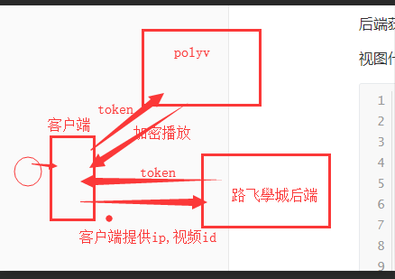

# 课程详情页

#### 课程详情页组件代码

```vue
<template>
	<div class="detail">
    <Header></Header>
    <div class="warp">
        <div class="course-info">
          <div class="warp-left" style="width: 690px;height: 388px;background-color: #000;">

          </div>
          <div class="warp-right">
              <h3 class="course-title">Python开发21天入门</h3>
              <p class="course-data">37400人在学&nbsp;&nbsp;&nbsp;&nbsp;课程总时长：154课时/30小时&nbsp;&nbsp;&nbsp;&nbsp;难度：初级</p>
              <div class="preferential">
                <p class="price-service">限时免费</p>
                <p class="timer">距离结束：仅剩 28天 14小时 10分 <span>57</span> 秒</p>
              </div>
              <p class="course-price">
                <span>活动价</span>
                <span class="real-price">¥0.00</span>
                <span class="old-price">¥9.00</span>
              </p>
              <div class="buy-course">
                <p class="buy-btn">
                  <span class="btn1">立即购买</span>
                  <span class="btn2">免费试学</span>
                </p>
                <p class="add-cart">
                  加入购物车
                </p>
              </div>
          </div>
        </div>
        <div class="course-tab">
            <ul>
                <li  class="active">详情介绍</li>
                <li>课程章节 <span>(试学)</span></li>
                <li>用户评论 (83)</li>
                <li>常见问题</li>
            </ul>
        </div>
        <div class="course-section">
          <section class="course-section-left">
            
          </section>

        </div>
    </div>
    <Footer></Footer>
	</div>
</template>

<script>
import Header from "./common/Header"
import Footer from "./common/Footer"
export default {
  name: 'CourseDetail',
  data(){
  	return {

  	}
  },
  components:{
    Header,
    Footer,

  },
  methods:{

  },
  created(){

  }
};
</script>

<style scoped>
.detail{
  margin-top: 80px;
}
.course-info{
  padding-top: 30px;
  width:1200px;
  height: 388px;
  margin: auto;
}
.warp-left,.warp-right{
  float: left;
}
.warp-right{
  height: 388px;
  position: relative;
}
.course-title{
    font-size: 20px;
    color: #333;
    padding: 10px 23px;
    letter-spacing: .45px;
    font-weight: normal;
}
.course-data{
    padding-left: 23px;
    padding-right: 23px;
    padding-bottom: 16px;
    font-size: 14px;
    color: #9b9b9b;
}
.preferential{
    width: 100%;
    height: auto;
    background: #fa6240;
    font-size: 14px;
    color: #4a4a4a;
    display: -ms-flexbox;
    display: flex;
    -ms-flex-align: center;
    align-items: center;
    -ms-flex-pack: justify;
    justify-content: space-between;
    padding: 10px 23px;
}
.price-service{
    font-size: 16px;
    color: #fff;
    letter-spacing: .36px;
}
.timer{
    font-size: 14px;
    color: #fff;
}
.course-price{
    width: 100%;
    background: #fff;
    height: auto;
    font-size: 14px;
    color: #4a4a4a;
    display: -ms-flexbox;
    display: flex;
    -ms-flex-align: end;
    align-items: flex-end;
    padding: 5px 23px;
}
.real-price{
    font-size: 26px;
    color: #fa6240;
    margin-left: 10px;
    display: inline-block;
    margin-bottom: -5px;
}
.old-price{
    font-size: 14px;
    color: #9b9b9b;
    margin-left: 10px;
    text-decoration: line-through;
}
.buy-course{
    position: absolute;
    left: 0;
    bottom: 20px;
    width: 100%;
    height: auto;
    -ms-flex-pack: justify;
    justify-content: space-between;
    padding-left: 23px;
    padding-right: 23px;
}
.buy-btn{
  float: left;
}
.buy-btn .btn1{
    display: inline-block;
    width: 125px;
    height: 40px;
    background: #ffc210;
    border-radius: 4px;
    color: #fff;
    cursor: pointer;
    margin-right: 15px;
    text-align: center;
    vertical-align: middle;
    line-height: 40px;
}
.buy-btn .btn2{
    width: 125px;
    height: 40px;
    border-radius: 4px;
    cursor: pointer;
    margin-right: 15px;
    display: inline-block;
    background: #fff;
    color: #ffc210;
    border: 1px solid #ffc210;
    text-align: center;
    vertical-align: middle;
    line-height: 40px;
}
.add-cart{
    font-size: 14px;
    color: #ffc210;
    text-align: center;
    cursor: pointer;
    float: right;
    margin-top: 10px;
}
.add-cart img{
    width: 20px;
    height: auto;
    margin-right: 7px;
}
.course-tab{
    width: 100%;
    height: auto;
    background: #fff;
    margin-bottom: 30px;
    box-shadow: 0 2px 4px 0 #f0f0f0;
}
.course-tab>ul{
    padding: 0;
    margin: 0;
    list-style: none;
    width: 1200px;
    height: auto;
    display: -ms-flexbox;
    display: flex;
    -ms-flex-align: center;
    align-items: center;
    color: #4a4a4a;
}
.course-tab>ul>li{
    margin-right: 15px;
    padding: 26px 20px 16px;
    font-size: 17px;
    cursor: pointer;
}
.course-tab>ul>.active{
    color: #ffc210;
    border-bottom: 2px solid #ffc210;
}
.course-section{
    background: #FAFAFA;
    overflow: hidden;
    padding-bottom: 40px;
    width: 1200px;
    height: auto;
    margin: 0 auto;
}
.course-section-left{
    width: 880px;
    height: auto;
    padding: 20px;
    background: #fff;
    float: left;
    box-sizing: border-box;
    overflow: hidden;
    position: relative;
    box-shadow: 0 2px 4px 0 #f0f0f0;
}
</style>

```

#### 注册路由

```javascript
import CourseDetail from "../components/CourseDetail"


    {
      name:"CourseDetail",
      path: "/detail",
      component: CourseDetail,
    }
```


### 在页面中引入vue-video组件实现视频播放

```
# 1. 安装依赖
npm install vue-video-player --save

# 2. 在main.js中注册加载组件
require('video.js/dist/video-js.css');
require('vue-video-player/src/custom-theme.css');
import VideoPlayer from 'vue-video-player'
Vue.use(VideoPlayer);
```

在课程详情页中的script标签里面加入以下代码:

```javascript
import {videoPlayer} from 'vue-video-player';

export default {
  data () {
    return {
      playerOptions: {
        playbackRates: [0.7, 1.0, 1.5, 2.0], // 播放速度
        autoplay: false, //如果true,则自动播放
        muted: false, // 默认情况下将会消除任何音频。
        loop: false, // 循环播放
        preload: 'auto', // 建议浏览器在<video>加载元素后是否应该开始下载视频数据。auto浏览器选择最佳行为,立即开始加载视频（如果浏览器支持）
        language: 'zh-CN',
        aspectRatio: '16:9', // 将播放器置于流畅模式，并在计算播放器的动态大小时使用该值。值应该代表一个比例 - 用冒号分隔的两个数字（例如"16:9"或"4:3"）
        fluid: true, // 当true时，Video.js player将拥有流体大小。换句话说，它将按比例缩放以适应其容器。
        sources: [{
          type: "video/mp4",
          src: "http://img.ksbbs.com/asset/Mon_1703/05cacb4e02f9d9e.mp4" //你的视频地址（必填）
        }],
        poster: "../static/courses/675076.jpeg", //视频封面图
        width: document.documentElement.clientWidth,
        notSupportedMessage: '此视频暂无法播放，请稍后再试', //允许覆盖Video.js无法播放媒体源时显示的默认信息。
      }
    }
  },
  components: {
    videoPlayer
  },
  methods: {
    onPlayerPlay(player) {
      alert("play");
    },
    onPlayerPause(player){
      alert("pause");
    },
  },
  computed: {
    player() {
      return this.$refs.videoPlayer.player
    }
  }
}
```

加入播放器以后的课程详情页组件代码:

```vue
<template>
	<div class="detail">
    <Header></Header>
    <div class="warp">
        <div class="course-info">
          <div class="warp-left" style="width: 690px;height: 388px;background-color: #000;">
          <video-player class="video-player vjs-custom-skin"
               ref="videoPlayer"
               :playsinline="true"
               :options="playerOptions"
               @play="onPlayerPlay($event)"
               @pause="onPlayerPause($event)"
          >
          </video-player>
          </div>
          <div class="warp-right">
              <h3 class="course-title">Python开发21天入门</h3>
              <p class="course-data">37400人在学&nbsp;&nbsp;&nbsp;&nbsp;课程总时长：154课时/30小时&nbsp;&nbsp;&nbsp;&nbsp;难度：初级</p>
              <div class="preferential">
                <p class="price-service">限时免费</p>
                <p class="timer">距离结束：仅剩 28天 14小时 10分 <span>57</span> 秒</p>
              </div>
              <p class="course-price">
                <span>活动价</span>
                <span class="real-price">¥0.00</span>
                <span class="old-price">¥9.00</span>
              </p>
              <div class="buy-course">
                <p class="buy-btn">
                  <span class="btn1">立即购买</span>
                  <span class="btn2">免费试学</span>
                </p>
                <p class="add-cart">
                  加入购物车
                </p>
              </div>
          </div>
        </div>
        <div class="course-tab">
            <ul>
                <li  class="active">详情介绍</li>
                <li>课程章节 <span>(试学)</span></li>
                <li>用户评论 (83)</li>
                <li>常见问题</li>
            </ul>
        </div>
        <div class="course-section">
          <section class="course-section-left">
            
          </section>

        </div>
    </div>
    <Footer></Footer>
	</div>
</template>

<script>
import Header from "./common/Header"
import Footer from "./common/Footer"

import {videoPlayer} from 'vue-video-player';

export default {
  name: 'CourseDetail',
  data(){
  	return {
        // vue-video的配置选项
        playerOptions: {
          playbackRates: [0.7, 1.0, 1.5, 2.0], // 播放速度
          autoplay: false, //如果true,则打开页面以后自动播放
          muted: false, // 默认情况下将会消除任何音频。
          loop: false, // 循环播放
          preload: 'auto', // 建议浏览器在<video>加载元素后是否应该开始下载视频数据。auto浏览器选择最佳行为,立即开始加载视频（如果浏览器支持）
          language: 'zh-CN',
          aspectRatio: '16:9', // 将播放器置于流畅模式，并在计算播放器的动态大小时使用该值。值应该代表一个比例 - 用冒号分隔的两个数字（例如"16:9"或"4:3"）
          fluid: true, // 当true时，Video.js player将拥有流体大小。换句话说，它将按比例缩放以适应其容器。
          sources: [{ // 播放资源类型和地址
            type: "video/mp4",
            src: "http://img.ksbbs.com/asset/Mon_1703/05cacb4e02f9d9e.mp4" //你的视频地址（必填）
          }],
          poster: "../static/courses/675076.jpeg", //视频封面图
          width: document.documentElement.clientWidth,
          notSupportedMessage: '此视频暂无法播放，请稍后再试', //允许覆盖Video.js无法播放媒体源时显示的默认信息。
        }
  	}
  },
  components:{
    Header,
    Footer,
    videoPlayer, // 引入vue-viedeo播放器组件
  },
  methods:{

  },
  computed: {
    player() {
      return this.$refs.videoPlayer.player
    }
  }
};
</script>

<style scoped>
.detail{
  margin-top: 80px;
}
.course-info{
  padding-top: 30px;
  width:1200px;
  height: 388px;
  margin: auto;
}
.warp-left,.warp-right{
  float: left;
}
.warp-right{
  height: 388px;
  position: relative;
}
.course-title{
    font-size: 20px;
    color: #333;
    padding: 10px 23px;
    letter-spacing: .45px;
    font-weight: normal;
}
.course-data{
    padding-left: 23px;
    padding-right: 23px;
    padding-bottom: 16px;
    font-size: 14px;
    color: #9b9b9b;
}
.preferential{
    width: 100%;
    height: auto;
    background: #fa6240;
    font-size: 14px;
    color: #4a4a4a;
    display: -ms-flexbox;
    display: flex;
    -ms-flex-align: center;
    align-items: center;
    -ms-flex-pack: justify;
    justify-content: space-between;
    padding: 10px 23px;
}
.price-service{
    font-size: 16px;
    color: #fff;
    letter-spacing: .36px;
}
.timer{
    font-size: 14px;
    color: #fff;
}
.course-price{
    width: 100%;
    background: #fff;
    height: auto;
    font-size: 14px;
    color: #4a4a4a;
    display: -ms-flexbox;
    display: flex;
    -ms-flex-align: end;
    align-items: flex-end;
    padding: 5px 23px;
}
.real-price{
    font-size: 26px;
    color: #fa6240;
    margin-left: 10px;
    display: inline-block;
    margin-bottom: -5px;
}
.old-price{
    font-size: 14px;
    color: #9b9b9b;
    margin-left: 10px;
    text-decoration: line-through;
}
.buy-course{
    position: absolute;
    left: 0;
    bottom: 20px;
    width: 100%;
    height: auto;
    -ms-flex-pack: justify;
    justify-content: space-between;
    padding-left: 23px;
    padding-right: 23px;
}
.buy-btn{
  float: left;
}
.buy-btn .btn1{
    display: inline-block;
    width: 125px;
    height: 40px;
    background: #ffc210;
    border-radius: 4px;
    color: #fff;
    cursor: pointer;
    margin-right: 15px;
    text-align: center;
    vertical-align: middle;
    line-height: 40px;
}
.buy-btn .btn2{
    width: 125px;
    height: 40px;
    border-radius: 4px;
    cursor: pointer;
    margin-right: 15px;
    display: inline-block;
    background: #fff;
    color: #ffc210;
    border: 1px solid #ffc210;
    text-align: center;
    vertical-align: middle;
    line-height: 40px;
}
.add-cart{
    font-size: 14px;
    color: #ffc210;
    text-align: center;
    cursor: pointer;
    float: right;
    margin-top: 10px;
}
.add-cart img{
    width: 20px;
    height: auto;
    margin-right: 7px;
}
.course-tab{
    width: 1200px;
    margin: auto;
    height: auto;
    background: #fff;
    margin-bottom: 30px;
    box-shadow: 0 2px 4px 0 #f0f0f0;
}
.course-tab>ul{
    padding: 0;
    margin: 0;
    list-style: none;
    width: 1200px;
    height: auto;
    display: -ms-flexbox;
    display: flex;
    -ms-flex-align: center;
    align-items: center;
    color: #4a4a4a;
}
.course-tab>ul>li{
    margin-right: 15px;
    padding: 26px 20px 16px;
    font-size: 17px;
    cursor: pointer;
}
.course-tab>ul>.active{
    color: #ffc210;
    border-bottom: 2px solid #ffc210;
}
.course-section{
    background: #FAFAFA;
    overflow: hidden;
    padding-bottom: 40px;
    width: 1200px;
    height: auto;
    margin: 0 auto;
}
.course-section-left{
    width: 880px;
    height: auto;
    padding: 20px;
    background: #fff;
    float: left;
    box-sizing: border-box;
    overflow: hidden;
    position: relative;
    box-shadow: 0 2px 4px 0 #f0f0f0;
}
</style>

```


### 后端提供数据接口

```python
import time
from datetime import datetime

from ckeditor_uploader.fields import RichTextUploadingField
from django.db import models
from cart.utils import get_course_real_price
# Create your models here.
class CourseCategory(models.Model):
    """
    课程分类
    """
    name = models.CharField(max_length=64, unique=True, verbose_name="分类名称")
    orders = models.IntegerField(verbose_name="课程排序",null=True)
    is_show = models.BooleanField(default=True, verbose_name="是否上线")
    is_delete = models.BooleanField(default=False, verbose_name="逻辑删除")
    class Meta:
        db_table = "ly_course_category"
        verbose_name = "课程分类"
        verbose_name_plural = "课程分类"


    def __str__(self):
        return "%s" % self.name


from django.conf import settings
class Course(models.Model):
    """
    专题课程
    """
    course_type = (
        (0, '付费'),
        (1, 'VIP专享'),
        (2, '学位课程')
    )
    level_choices = (
        (0, '初级'),
        (1, '中级'),
        (2, '高级')
    )
    status_choices = (
        (0, '上线'),
        (1, '下线'),
        (2, '预上线')
    )
    name = models.CharField(max_length=128, verbose_name="课程名称")
    course_img = models.ImageField(max_length=255, verbose_name="封面图片", blank=True, null=True)
    course_type = models.SmallIntegerField(choices=course_type, verbose_name="付费类型")
    # 使用这个字段的原因
    # brief = models.TextField(max_length=2048, verbose_name="课程概述", null=True, blank=True)
    brief = RichTextUploadingField(max_length=2048, verbose_name="课程概述", null=True, blank=True)
    level = models.SmallIntegerField(choices=level_choices, default=1, verbose_name="难度等级划分")
    pub_date = models.DateField(verbose_name="发布日期", auto_now_add=True)
    period = models.IntegerField(verbose_name="建议学习周期(day)", default=7)
    orders = models.IntegerField(verbose_name="课程排序")
    attachment_path = models.FileField(max_length=128, verbose_name="课件路径", blank=True, null=True)
    status = models.SmallIntegerField(choices=status_choices, default=0, verbose_name="课程状态")
    course_category = models.ForeignKey("CourseCategory", on_delete=models.CASCADE, null=True, blank=True,verbose_name="课程分类")
    students = models.IntegerField(verbose_name="学习人数",default = 0)
    lessons = models.IntegerField(verbose_name="总课时数量",default = 0)
    pub_lessons = models.IntegerField(verbose_name="课时更新数量",default = 0)
    price = models.DecimalField(max_digits=6,decimal_places=2, verbose_name="课程原价",default=0)
    teacher = models.ForeignKey("Teacher",on_delete=models.DO_NOTHING, null=True, blank=True,verbose_name="授课老师")
    price_service_type = models.ForeignKey("PriceServiceType",on_delete=models.DO_NOTHING, null=True, blank=True,verbose_name="价格服务")
    class Meta:
        db_table = "ly_course"
        verbose_name = "专题课程"
        verbose_name_plural = "专题课程"

    def __str__(self):
        return "%s" % self.name

    # 自定义显示字段
    def course_http_img(self):
        return settings.HOST+self.course_img.url

    def real_price(self):
        return get_course_real_price(self)

    def level_name(self):
        return self.level_choices[self.level][1]

class Teacher(models.Model):
    """讲师、导师表"""
    role_choices = (
        (0, '讲师'),
        (1, '导师'),
    )
    name = models.CharField(max_length=32, verbose_name="讲师title")
    role = models.SmallIntegerField(choices=role_choices, default=0, verbose_name="讲师身份")
    title = models.CharField(max_length=64, verbose_name="职位、职称")
    signature = models.CharField(max_length=255, help_text="导师签名", blank=True, null=True)
    image = models.ImageField(blank=True,verbose_name = "讲师封面")
    brief = models.TextField(max_length=1024, verbose_name="讲师描述")

    class Meta:
        db_table = "ly_teacher"
        verbose_name = "讲师导师"
        verbose_name_plural = "讲师导师"

    def __str__(self):
        return "%s" % self.name


class CourseChapter(models.Model):
    """课程章节"""
    course = models.ForeignKey("Course", related_name='coursechapters', on_delete=models.CASCADE, verbose_name="课程名称")
    chapter = models.SmallIntegerField(verbose_name="第几章", default=1)
    name = models.CharField(max_length=128, verbose_name="章节标题")
    summary = models.TextField(verbose_name="章节介绍", blank=True, null=True)
    pub_date = models.DateField(verbose_name="发布日期", auto_now_add=True)

    class Meta:
        db_table = "ly_course_chapter"
        verbose_name = "课程章节"
        verbose_name_plural = "课程章节"

    def __str__(self):
        return "%s:(第%s章)%s" % (self.course, self.chapter, self.name)


class CourseLesson(models.Model):
    """课程课时"""
    section_type_choices = (
        (0, '文档'),
        (1, '练习'),
        (2, '视频')
    )
    chapter = models.ForeignKey("CourseChapter", related_name='coursesections', on_delete=models.CASCADE,verbose_name="课程章节")
    name = models.CharField(max_length=128,verbose_name = "课时标题")
    orders = models.PositiveSmallIntegerField(verbose_name="课时排序")
    section_type = models.SmallIntegerField(default=2, choices=section_type_choices, verbose_name="课时种类")
    section_link = models.CharField(max_length=255, blank=True, null=True, verbose_name="课时链接", help_text = "若是video，填vid,若是文档，填link")
    duration = models.CharField(verbose_name="视频时长", blank=True, null=True, max_length=32)  # 仅在前端展示使用
    pub_date = models.DateTimeField(verbose_name="发布时间", auto_now_add=True)
    free_trail = models.BooleanField(verbose_name="是否可试看", default=False)

    class Meta:
        db_table = "ly_course_lesson"
        verbose_name = "课程课时"
        verbose_name_plural = "课程课时"

    def __str__(self):
        return "%s-%s" % (self.chapter, self.name)


class PriceServiceType(models.Model):
    """价格服务类型"""
    name = models.CharField(max_length=32, verbose_name="服务名称")

    class Meta:
        db_table = "ly_price_service_type"
        verbose_name = "价格服务"
        verbose_name_plural = "价格服务"

    def __str__(self):
        return "%s" % (self.name)

class PriceService(models.Model):
    """价格服务策略"""
    services_type = models.ForeignKey("PriceServiceType", related_name='priceservices', on_delete=models.CASCADE,verbose_name="服务名称")
    condition = models.IntegerField(verbose_name="满足优惠的价格条件")
    sale=models.CharField(max_length=32,verbose_name="优惠值",help_text="-1表示免费；<br>*号开头表示折扣价，例如*0.82表示八二折；<br>$号开头表示积分兑换，例如$50表示可以兑换50积分")
    start_time = models.DateTimeField(verbose_name="优惠策略的开始时间")
    end_time = models.DateTimeField(verbose_name="优惠策略的结束时间")

    class Meta:
        db_table = "ly_price_service"
        verbose_name = "价格服务策略"
        verbose_name_plural = "价格服务策略"

    def __str__(self):
        return "价格服务:%s,优惠条件:%s,优惠值:%s" % (self.services_type.name,self.condition,self.sale)

    def endtime(self):
        """返回活动结束的倒计时"""
        # 把 活动结束时间 - 当前,大于0表示活动继续,小于0表示活动结束
        end_time = self.end_time.timestamp()
        now_time = int( time.time() )
        has_time = end_time - now_time
        if has_time <= 0:
            return 0
        return has_time
```


### 前端请求api接口并显示数据

```vue
<template>
	<div class="detail">
    <Header></Header>
    <div class="warp">
        <div class="course-info">
          <div class="warp-left" style="width: 690px;height: 388px;background-color: #000;">
          <video-player class="video-player vjs-custom-skin"
               ref="videoPlayer"
               :playsinline="true"
               :options="playerOptions"
               @play="onPlayerPlay($event)"
               @pause="onPlayerPause($event)"
          >
          </video-player>
          </div>
          <div class="warp-right">
              <h3 class="course-title">{{course.name}}</h3>
              <p class="course-data">{{course.students}}人在学&nbsp;&nbsp;&nbsp;&nbsp;课程总时长：{{course.lessons}}课时/{{course.pub_lessons}}小时&nbsp;&nbsp;&nbsp;&nbsp;难度：{{course.level_name}}</p>
              <div class="preferential">
                <p class="price-service" v-html="course.price_service_type.name"></p>
                <p class="timer">距离结束：仅剩 {{Math.floor(sale_time/86400)}}天 {{Math.floor(sale_time%86400/3600)}}小时 {{Math.floor(sale_time%3600/60)}}分 <span>{{Math.floor(sale_time%60)}}</span> 秒</p>
              </div>
              <p class="course-price">
                <span>活动价</span>
                <span class="real-price">¥{{course.real_price}}</span>
                <span class="old-price">¥{{course.price}}</span>
              </p>
              <div class="buy-course">
                <p class="buy-btn">
                  <span class="btn1">立即购买</span>
                  <span class="btn2">免费试学</span>
                </p>
                <p class="add-cart">
                  加入购物车
                </p>
              </div>
          </div>
        </div>
        <div class="course-tab">
            <ul>
                <li  class="active">详情介绍</li>
                <li>课程章节 <span>(试学)</span></li>
                <li>用户评论 (83)</li>
                <li>常见问题</li>
            </ul>
        </div>
        <div class="course-section">
          <section class="course-section-left" v-html="course.brief">

          </section>

        </div>
    </div>
    <Footer></Footer>
	</div>
</template>

<script>
import Header from "./common/Header"
import Footer from "./common/Footer"

import {videoPlayer} from 'vue-video-player';

export default {
  name: 'CourseDetail',
  data(){
  	return {
  	    video_id:5,
        course:{},
        sale_time: 0,
        // vue-video的配置选项
        playerOptions: {
          playbackRates: [0.7, 1.0, 1.5, 2.0], // 播放速度
          autoplay: false, //如果true,则打开页面以后自动播放
          muted: false, // 默认情况下将会消除任何音频。
          loop: false, // 循环播放
          preload: 'auto', // 建议浏览器在<video>加载元素后是否应该开始下载视频数据。auto浏览器选择最佳行为,立即开始加载视频（如果浏览器支持）
          language: 'zh-CN',
          aspectRatio: '16:9', // 将播放器置于流畅模式，并在计算播放器的动态大小时使用该值。值应该代表一个比例 - 用冒号分隔的两个数字（例如"16:9"或"4:3"）
          fluid: true, // 当true时，Video.js player将拥有流体大小。换句话说，它将按比例缩放以适应其容器。
          sources: [{ // 播放资源类型和地址
            type: "video/mp4",
            src: "http://img.ksbbs.com/asset/Mon_1703/05cacb4e02f9d9e.mp4" //你的视频地址（必填）
          }],
          poster: "../static/courses/675076.jpeg", //视频封面图
          width: document.documentElement.clientWidth,
          notSupportedMessage: '此视频暂无法播放，请稍后再试', //允许覆盖Video.js无法播放媒体源时显示的默认信息。
        }
  	}
  },
  components:{
    Header,
    Footer,
    videoPlayer, // 引入vue-viedeo播放器组件
  },
  methods:{
      intervaltimer(){
          // 课程优惠倒计时
          if(this.sale_time > 0 ){
            let timer = setInterval(()=>{
              if( this.sale_time < 0 ){
                clearInterval(timer)
              }else{
                --this.sale_time;
              }
            },1000);
          }
      }
  },
  computed: {
    player() {
      return this.$refs.videoPlayer.player
    }
  },
  created(){
    // 获取当前课程详情页信息
    this.$axios.get("http://127.0.0.1:8000/courses/"+this.video_id).
    then(response=>{
      this.course = response.data;
      this.playerOptions.poster = response.data.course_img;
      this.sale_time = response.data.price_service_type.priceservices[0].endtime
      this.intervaltimer()
    }).catch(error=>{
      console.log(error.response);
    })
  }
};
</script>
```


## 课程播放页面

使用保利威云视频服务来对视频进行加密.



官方网址: http://www.polyv.net/vod/

开发文档地址:http://dev.polyv.net/2017/videoproduct/v-playerapi/html5player/html5-docs/


后端获取保利威的视频播放授权token,提供接口api给前端

视图代码:

```python
from rest_framework.response import Response
from luffy.utils.polyv import PolyvPlayer

from rest_framework.views import APIView
class PolyvAPIView(APIView):
    def get(self, request):
        vid = request.query_params.get("vid")
        remote_addr = request.META.get("REMOTE_ADDR")
        user_id = 1
        user_name = "test"
        polyv_video = PolyvPlayer()
        verify_data = polyv_video.get_video_token(vid, remote_addr, user_id, user_name)
        return Response(verify_data["token"])
```

根据官方文档的案例,已经有其他人开源了,针对polvy的token生成的python版本了,我们可以直接拿来使用.

在utils下创建polyv.py,编写token生成工具函数

```python
from django.conf import settings
import time
import requests
import hashlib

class PolyvPlayer(object):
    userId = settings.POLYV_CONFIG['userId']
    secretkey = settings.POLYV_CONFIG['secretkey']

    def tomd5(self, value):
        """取md5值"""
        return hashlib.md5(value.encode()).hexdigest()

    # 获取视频数据的token
    def get_video_token(self, videoId, viewerIp, viewerId=None, viewerName='', extraParams='HTML5'):
        """
        :param videoId: 视频id
        :param viewerId: 看视频用户id
        :param viewerIp: 看视频用户ip
        :param viewerName: 看视频用户昵称
        :param extraParams: 扩展参数
        :param sign: 加密的sign
        :return: 返回点播的视频的token
        """
        ts = int(time.time() * 1000)  # 时间戳
        plain = {
            "userId": self.userId,
            'videoId': videoId,
            'ts': ts,
            'viewerId': viewerId,
            'viewerIp': viewerIp,
            'viewerName': viewerName,
            'extraParams': extraParams
        }

        # 按照ASCKII升序 key + value + key + value... + value 拼接
        plain_sorted = {}
        key_temp = sorted(plain)
        for key in key_temp:
            plain_sorted[key] = plain[key]
        print(plain_sorted)

        plain_string = ''
        for k, v in plain_sorted.items():
            plain_string += str(k) + str(v)
        print(plain_string)

        sign_data = self.secretkey + plain_string + self.secretkey

        # 取sign_data的md5的大写
        sign = self.tomd5(sign_data).upper()

        # 新的带有sign的字典
        plain.update({'sign': sign})

        result = requests.post(
            url='https://hls.videocc.net/service/v1/token',
            headers={"Content-type": "application/x-www-form-urlencoded"},
            data=plain
        ).json()
        data = {} if isinstance(result, str) else result.get("data", {})

        return {"token": data}
```


### 客户端请求token并播放视频

在 index.html 中加载保利威视频播放器的js核心类库

```html
<script src='https://player.polyv.net/script/polyvplayer.min.js'></script>
```

在组件中,直接配置保利威播放器需要的参数:

```vue
<template>
    <div class="player">
    <div id="player"></div>
    </div>
</template>

<script>
export default {
  name:"Player",
  data () {
    return {

    }
  },
  methods: {

  },
  mounted(){
    let _this = this;
    var player = polyvObject('#player').videoPlayer({
        wrap: '#player',
        width: 800,
        height: 533,
        forceH5: true,
        vid: '3df10095cd7aa7a0f0ca6ff876a2907a_3',
        code: 'myRandomCodeValue',
        playsafe: function (vid, next) {// 向后端发送请求获取加密的token
            _this.$axios.get("http://127.0.0.1:8000/courses/polyv",{
              params:{
                vid: vid,
              }
            }).then(function (data) {
                console.log(data);
                next(data.data.token)
            })

        }
    });
  },
  computed: {
  }
}
</script>

<style scoped>
</style>

```


### 显示我的订单页面

注册路由

```
# routers/index.js
import UserOrder from "../components/UserOrder"


# 路由列表

    {
      name:"UserOrder",
      path: "/my/order",
      component: UserOrder,
    },
```


